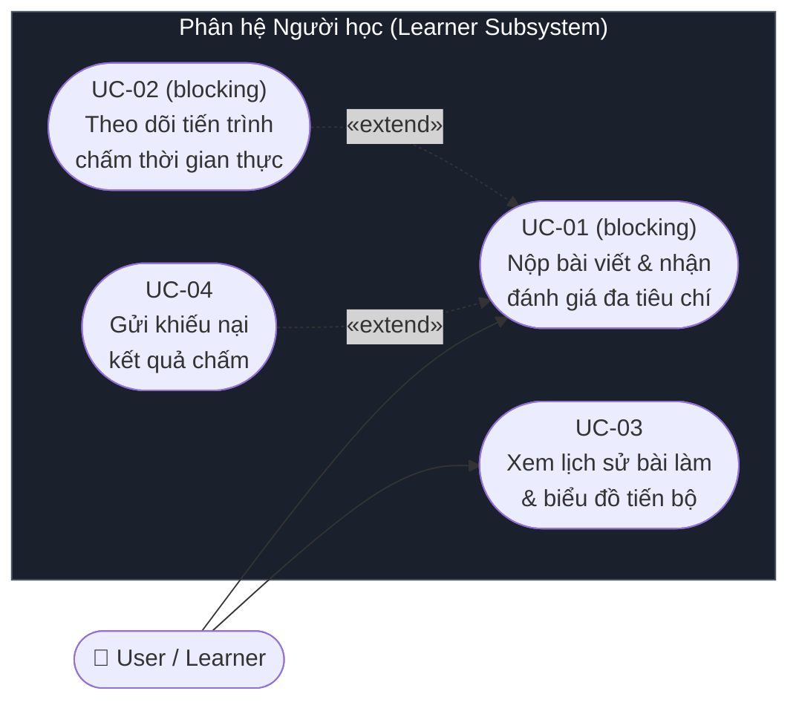
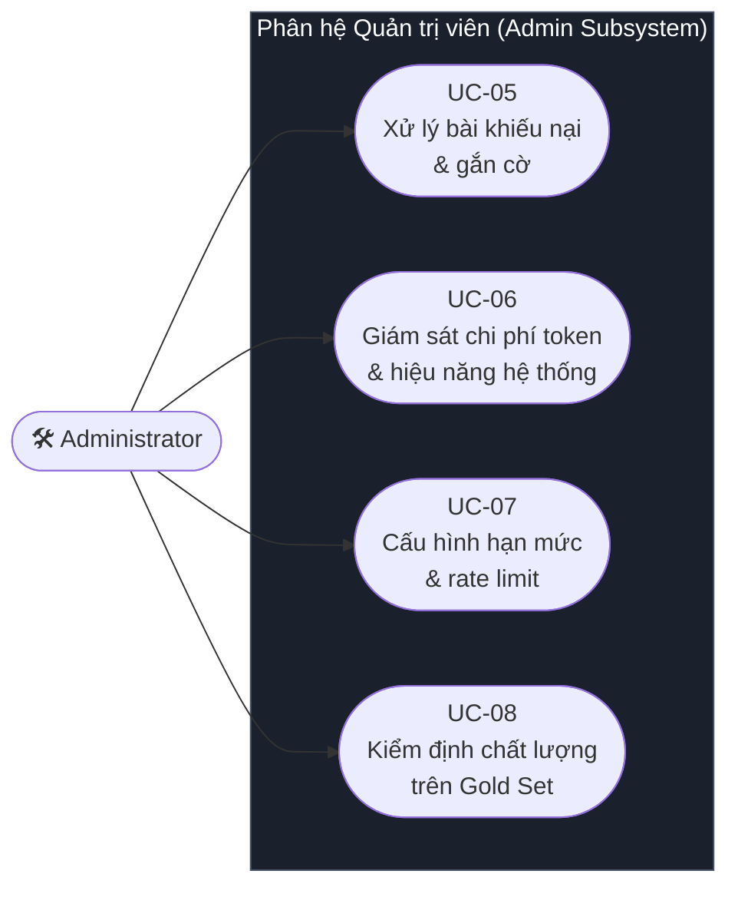

# Software Requirements Specification

## For IELTS Writing Agent — Hệ thống chấm và phản hồi kỹ năng viết IELTS (Writing Skill Only) bằng Multi-Agent (LangGraph)

Version 2.0
Prepared by Nhóm IELTS Writing Agent — Môn SE373 (AI Agentic)
Trường Đại học Công nghệ Thông tin, ĐHQG-HCM (UIT)
2026-09-29

> **Cách đọc tài liệu này:** Heading và thuật ngữ kỹ thuật giữ nguyên tiếng Anh để khớp với template `jam01/SRS-Template` (ISO/IEC/IEEE 29148) và với mã nguồn; phần diễn giải viết bằng tiếng Việt.
>
> **Từ khóa mức độ bắt buộc** (theo RFC 2119): **PHẢI** (MUST/SHALL) = yêu cầu bắt buộc; **NÊN** (SHOULD) = khuyến nghị mạnh, được phép bỏ qua nếu có lý do ghi nhận; **CÓ THỂ** (MAY) = tùy chọn.

### Thông tin nhóm và phân công

Thành viên          | Trách nhiệm chính trong dự án                        |
------------------- | ----------------------------------------------------------- |
(điền tên – MSSV) | Duyệt scope, ưu tiên requirement, chốt Acceptance Criteria  |
(điền tên – MSSV) | Biên soạn toàn bộ SRS, duy trì traceability matrix          |
(điền tên – MSSV) | Review mục 3.6 AI/ML, 3.2 FR2–FR4, Appendix A               |
(điền tên – MSSV) | Use Case Diagram, Activity Diagram, đối chiếu Actor/Persona |
(điền tên – MSSV) | Review mục 4 Verification, thiết kế gold set và test case   |

## Table of Contents

<!-- TOC -->

- [1. Introduction](#1-introduction)
  - [1.1 Document Purpose](#11-document-purpose)
  - [1.2 Product Scope](#12-product-scope)
  - [1.3 Definitions, Acronyms, and Abbreviations](#13-definitions-acronyms-and-abbreviations)
  - [1.4 References](#14-references)
  - [1.5 Document Overview](#15-document-overview)
- [2. Product Overview](#2-product-overview)
  - [2.1 Product Perspective](#21-product-perspective)
  - [2.2 Product Functions](#22-product-functions)
  - [2.3 Product Constraints](#23-product-constraints)
  - [2.4 User Characteristics](#24-user-characteristics)
  - [2.5 Assumptions and Dependencies](#25-assumptions-and-dependencies)
  - [2.6 Apportioning of Requirements](#26-apportioning-of-requirements)
- [3. Requirements](#3-requirements)
  - [3.1 External Interfaces](#31-external-interfaces)
  - [3.2 Functions](#32-functions)
    - [3.2.1 Use Case Diagram](#321-use-case-diagram)
      - [3.2.1.1 Phân hệ Người học (User / Learner Subsystem)](#3211-phân-hệ-người-học-user--learner-subsystem)
      - [3.2.1.2 Phân hệ Quản trị viên (Administrator Subsystem)](#3212-phân-hệ-quản-trị-viên-administrator-subsystem)
    - [3.2.2 System Feature 1: Input Ingestion, Validation and Guardrails](#322-system-feature-1-input-ingestion-validation-and-guardrails-tiếp-nhận-kiểm-tra-hợp-lệ--phòng-vệ-đầu-vào)
    - [3.2.3 System Feature 2: Multi-Criteria Grading & Agent Coordination (blocking)](#323-system-feature-2-multi-criteria-grading--agent-coordination-điều-phối-chấm-điểm-đa-tiêu-chí-ielts-blocking)
    - [3.2.4 System Feature 3: Grounding & Knowledge Tool Integration (blocking)](#324-system-feature-3-grounding--knowledge-tool-integration-tích-hợp-tri-thức-bài-mẫu--công-cụ-ngôn-ngữ-blocking)
    - [3.2.5 System Feature 4: Multi-Agent Consistency Verification & Scoring (blocking)](#325-system-feature-4-multi-agent-consistency-verification--scoring-kiểm-chứng-mâu-thuẫn--tổng-hợp-điểm-blocking)
    - [3.2.6 System Feature 5: Pedagogical Feedback & Actionable Plan Generation](#326-system-feature-5-pedagogical-feedback--actionable-plan-generation-sinh-phản-hồi-sư-phạm--lộ-trình-cải-thiện)
    - [3.2.7 System Feature 6: Learning History & System Administration](#327-system-feature-6-learning-history--system-administration-lịch-sử-học-tập--quản-trị-hệ-thống)
  - [3.3 Quality of Service](#33-quality-of-service)
  - [3.4 Compliance](#34-compliance)
  - [3.5 Design and Implementation](#35-design-and-implementation)
  - [3.6 AI/ML](#36-aiml)

---

## 1. Introduction

### 1.1 Document Purpose

Tài liệu này đặc tả đầy đủ và có thể kiểm chứng được các yêu cầu của **IELTS Writing Agent** — một hệ thống Multi-Agent chuyên sâu cho kỹ năng viết (**Writing skill only**), thực hiện chấm điểm và phản hồi sư phạm bài thi IELTS Writing bao gồm cả **Task 1** (Academic) và **Task 2** (Academic Essay) theo bộ tiêu chí chấm công khai của Cambridge/IELTS Partners.

Hệ thống được thiết kế **dành riêng và duy nhất cho kỹ năng Viết (Writing)**, hoàn toàn không bao gồm các kỹ năng khác của bài thi IELTS (Speaking, Listening, Reading).

Tài liệu phục vụ bốn nhóm đối tượng:

| Đối tượng                    | Sử dụng tài liệu để                                                        |
| ---------------------------- | -------------------------------------------------------------------------- |
| Giảng viên môn SE373         | Đánh giá phạm vi, độ chặt chẽ và tính khả thi của đồ án                    |
| Developers (thành viên nhóm) | Làm nguồn sự thật duy nhất khi hiện thực các agent node, API và data model |
| Testers / QA                 | Dẫn xuất test case và tiêu chí nghiệm thu từ mục 3 và mục 4                |
| Product Owner / Team Leader  | Quản lý scope, ưu tiên backlog và nghiệm thu từng sprint                   |

Tài liệu mô tả hệ thống **PHẢI làm gì** và **đạt chất lượng nào**, không mô tả chi tiết hiện thực (thuật toán nội bộ, nội dung prompt cụ thể, cấu trúc thư mục mã nguồn).

### 1.2 Product Scope

**Tên sản phẩm:** IELTS Writing Agent

**Mục đích:** Cung cấp cho người học IELTS một chu trình luyện viết nhanh chóng, chính xác và có căn cứ minh bạch: nộp bài viết → nhận điểm 4 tiêu chí kèm trích dẫn chứng minh từ chính bài làm → nhận phân tích lỗi và kế hoạch cải thiện hành động được (Actionable Plan), trong vòng dưới 30 giây, với chi phí tối ưu so với việc thuê giáo viên/giám khảo chấm bài truyền thống.

**Phạm vi chuyên biệt:** Hệ thống chỉ tập trung duy nhất vào kỹ năng viết, bao phủ toàn diện cả hai phần thi của IELTS Writing: **Task 1** và **Task 2**.

**Năng lực cốt lõi (in scope):**

- **Chấm IELTS Writing Task 1:**
  - **Academic Task 1:** Đánh giá bài viết mô tả dữ liệu trực quan tối thiểu 150 từ (thời gian làm bài chuẩn 20 phút), gồm tất cả các dạng: Biểu đồ đường (Line graphs), Biểu đồ cột (Bar charts), Biểu đồ tròn (Pie charts), Bảng số liệu (Tables), Sơ đồ quy trình (Process diagrams), và Bản đồ (Maps). Hỗ trợ tải lên hình ảnh biểu đồ và tích hợp node đa phương thức `Visual Data Extractor` để trích xuất số liệu và xu hướng đối chiếu.
  - **Chấm theo 4 tiêu chí chuẩn IELTS:**
    - **Task Achievement (TA):** Đầy đủ đoạn tổng quan, lựa chọn và báo cáo chính xác các đặc điểm nổi bật, số liệu trích xuất chính xác, không đưa quan điểm cá nhân.

    - **Coherence and Cohesion (CC):** Tổ chức bố cục đoạn văn mạch lạc, tiến trình triển khai logic, sử dụng linh hoạt các phương tiện liên kết và từ thay thế.

    - **Lexical Resource (LR):** Độ đa dạng và chính xác của từ vựng mô tả xu hướng/so sánh, hạn chế lỗi chính tả, sử dụng đúng ngữ cảnh học thuật.

    - **Grammatical Range and Accuracy (GRA):** Mức độ đa dạng cấu trúc câu (câu phức, mệnh đề quan hệ, thể bị động) và mức độ kiểm soát lỗi ngữ pháp/chia thì.
- **Chấm IELTS Writing Task 2:**
  - Đánh giá bài luận học thuật tối thiểu 250 từ (thời gian làm bài chuẩn 40 phút), bao quát toàn bộ 5 dạng bài luận IELTS Writing Task 2:
    1. *Opinion Essay (Agree or Disagree)*
    2. *Discussion Essay (Discuss both views and give your own opinion)*
    3. *Problem and Solution / Causes and Solutions*
    4. *Advantages and Disadvantages (Outweigh / Direct discussion)*
    5. *Two-part Question / Double Question*
  - **Chấm theo 4 tiêu chí chuẩn IELTS:** 
    - **Task Response (TR):** Trả lời trọn vẹn mọi vế của đề bài, lập trường rõ ràng xuyên suốt, phát triển luận điểm có dẫn chứng thuyết phục
    - **Coherence and Cohesion (CC):** Phân đoạn hợp lý, liên kết ý mạch lạc
    - **Lexical Resource (LR):** Vốn từ học thuật phong phú, collocations chính xác
    - **Grammatical Range and Accuracy (GRA):** Kết hợp câu đơn/phức, kiểm soát cấu trúc và dấu câu.
- **Tính điểm và Tổng hợp kết quả chuẩn IELTS:**
  - Điểm thành phần từng task tính từ trung bình 4 tiêu chí (TA/TR, CC, LR, GRA) làm tròn bước nhảy 0.5 band theo chuẩn IELTS.
  - Khi người học thực hiện cả Task 1 và Task 2 trong một phiên thi thử đầy đủ (Full Writing Test), hệ thống tự động tổng hợp **Overall Writing Band** theo tỷ lệ trọng số chuẩn Cambridge: **Task 1 : Task 2 = 1 : 2** (công thức: `(Task 1 + 2 * Task 2) / 3`, làm tròn 0.5 band).
- **Kiến trúc Multi-Agent trên LangGraph:**

- **Grounding** bằng RAG trên kho bài mẫu Task 1 & Task 2 Band 8.0+ và bằng tool tra cứu từ vựng học thuật (AWL/CEFR) / kiểm tra ngữ pháp.
- **Lưu lịch sử bài nộp** và theo dõi tiến bộ của người học theo từng tiêu chí và từng task.

**Ngoài phạm vi (out of scope):**

Vì hệ thống được thiết kế đặc thù là một tác tử AI chuyên sâu cho kỹ năng viết (**IELTS Writing Agent**), các hạng mục sau hoàn toàn nằm ngoài phạm vi:

| Hạng mục                                                | Lý do loại trừ                                                    | Dự kiến         |
| ------------------------------------------------------- | ----------------------------------------------------------------- | --------------- |
| **IELTS Speaking** (FC/LR/GRA/P)                        | Hệ thống là Writing Agent chuyên biệt; Speaking là kỹ năng nói tương tác đòi hỏi pipeline Speech-to-Text và phân tích phát âm âm thanh hoàn toàn khác biệt | Không làm (Phase 2 nếu làm dự án riêng) |
| **IELTS Listening và Reading**                          | Là hai kỹ năng tiếp nhận thụ động (receptive skills) với bài thi trắc nghiệm khách quan có đáp án cố định (fixed key), không cần hệ thống Multi-Agent đánh giá văn bản tự do | Tuyệt đối không làm |
| Fine-tuning hoặc huấn luyện mô hình riêng               | Phiên bản 1.0 tập trung vào Prompt Engineering có cấu trúc, Few-shot và RAG; không có ngân sách GPU lớn | Phase 2 (RLAIF) |
| Ứng dụng di động native                                 | Web responsive đã đủ cho mục tiêu đồ án                           | Phase 2         |
| Thanh toán, gói cước, quản lý lớp học                   | Không liên quan tới trọng tâm AI Agentic của môn học              | Không làm       |
| Cấp chứng chỉ hoặc điểm IELTS chính thức                | Không có thẩm quyền pháp lý; xem [3.4 Compliance](#34-compliance) | Không làm       |

**Lợi ích kỳ vọng:** rút ngắn chu kỳ phản hồi cho người học từ 1–3 ngày (thuê giám khảo) xuống dưới 30 giây, với sai số điểm trung bình **MAE ≤ 0.5 band** so với giám khảo người thật trên bộ dữ liệu chuẩn.

### 1.3 Definitions, Acronyms, and Abbreviations

| Term                      | Definition                                                                                                                                                                                                                                |
| ------------------------- | ----------------------------------------------------------------------------------------------------------------------------------------------------------------------------------------------------------------------------------------- |
| **Actionable Plan**       | Tập hợp tối đa 3 lời khuyên cải thiện được sắp xếp theo mức tác động lên band score, mỗi lời khuyên gắn với một tiêu chí và một hành động luyện tập cụ thể                                                                                |
| **AgentState**            | Cấu trúc dữ liệu dùng chung (shared state) được mọi node trong đồ thị LangGraph đọc và ghi; định nghĩa đầy đủ tại [Appendix A](#appendix-a--agentstate-và-pydantic-models)                                                                |
| **AWL**                   | Academic Word List — danh sách 570 họ từ học thuật của Coxhead (2000), dùng để đo mật độ từ vựng học thuật phục vụ tiêu chí LR                                                                                                            |
| **Band Descriptors**      | Bảng mô tả tiêu chí chấm công khai của IELTS, chia mỗi tiêu chí thành 9 band; là nguồn chuẩn (normative) cho mọi quyết định chấm điểm của hệ thống                                                                                        |
| **Band Score**            | Điểm IELTS trong thang 0.0–9.0, bước nhảy 0.5                                                                                                                                                                                             |
| **CC**                    | Coherence and Cohesion — tiêu chí về mạch lạc và liên kết, áp dụng cho cả Task 1 và Task 2                                                                                                                                                |
| **Checkpointer**          | Thành phần LangGraph lưu trạng thái đồ thị sau mỗi node, cho phép khôi phục hoặc chạy tiếp khi có lỗi                                                                                                                                     |
| **Coordinator**           | Node đầu đồ thị, chịu trách nhiệm nhận diện loại đề (Task 1 Academic hoặc Task 2), lập kế hoạch chấm và fan-out tới các Evaluator                                                                                                |
| **Evaluator Node**        | Agent node chấm độc lập **một** tiêu chí và trả về một đối tượng `CriterionScore`                                                                                                                                                         |
| **Evidence Quote**        | Đoạn trích nguyên văn từ bài làm của thí sinh, kèm vị trí ký tự, dùng để chứng minh cho một nhận định chấm điểm                                                                                                                           |
| **Fan-out / Fan-in**      | Mẫu thiết kế trong LangGraph: một node phân nhánh tới nhiều node chạy song song (fan-out) rồi gộp kết quả lại (fan-in)                                                                                                                    |
| **Gold Set**              | Bộ dữ liệu chuẩn gồm các bài viết đã được giám khảo người thật chấm, dùng làm mốc đo MAE                                                                                                                                                  |
| **GRA**                   | Grammatical Range and Accuracy — tiêu chí về độ đa dạng và độ chính xác ngữ pháp                                                                                                                                                          |
| **Guardrail**             | Cơ chế kiểm soát giữ hệ thống hoạt động trong giới hạn cho phép (lọc đầu vào, xác thực đầu ra, giới hạn hành động)                                                                                                                        |
| **HITL**                  | Human-in-the-Loop — cơ chế đưa con người vào vòng quyết định để giám sát hoặc sửa kết quả của AI                                                                                                                                          |
| **IELTS**                 | International English Language Testing System                                                                                                                                                                                             |
| **IELTS Writing Agent**   | Hệ thống tác tử AI đa thành phần (Multi-Agent System) chuyên biệt cho kỹ năng viết IELTS (Writing skill only), thực hiện đánh giá, chấm điểm và hướng dẫn cải thiện bài thi IELTS Writing Task 1 và Task 2                                  |
| **LangGraph**             | Framework xây dựng ứng dụng LLM dạng đồ thị có trạng thái (stateful graph), hỗ trợ node, edge có điều kiện, vòng lặp và checkpoint                                                                                                        |
| **LLM**                   | Large Language Model                                                                                                                                                                                                                      |
| **LR**                    | Lexical Resource — tiêu chí về vốn từ vựng                                                                                                                                                                                                |
| **MAE**                   | Mean Absolute Error — sai số tuyệt đối trung bình giữa điểm hệ thống và điểm giám khảo người thật                                                                                                                                         |
| **Multi-Agent System**    | Hệ thống gồm nhiều agent chuyên biệt phối hợp giải quyết một bài toán mà một agent đơn lẻ làm kém hơn                                                                                                                                     |
| **Node**                  | Một đơn vị xử lý trong đồ thị LangGraph; nhận `AgentState`, trả về phần cập nhật của `AgentState`                                                                                                                                         |
| **Off-topic**             | Bài làm không trả lời đúng đề bài; theo Band Descriptors sẽ bị chấm TR/TA ở band 1–2                                                                                                                                                      |
| **Overall Writing Band**  | Điểm tổng kỹ năng viết IELTS tính từ điểm Task 1 và Task 2 theo tỷ lệ trọng số 1 : 2 và làm tròn theo chuẩn IELTS                                                                                                                         |
| **Prompt Injection**      | Kỹ thuật tấn công trong đó nội dung do người dùng cung cấp chứa chỉ thị nhằm chiếm quyền điều khiển hành vi của LLM                                                                                                                       |
| **Pydantic**              | Thư viện Python xác thực dữ liệu theo kiểu; dùng để định nghĩa và ép buộc schema đầu ra của mọi agent                                                                                                                                     |
| **RAG**                   | Retrieval-Augmented Generation — truy xuất tài liệu liên quan từ kho tri thức rồi đưa vào ngữ cảnh của LLM để tăng độ chính xác và giảm bịa đặt                                                                                           |
| **Reducer**               | Hàm quy định cách hợp nhất các cập nhật đồng thời vào cùng một trường của `AgentState` khi nhiều node chạy song song                                                                                                                      |
| **RLAIF**                 | Reinforcement Learning from AI Feedback — kỹ thuật tinh chỉnh mô hình bằng tín hiệu ưu tiên do AI sinh ra thay vì do người gán nhãn; ở đồ án này chỉ thu thập dữ liệu, chưa huấn luyện (xem [3.6.6](#366-model-lifecycle-and-operations)) |
| **SSE**                   | Server-Sent Events — giao thức đẩy sự kiện một chiều từ server tới client trên nền HTTP, dùng để stream kết quả chấm từng phần                                                                                                            |
| **TA**                    | Task Achievement — tiêu chí thứ nhất của **Writing Task 1** (Academic: tổng quan, đặc điểm chính, độ chính xác số liệu)                                                                                                                   |
| **Temperature**           | Tham số điều khiển độ ngẫu nhiên của LLM; giá trị thấp cho kết quả ổn định hơn                                                                                                                                                            |
| **TR**                    | Task Response — tiêu chí thứ nhất của **Writing Task 2** (bài luận: trả lời mọi vế đề bài, lập trường rõ ràng xuyên suốt, luận điểm phát triển đầy đủ)                                                                                   |
| **TTFT**                  | Time To First Token — thời gian từ khi nhận request đến khi client nhận được sự kiện SSE có nội dung đầu tiên                                                                                                                             |
| **Tutor Agent**           | Node cuối đồ thị, biến kết quả chấm thành phản hồi sư phạm: highlight lỗi, câu viết lại mẫu và Actionable Plan                                                                                                                            |
| **Vector Database**       | Cơ sở dữ liệu lưu và truy vấn embedding theo độ tương đồng ngữ nghĩa; dùng cho RAG                                                                                                                                                        |
| **Verifier Node**         | Node kiểm tra chéo kết quả của 4 Evaluator, phát hiện mâu thuẫn và tính điểm tổng                                                                                                                                                         |
| **Visual Data Extractor** | Node chỉ chạy với Task 1 Academic, trích xuất dữ liệu số và xu hướng từ ảnh biểu đồ để làm căn cứ kiểm tra tính chính xác dữ kiện                                                                                                         |
| **Writing Task 1**        | Phần thi viết 20 phút, tối thiểu 150 từ; dạng Academic (mô tả biểu đồ đường/cột/tròn, bảng, bản đồ, quy trình kèm ảnh biểu đồ/dữ liệu trực quan)                                                                                          |
| **Writing Task 2**        | Phần thi viết 40 phút, tối thiểu 250 từ, dạng luận phân tích/nghị luận (Opinion, Discussion, Problem-Solution, Advantages-Disadvantages, Two-part Question); trọng số gấp đôi Task 1 khi tính điểm Writing tổng                          |

### 1.4 References

| #   | Title                                                                           | Owner                      | Version / Date    | Location                         | Type                             |
| --- | ------------------------------------------------------------------------------- | -------------------------- | ----------------- | -------------------------------- | -------------------------------- |
| R1  | ISO/IEC/IEEE 29148 — Systems and software engineering: Requirements engineering | ISO/IEC/IEEE               | 2018              | iso.org                          | Normative                        |
| R2  | IEEE 830-1998 — Recommended Practice for Software Requirements Specifications   | IEEE                       | 1998 (superseded) | ieee.org                         | Informative                      |
| R3  | IELTS Writing Task 1 Band Descriptors (public version)                          | IELTS Partners             | Hiện hành         | ielts.org                        | **Normative**                    |
| R4  | IELTS Writing Task 2 Band Descriptors (public version)                          | IELTS Partners             | Hiện hành         | ielts.org                        | **Normative**                    |
| R5  | IELTS Scoring in Detail / How IELTS is scored                                   | IELTS Partners             | Hiện hành         | ielts.org                        | **Normative** (quy tắc làm tròn) |
| R6  | Cambridge IELTS 10–19 Official Practice Materials                               | Cambridge University Press | 2015–2024         | Bản in / bản quyền thư viện      | Informative (nguồn bài mẫu)      |
| R7  | LangGraph Documentation                                                         | LangChain Inc.             | Hiện hành         | langchain-ai.github.io/langgraph | Informative                      |
| R8  | Pydantic v2 Documentation                                                       | Pydantic Services          | v2.x              | docs.pydantic.dev                | Informative                      |
| R9  | OWASP Top 10 for LLM Applications                                               | OWASP Foundation           | 2025              | owasp.org                        | **Normative** (mục 3.3.2, 3.6.3) |
| R10 | Anthropic Claude API Documentation                                              | Anthropic                  | Hiện hành         | docs.claude.com                  | Informative                      |
| R11 | Coxhead, A. — _A New Academic Word List_, TESOL Quarterly 34(2)                 | TESOL                      | 2000              | JSTOR                            | Informative                      |
| R12 | HTML Living Standard — Server-Sent Events                                       | WHATWG                     | Hiện hành         | html.spec.whatwg.org             | **Normative**                    |
| R13 | Nghị định 13/2023/NĐ-CP về bảo vệ dữ liệu cá nhân                               | Chính phủ Việt Nam         | 17/04/2023        | vanban.chinhphu.vn               | **Normative**                    |
| R14 | NIST AI Risk Management Framework 1.0                                           | NIST                       | 2023              | nist.gov                         | Informative                      |
| R15 | Web Content Accessibility Guidelines (WCAG) 2.1                                 | W3C                        | 2018              | w3.org/TR/WCAG21                 | **Normative** (mức AA)           |
| R16 | SRS-Template                                                                    | jam01 (CC0-1.0)            | master            | github.com/jam01/SRS-Template    | Informative (khuôn tài liệu)     |

### 1.5 Document Overview

Tài liệu gồm 5 mục theo cấu trúc của [R16] và tuân thủ [R1]:

- **Mục 1** giới thiệu mục đích, phạm vi, thuật ngữ và tài liệu tham chiếu.
- **Mục 2** mô tả bối cảnh sản phẩm: kiến trúc tổng quan, người dùng, ràng buộc, giả định, và phân bổ yêu cầu theo sprint.
- **Mục 3** là phần đặc tả chính: giao diện ngoài (3.1), yêu cầu chức năng (3.2), yêu cầu chất lượng (3.3), tuân thủ (3.4), ràng buộc thiết kế và triển khai (3.5), và yêu cầu riêng cho AI/ML (3.6).
- **Mục 4** là ma trận nghiệm thu, ánh xạ mọi mã yêu cầu tới phương pháp kiểm chứng.
- **Mục 5** là phụ lục chứa data model, thuật toán làm tròn, sơ đồ và giao thức gán nhãn.

**Quy ước đánh mã yêu cầu:**

| Tiền tố     | Loại yêu cầu                   | Ví dụ       |
| ----------- | ------------------------------ | ----------- |
| `FR-x.y`    | Functional Requirement         | `FR-2.3`    |
| `UI-n`      | User Interface Requirement     | `UI-4`      |
| `IF-n`      | Software Interface Requirement | `IF-2`      |
| `NFR-PER-n` | Performance                    | `NFR-PER-1` |
| `NFR-SEC-n` | Security                       | `NFR-SEC-5` |
| `NFR-REL-n` | Reliability                    | `NFR-REL-3` |
| `NFR-AVL-n` | Availability                   | `NFR-AVL-2` |
| `NFR-OBS-n` | Observability                  | `NFR-OBS-1` |
| `CMP-n`     | Compliance                     | `CMP-3`     |
| `DI-xxx-n`  | Design & Implementation        | `DI-CST-1`  |
| `AI-xxx-n`  | AI/ML                          | `AI-GRD-4`  |
| `UC-nn`     | Use Case                       | `UC-02`     |

Mỗi yêu cầu có **Priority** theo thang MoSCoW: **M** (Must have — bắt buộc cho MVP), **S** (Should have), **C** (Could have). Mọi yêu cầu mức **M** PHẢI được nghiệm thu trước khi bảo vệ đồ án.

---

## 2. Product Overview

### 2.1 Product Perspective

IELTS Writing Agent là một **sản phẩm mới, độc lập** (self-contained), chuyên biệt hoàn toàn cho kỹ năng viết IELTS (Writing skill only). Hệ thống được xây dựng trong khuôn khổ đồ án môn SE373 nhằm minh họa kiến trúc Multi-Agent thực thụ: nhiều agent chuyên biệt, có trạng thái chia sẻ, có vòng lặp kiểm chứng và có tool use phục vụ đánh giá hai phần thi IELTS Writing Task 1 và Task 2 — chứ không phải một lời gọi LLM đơn lẻ được bọc lại.

Hệ thống nằm ở vị trí trung tâm, giao tiếp với 6 hệ thống bên ngoài:

**Kiến trúc Multi-Agent bên trong** — đồ thị LangGraph gồm 8 node, trong đó 4 Evaluator chạy song song:

**Nguyên tắc kiến trúc** (là cơ sở cho các yêu cầu ở mục 3):

### 2.2 Product Functions

| #    | Nhóm chức năng                | Mô tả ngắn                                                                                                                               |
| ---- | ----------------------------- | ---------------------------------------------------------------------------------------------------------------------------------------- |
| PF1  | Tiếp nhận và làm sạch bài nộp | Nhận đề bài, bài làm cho Task 1 (Academic kèm ảnh biểu đồ/sơ đồ) hoặc Task 2 (bài luận); kiểm tra hợp lệ; vô hiệu hóa prompt injection; tách đoạn và đánh chỉ số ký tự           |
| PF2  | Điều phối đa tác tử (blocking)          | Nhận diện loại bài viết (`TASK_1_ACADEMIC`, `TASK_2`), lập kế hoạch chấm, phân nhánh song song tới 4 Evaluator theo đúng rubric (TA hoặc TR, CC, LR, GRA) và gộp kết quả         |
| PF3  | Trích xuất dữ liệu trực quan  | Với Task 1 Academic, chuyển ảnh biểu đồ/sơ đồ thành bộ dữ kiện có cấu trúc làm chuẩn đối chiếu độ chính xác số liệu                            |
| PF4  | Chấm độc lập 4 tiêu chí (blocking) | Mỗi tiêu chí được một agent riêng chấm theo rubric chuẩn của Cambridge (TA, CC, LR, GRA cho Task 1; TR, CC, LR, GRA cho Task 2), trả về điểm phụ, lý giải, dẫn chứng và danh sách lỗi có vị trí |
| PF5  | Grounding bằng RAG và tool (blocking)    | Truy xuất bài mẫu Band 8.0+ cùng dạng đề (Task 1 / Task 2); tra cứu AWL/CEFR; kiểm tra ngữ pháp bằng công cụ ngoài                                         |
| PF6  | Kiểm chứng và tổng hợp điểm (blocking) | Phát hiện mâu thuẫn giữa điểm và nhận xét, kiểm tra các điều kiện vi phạm đặc thù của Task 1 và Task 2, kích hoạt chấm lại khi cần, áp dụng làm tròn 0.5 band và tính điểm thành phần Task 1, Task 2 cùng Overall Writing (trọng số 1 : 2) |
| PF7  | Sinh phản hồi sư phạm         | Highlight lỗi trên bài gốc, đề xuất câu viết lại Band 8.0+, và đúng 3 lời khuyên cải thiện xếp theo mức tác động                         |
| PF8  | Streaming tiến trình          | Đẩy sự kiện tiến độ và kết quả từng phần về client qua đường dẫn online  ngay khi từng node hoàn tất                                                   |
| PF9  | Lịch sử và theo dõi tiến bộ   | Lưu bài nộp, hiển thị biểu đồ band score theo thời gian cho Task 1, Task 2, Overall và các lỗi lặp lại                                   |
| PF10 | Quản trị và giám sát          | Cấu hình rate limit, theo dõi chi phí token, xem dashboard chất lượng và hàng đợi bài nộp gắn cờ / khiếu nại (flagged submissions & disputes) |

### 2.3 Product Constraints

| #   | Ràng buộc                                                                                           | Nguồn                                                    | Tác động                                              |
| --- | --------------------------------------------------------------------------------------------------- | -------------------------------------------------------- | ----------------------------------------------------- |
| C1  | **PHẢI** dùng LangGraph làm framework điều phối agent                                               | Yêu cầu môn SE373                                        | Quyết định toàn bộ mô hình node/edge/state            |
| C2  | **PHẢI** dùng Python 3.11+ và Pydantic v2 cho mọi contract dữ liệu                                  | Quyết định nhóm; tương thích hệ sinh thái LangGraph      | Không dùng dict thô giữa các node                     |
| C3  | API **PHẢI** là REST không trạng thái, streaming bằng SSE                                           | Yêu cầu đề bài                                           | Loại trừ WebSocket và long-polling                    |
| C4  | **KHÔNG** fine-tune mô hình; chỉ dùng prompt engineering, RAG và few-shot             | Không có ngân sách GPU, không có dữ liệu gán nhãn đủ lớn | Chất lượng phụ thuộc vào prompt và kho tri thức       |
| C5  | Ngân sách API tối đa **50 USD/tháng** trong suốt kỳ                                                 | Nhóm tự chi trả / tín dụng giáo dục                      | Buộc phải dùng prompt caching và chọn model theo tầng |
| C6  | Thời gian phát triển 14 tuần, 5 thành viên bán thời gian                                            | Lịch học kỳ                                              | Quyết định mức phân bổ ở 2.6 và mốc ở 3.5.8           |
| C7  | Chỉ được dùng **Band Descriptors bản công khai**, không có thang chấm nội bộ của Cambridge          | Không có quyền truy cập                                  | Điểm hệ thống là ước lượng, không chính thức          |
| C8  | Kho bài mẫu chỉ được chứa tài liệu có bản quyền hợp lệ hoặc do nhóm tự viết                         | Luật bản quyền; xem CMP-4                                | Giới hạn kích thước corpus                            |
| C9  | **KHÔNG** lưu dữ liệu định danh cá nhân (họ tên, email, số điện thoại) trong nội dung gửi tới LLM   | R13                                                      | Buộc phải khử định danh trước khi gọi API             |
| C10 | Toàn bộ hệ thống **PHẢI** chạy được trên một máy cá nhân ≤ 16 GB RAM, không GPU, qua Docker Compose | Điều kiện demo và chấm đồ án                             | Loại trừ mô hình chạy cục bộ nặng                     |

### 2.4 User Characteristics

#### 2.4.1 Actors

| Actor                                  | Loại             | Mô tả                                                                                                                               | Tần suất sử dụng |
| -------------------------------------- | ---------------- | ----------------------------------------------------------------------------------------------------------------------------------- | ---------------- |
| **User / Learner** (Người học/Thí sinh)| Human, primary   | Người học IELTS nộp bài viết (Task 1 / Task 2) để được chấm, nhận phản hồi sư phạm, theo dõi tiến độ và gửi khiếu nại (nếu có)     | 3–10 lần/tuần    |
| **Administrator / Admin**              | Human, secondary | Thành viên nhóm vận hành: cấu hình rate limit, theo dõi chi phí/token, giám sát chất lượng và xem xét các bài bị gắn cờ / khiếu nại | Hằng ngày        |
| **LLM Provider**                       | System           | Dịch vụ mô hình ngôn ngữ bên ngoài                                                                                                  | Mỗi lần chấm     |
| **Vector Database**                    | System           | Kho embedding phục vụ RAG bài mẫu Band 8.0+                                                                                         | Mỗi lần chấm     |
| **Grammar Tool**                       | System           | Dịch vụ phát hiện lỗi ngữ pháp bên ngoài                                                                                            | Mỗi lần chấm     |
| **Scheduler**                          | System           | Tiến trình định kỳ chạy regression eval và tổng hợp báo cáo chi phí                                                                 | Hằng ngày        |

#### 2.4.2 User Personas

**P1 — Minh, 20 tuổi, sinh viên năm 2 (Learner chính)**
Mục tiêu band 6.5 Writing để đủ điều kiện tốt nghiệp. Luyện viết 2 bài Task 1 và 3 bài Task 2 mỗi tuần nhưng không ai chấm, nên không biết mình sai ở đâu và cứ lặp lại cùng một lỗi. Không đủ tiền thuê giáo viên chấm (150–300k/bài). Trình độ tiếng Anh trung bình, đọc phản hồi tiếng Anh học thuật khá chậm. **Kỳ vọng:** biết ngay mình đang ở band nào (từng task và overall writing), lỗi nằm ở câu nào, và tuần này nên luyện gì.

**P2 — Lan, 27 tuổi, nhân viên văn phòng (Learner)**
Cần band 7.0 Writing để nộp hồ sơ định cư, hạn nộp còn 3 tháng. Cần luyện gấp cả Task 1 (tổng hợp và phân tích biểu đồ) lẫn Task 2 (bài luận). Chỉ luyện được lúc 22h–24h nên cần phản hồi tức thì, không chờ được qua đêm. Đã thi 2 lần, Writing luôn kẹt ở 6.0 mà không rõ vì sao. **Kỳ vọng:** phản hồi dưới 1 phút, chỉ rõ tiêu chí nào đang kéo điểm xuống ở từng task, và mẫu câu Band 8.0+ để học theo.

**P3 — Hùng, 21 tuổi, thành viên nhóm phụ trách vận hành (Administrator)**
Chịu trách nhiệm để hệ thống không vượt ngân sách 50 USD/tháng và không sập lúc demo; kiểm tra các bài nộp bị người học khiếu nại hoặc hệ thống gắn cờ độ tin cậy thấp. **Kỳ vọng:** dashboard chi phí theo ngày, cảnh báo khi sắp chạm ngưỡng, nút hạ rate limit tức thời, và hàng đợi quản lý bài gắn cờ rõ ràng.

#### 2.4.3 Yêu cầu về khả năng tiếp cận và bản địa hóa

- Giao diện **PHẢI** hỗ trợ song ngữ **Việt – Anh**, mặc định tiếng Việt cho phần hướng dẫn và tiếng Anh cho nội dung học thuật (câu viết lại, tên tiêu chí).
- Giao diện **PHẢI** đạt WCAG 2.1 mức AA (xem CMP-6), đặc biệt phần highlight lỗi không được chỉ dùng màu sắc để truyền đạt thông tin.

### 2.5 Assumptions and Dependencies

| #   | Giả định / Phụ thuộc                                                                                      | Loại      | Tác động nếu sai                                   | Rủi ro     | Biện pháp giảm thiểu                                                                         |
| --- | --------------------------------------------------------------------------------------------------------- | --------- | -------------------------------------------------- | ---------- | -------------------------------------------------------------------------------------------- |
| A1  | LLM Provider đạt khả dụng ≥ 99% và độ trễ p95 ≤ 8s cho một lời gọi evaluator                              | Phụ thuộc | Không đạt NFR-PER-2                                | Cao        | Cấu hình provider dự phòng (DI-POR-2); timeout + retry có backoff                            |
| A2  | Nhóm có tín dụng API đủ cho ~3.000 lượt chấm trong kỳ                                                     | Giả định  | Phải giảm số lần chạy eval                         | Trung bình | Prompt caching, Batch API cho eval, giới hạn ở DI-CST-2                                      |
| A3  | Thu thập được ≥ 100 bài viết có điểm giám khảo tin cậy làm gold set                                       | Giả định  | Không đo được MAE → không nghiệm thu được AI-MOD-3 | **Cao**    | Bắt đầu thu thập từ Sprint 0; dùng bài mẫu có điểm công bố của Cambridge làm nguồn bổ sung   |
| A4  | Bộ dữ liệu gold set chuẩn được tổng hợp từ bài mẫu chính thức của Cambridge và chuyên gia ngoại tuyến    | Phụ thuộc | Nhãn kém tin cậy, MAE mất ý nghĩa                  | Cao        | Ưu tiên bài mẫu Cambridge đã công bố điểm; 2 thành viên/chuyên gia chấm độc lập theo rubric  |
| A5  | Người học nộp bài bằng tiếng Anh, độ dài 100–500 từ                                                       | Giả định  | Ngoài dải này chất lượng chấm giảm                 | Thấp       | FR-1.3 và FR-1.4 chặn và cảnh báo                                                            |
| A6  | Band Descriptors bản công khai đủ chi tiết để phân biệt các band liền kề                                  | Giả định  | Hệ thống lẫn giữa band 6.0 và 6.5                  | Trung bình | Bù bằng few-shot có bài mẫu đã biết điểm (FR-3.1)                                            |
| A7  | LanguageTool self-host chạy được trong giới hạn RAM ở C10                                                 | Phụ thuộc | Phải chuyển sang API công cộng (có rate limit)     | Thấp       | Đặt tool này ở mức tùy chọn; GRA Evaluator vẫn hoạt động khi tool lỗi (NFR-REL-4)            |
| A8  | Định dạng JSON Schema đầu ra của LLM ổn định giữa các phiên bản model                                     | Giả định  | Vỡ contract khi provider cập nhật model            | Trung bình | Pin model version; dùng structured output có ràng buộc schema; validator + repair ở AI-GRD-2 |

**Phân bổ theo thành phần:**

| Thành phần                                 | Yêu cầu chịu trách nhiệm                           |
| ------------------------------------------ | -------------------------------------------------- |
| `api-gateway` (FastAPI)                    | IF-1…IF-6, UI-_, NFR-SEC-1…4, NFR-PER-1, NFR-AVL-_ |
| `graph-runtime` (LangGraph) (blocking)     | FR-2.*, FR-4.*, NFR-REL-*, NFR-PER-2…4            |
| `agents/*` (Evaluator, Coordinator, Verifier - blocking; Tutor) | FR-2.*, FR-4.*, FR-5.*, AI-MOD-*, AI-GRD-*         |
| `guard` (Input Guard)                      | FR-1.\*, NFR-SEC-5…7, AI-GRD-1                     |
| `knowledge` (RAG + tools)                  | FR-3._, AI-DAT-_                                   |
| `web-ui`                                   | UI-1…UI-9, CMP-6                                   |
| `ops` (CI/CD, monitoring)                  | DI-_, NFR-OBS-_, AI-OPS-\*                         |

---

## 3. Requirements

### 3.1 External Interfaces

#### 3.1.1 User Interfaces

Ứng dụng web responsive gồm 5 màn hình. Bản vẽ wireframe chi tiết nằm ở tài liệu thiết kế riêng; mục này chỉ đặc tả yêu cầu có thể kiểm chứng.

| Màn hình               | Actor             | Nội dung chính                                                                                                                    |
| ---------------------- | ----------------- | --------------------------------------------------------------------------------------------------------------------------------- |
| S1 · Submit            | User / Learner    | Chọn loại bài viết (Task 1 Academic / Task 2), nhập đề bài, tải ảnh biểu đồ (với Task 1 Academic), soạn bài làm                   |
| S2 · Live Grading      | User / Learner    | Hiển thị tiến trình từng node theo thời gian thực qua SSE                                                                         |
| S3 · Result & Feedback | User / Learner    | Band tổng (Task 1, Task 2 hoặc Overall Writing), 4 điểm phụ theo tiêu chí, bài làm có highlight lỗi, câu viết lại, 3 lời khuyên  |
| S4 · History           | User / Learner    | Danh sách bài đã nộp, biểu đồ band theo thời gian cho từng task và overall, lỗi lặp lại                                          |
| S5 · Admin Dashboard   | Administrator     | Thống kê chi phí token, độ trễ, tỉ lệ lỗi, cấu hình rate limit, và hàng đợi xử lý các bài nộp bị gắn cờ / khiếu nại điểm         |

| ID        | Yêu cầu                                                                                                                                                            | Priority |
| --------- | ------------------------------------------------------------------------------------------------------------------------------------------------------------------ | -------- |
| **UI-1**  | S1 **PHẢI** hiển thị bộ đếm số từ theo thời gian thực, đổi màu cảnh báo khi dưới ngưỡng tối thiểu (150 từ với Task 1 Academic, 250 từ với Task 2) và nêu rõ hệ quả trừ điểm                 | M        |
| **UI-2**  | S1 **PHẢI** cho phép tải ảnh biểu đồ định dạng PNG/JPEG/WebP, tối đa 5 MB, và chỉ bật ô này khi người dùng chọn Task 1 Academic                                    | M        |
| **UI-3**  | S2 **PHẢI** hiển thị trạng thái của từng node (chờ / đang chạy / xong / lỗi) và cập nhật trong vòng 500 ms kể từ khi nhận sự kiện SSE tương ứng                    | M        |
| **UI-4**  | S3 **PHẢI** highlight lỗi trực tiếp trên bài làm gốc; khi người dùng trỏ hoặc chạm vào vùng highlight, hệ thống hiển thị loại lỗi, giải thích và đề xuất sửa       | M        |
| **UI-5**  | Vùng highlight **KHÔNG ĐƯỢC** chỉ dùng màu sắc để phân biệt loại lỗi; **PHẢI** kèm gạch chân dạng khác nhau hoặc nhãn văn bản (WCAG 2.1 SC 1.4.1)                  | M        |
| **UI-6**  | S3 **PHẢI** hiển thị, với mỗi tiêu chí: điểm phụ, tóm tắt lý giải, và tối thiểu 2 dẫn chứng trích nguyên văn có thể bấm để nhảy tới vị trí trong bài; hiển thị điểm Task 1, Task 2 và Overall Writing Band tương ứng khi nộp cả hai bài | M        |
| **UI-7**  | S3 **PHẢI** hiển thị cảnh báo thường trực: điểm do hệ thống đưa ra là ước lượng tham khảo, không phải kết quả IELTS chính thức (xem CMP-2)                         | M        |
| **UI-8**  | S3 **PHẢI** có nút gửi khiếu nại điểm, chuyển bài vào hàng đợi xem xét của Administrator (AI-HIL-1)                                                                 | S        |
| **UI-9**  | Toàn bộ giao diện **PHẢI** hoạt động đúng ở bề rộng khung nhìn từ 360 px trở lên, không xuất hiện thanh cuộn ngang                                                 | M        |
| **UI-10** | S4 **PHẢI** vẽ biểu đồ đường band score theo thời gian cho từng tiêu chí và cho điểm tổng                                                                          | S        |
| **UI-11** | Giao diện **PHẢI** có công tắc chuyển ngôn ngữ Việt/Anh, ghi nhớ lựa chọn trong phiên                                                                              | S        |

#### 3.1.2 Hardware Interfaces

Hệ thống **không** giao tiếp trực tiếp với thiết bị phần cứng nào: không cảm biến, không thiết bị đo, không cổng vật lý. Mọi đầu vào đến qua HTTP.

Yêu cầu tối thiểu về môi trường phần cứng:

| ID       | Yêu cầu                                                                                                                                      | Priority |
| -------- | -------------------------------------------------------------------------------------------------------------------------------------------- | -------- |
| **HW-1** | Máy chủ ứng dụng **PHẢI** chạy được với 4 vCPU, 8 GB RAM, 20 GB ổ đĩa, **không cần GPU**                                                     | M        |
| **HW-2** | Toàn bộ stack (API, Postgres, Redis, Qdrant, LanguageTool) **PHẢI** khởi động được trên một máy 16 GB RAM qua Docker Compose (ràng buộc C10) | M        |
| **HW-3** | Client **PHẢI** chạy được trên trình duyệt hỗ trợ `EventSource` và ES2020: Chrome/Edge ≥ 111, Firefox ≥ 111, Safari ≥ 16.4                   | M        |

#### 3.1.3 Software Interfaces

##### IF-1 · REST API (hệ thống cung cấp)

Base path: `/api/v1`. Định dạng: JSON, mã hóa UTF-8. Xác thực: `Authorization: Bearer <JWT>`.

| Method & Path                       | Mục đích                             | Request                        | Response                                               |
| ----------------------------------- | ------------------------------------ | ------------------------------ | ------------------------------------------------------ |
| `POST /submissions`                 | Nộp bài để chấm                      | `SubmissionRequest`            | `202 Accepted` + `{submission_id, stream_url, status}` |
| `GET /submissions/{id}/stream`      | Nhận tiến trình chấm                 | —                              | `200` + `text/event-stream`                            |
| `GET /submissions/{id}`             | Lấy kết quả cuối                     | —                              | `200` + `GradingResult` \| `404`                       |
| `GET /submissions`                  | Lịch sử bài nộp                      | `?page`, `?size`, `?task_type` | `200` + trang dữ liệu                                  |
| `POST /submissions/{id}/dispute`    | Khiếu nại điểm                       | `{reason, expected_band?}`     | `201`                                                  |
| `POST /uploads/images`              | Tải ảnh biểu đồ                      | `multipart/form-data`          | `201` + `{asset_id, url}`                              |
| `GET /admin/disputes`               | Hàng đợi bài khiếu nại & gắn cờ      | `?status`, `?page`             | `200` + trang dữ liệu                                  |
| `POST /admin/disputes/{id}/resolve` | Xử lý khiếu nại & ghi chú đối soát   | `DisputeResolutionRequest`     | `200`                                                  |
| `GET /admin/usage`                  | Thống kê chi phí & lưu lượng         | `?from`, `?to`                 | `200`                                                  |
| `PUT /admin/config/rate-limit`      | Cập nhật hạn mức                     | `RateLimitConfig`              | `200`                                                  |
| `GET /health`                       | Liveness/readiness probe             | —                              | `200` \| `503`                                         |
| `GET /metrics`                      | Chỉ số Prometheus                    | —                              | `200` + `text/plain`                                   |

| ID         | Yêu cầu                                                                                                                                                 | Priority |
| ---------- | ------------------------------------------------------------------------------------------------------------------------------------------------------- | -------- |
| **IF-1.1** | Mọi phản hồi lỗi **PHẢI** theo RFC 9457 (Problem Details): `{type, title, status, detail, instance, errors[]}`                                          | M        |
| **IF-1.2** | `POST /submissions` **PHẢI** hỗ trợ header `Idempotency-Key`; hai request cùng khóa trong 24 giờ trả về cùng `submission_id` và không tạo lượt chấm mới | S        |
| **IF-1.3** | API **PHẢI** đánh phiên bản trên đường dẫn (`/api/v1`); thay đổi phá vỡ tương thích **PHẢI** tăng lên `/api/v2`                                         | M        |
| **IF-1.4** | Mọi phản hồi **PHẢI** chứa header `X-Trace-Id` khớp với `trace_id` trong `AgentState` (liên kết với NFR-OBS-2)                                          | M        |

##### IF-2 · SSE Event Contract (hệ thống cung cấp)

Luồng `GET /submissions/{id}/stream` phát các sự kiện sau, mỗi sự kiện có `event:` và `data:` là JSON một dòng:

| `event`                  | Thời điểm phát                        | `data`                                                   |
| ------------------------ | ------------------------------------- | -------------------------------------------------------- |
| `accepted`               | Ngay khi mở luồng                     | `{submission_id, task_type, word_count}`                 |
| `node_started`           | Khi một node bắt đầu                  | `{node, started_at}`                                     |
| `criterion_completed`    | Khi một Evaluator xong                | `CriterionScore` đầy đủ                                  |
| `verification_completed` | Khi Verifier xong                     | `{overall_band, task_band, revision_count, conflicts[]}` |
| `feedback_delta`         | Trong khi Tutor Agent sinh nội dung   | `{chunk}` — văn bản tăng dần                             |
| `completed`              | Khi đồ thị kết thúc                   | `GradingResult` đầy đủ                                   |
| `error`                  | Khi có lỗi không khôi phục được       | `{code, message, node, recoverable}`                     |
| `heartbeat`              | Mỗi 15 giây khi không có sự kiện khác | `{ts}`                                                   |

| ID         | Yêu cầu                                                                                            | Priority |
| ---------- | -------------------------------------------------------------------------------------------------- | -------- |
| **IF-2.1** | Mỗi sự kiện **PHẢI** có trường `id:` tăng đơn điệu để client khôi phục bằng header `Last-Event-ID` | S        |
| **IF-2.2** | Server **PHẢI** gửi `heartbeat` tối thiểu mỗi 15 giây nhằm tránh proxy trung gian đóng kết nối     | M        |
| **IF-2.3** | Luồng **PHẢI** đóng bằng `completed` hoặc `error`; không được đóng im lặng                         | M        |
| **IF-2.4** | Sự kiện `criterion_completed` **PHẢI** được phát ngay khi từng Evaluator xong, không chờ đủ cả 4   | M        |

##### IF-3 · LLM Provider API (hệ thống tiêu thụ)

| Thuộc tính                | Giá trị                                                             |
| ------------------------- | ------------------------------------------------------------------- |
| Chủ sở hữu                | Anthropic (chính); một provider thay thế được cấu hình dự phòng     |
| Giao thức                 | HTTPS, JSON, hỗ trợ streaming                                       |
| Xác thực                  | API key đọc từ biến môi trường, không bao giờ nằm trong mã nguồn    |
| Cơ chế đầu ra có cấu trúc | Structured output ràng buộc theo JSON Schema sinh từ Pydantic model |

| ID         | Yêu cầu                                                                                                                  | Priority |
| ---------- | ------------------------------------------------------------------------------------------------------------------------ | -------- |
| **IF-3.1** | Hệ thống **PHẢI** truy cập LLM qua một lớp trừu tượng (`LLMClient`) để đổi provider mà không sửa mã của agent            | M        |
| **IF-3.2** | Mọi lời gọi **PHẢI** đặt timeout ≤ 20 giây và tối đa 2 lần thử lại với backoff lũy thừa kèm jitter                       | M        |
| **IF-3.3** | Mọi lời gọi **PHẢI** ghim (pin) định danh model cụ thể; **KHÔNG ĐƯỢC** dùng bí danh trỏ tới "bản mới nhất" (liên kết A8) | M        |
| **IF-3.4** | Hệ thống **PHẢI** bật prompt caching cho phần tiền tố cố định (Band Descriptors, hướng dẫn hệ thống) để giảm chi phí     | S        |
| **IF-3.5** | Hệ thống **PHẢI** ghi lại `input_tokens`, `output_tokens`, `cache_read_tokens` của mọi lời gọi vào bảng chi phí          | M        |

##### IF-4 · Vector Database (hệ thống tiêu thụ)

| Thuộc tính        | Giá trị                                                                        |
| ----------------- | ------------------------------------------------------------------------------ |
| Sản phẩm          | Qdrant (self-host qua Docker)                                                  |
| Collection        | `exemplars` — bài mẫu Band 8.0+; `band_descriptors` — mô tả tiêu chí theo band |
| Metadata bắt buộc | `task_type`, `topic_cluster`, `band`, `criterion`, `source`, `license`         |

| ID         | Yêu cầu                                                                                                                             | Priority |
| ---------- | ----------------------------------------------------------------------------------------------------------------------------------- | -------- |
| **IF-4.1** | Truy vấn **PHẢI** lọc theo `task_type` trước khi xếp hạng theo độ tương đồng                                                        | M        |
| **IF-4.2** | Mỗi lần truy xuất trả về tối đa **k = 3** bản ghi, ngưỡng tương đồng cosine ≥ 0.70                                                  | M        |
| **IF-4.3** | Khi Vector DB không phản hồi trong 2 giây, Evaluator **PHẢI** tiếp tục chấm ở chế độ không grounding và đánh dấu `grounded = false` | M        |

##### IF-5 · Grammar Checking Tool (hệ thống tiêu thụ)

LanguageTool self-host, HTTP `POST /v2/check`, ngôn ngữ `en-GB` và `en-US`.

| ID         | Yêu cầu                                                                                                                              | Priority |
| ---------- | ------------------------------------------------------------------------------------------------------------------------------------ | -------- |
| **IF-5.1** | Kết quả từ tool là **ứng viên lỗi**, không phải kết luận; GRA Evaluator **PHẢI** tự quyết định giữ hay bỏ từng ứng viên và ghi lý do | M        |
| **IF-5.2** | Hệ thống **PHẢI** chấp nhận cả chính tả Anh-Anh và Anh-Mỹ, chỉ tính lỗi khi bài trộn lẫn hai hệ thống một cách không nhất quán       | M        |
| **IF-5.3** | Khi tool lỗi hoặc quá 3 giây, GRA Evaluator **PHẢI** chạy tiếp mà không có ứng viên từ tool (xem NFR-REL-4)                          | M        |

##### IF-6 · Hạ tầng lưu trữ và quan trắc

| Thành phần                  | Vai trò                                                 | Yêu cầu                                                                                                         |
| --------------------------- | ------------------------------------------------------- | --------------------------------------------------------------------------------------------------------------- |
| PostgreSQL 16               | Lưu bài nộp, kết quả chấm, bản ghi khiếu nại/đối soát, bản ghi chi phí | **IF-6.1** Mọi lần ghi kết quả chấm **PHẢI** nằm trong một giao dịch duy nhất                                   |
| Redis 7                     | Rate limiting, khóa idempotency, LangGraph checkpointer | **IF-6.2** Khi Redis không khả dụng, hệ thống **PHẢI** từ chối request mới bằng `503` thay vì bỏ qua rate limit |
| Object Storage (MinIO / S3) | Ảnh biểu đồ Task 1                                      | **IF-6.3** Ảnh **PHẢI** truy cập qua URL ký có hạn ≤ 15 phút                                                    |
| LangSmith / OpenTelemetry   | Trace đồ thị, chi phí, chất lượng                       | **IF-6.4** Mọi lần chạy đồ thị **PHẢI** phát ra một trace có `trace_id` khớp với `X-Trace-Id`                   |

### 3.2 Functions

Toàn bộ các yêu cầu chức năng của hệ thống **IELTS Writing Agent** được tổ chức thành 6 nhóm tính năng hệ thống chính (**System Features**) theo cấu trúc chuẩn mực của ISO/IEC/IEEE 29148:2018 (Clause 9.5.3.3) và IEEE 830-1998. Hệ thống được tinh giản phân quyền người dùng, chỉ hỗ trợ hai vai trò con người trực tiếp: **User / Learner** (học viên nộp bài làm, nhận điểm và phản hồi) và **Administrator / Admin** (vận hành hệ thống, kiểm soát chi phí token, cấu hình hạn mức và xử lý bài nộp khiếu nại / gắn cờ). Toàn bộ các tương tác của vai trò Examiner trước đây đã được bãi bỏ hoặc chuyển giao về giao diện quản trị viên.

> **Ghi chú kiến trúc:** Các tính năng và yêu cầu liên quan đến **Evaluator** (chấm tiêu chí) và **Verifier** (kiểm chứng) được đánh dấu tiền tố/hậu tố **(blocking)** để biểu thị trạng thái đang chờ bản thiết kế kiến trúc chi tiết (Architecture Design) từ thành viên phụ trách kiến trúc hệ thống.

#### 3.2.1 Use Case Diagram

> **Định nghĩa chuẩn mực (UML Standard Compliance):** Theo chuẩn UML 2.5 và phương pháp luận của Ivar Jacobson / Alistair Cockburn, **Use Case (Ca sử dụng)** đại diện cho một chuỗi hành động mà một tác tử (Actor — con người tương tác trực tiếp) tiến hành với hệ thống nhằm đạt được một kết quả có **giá trị đo lường được (observable value)** đối với tác tử đó. 
> 
> Các quy trình tính toán kỹ thuật nội bộ (như kiểm tra regex, quét prompt injection, truy vấn cơ sở dữ liệu vector, trích xuất dữ liệu biểu đồ đa phương thức, kiểm chứng mâu thuẫn đa tác tử hay làm tròn điểm 0.5 band) thuộc về nghiệp vụ bên trong của các tính năng hệ thống (System Features), hoàn toàn không phải là ca sử dụng.
> 
> Hệ thống phục vụ hai nhóm Actor người dùng trực tiếp duy nhất: **User / Learner** (học viên luyện viết) và **Administrator** (quản trị viên vận hành). Các dịch vụ kỹ thuật hạ tầng như **LLM Provider** và **Vector DB** là thành phần tích hợp bên trong kiến trúc (System Architecture Infrastructure), không đóng vai trò Actor trong sơ đồ ca sử dụng nghiệp vụ. Nhằm bảo đảm tính trực quan, rõ ràng và loại bỏ hoàn toàn hiện tượng giao cắt đường nối (line crossing), các ca sử dụng được phân tách độc lập theo từng phân hệ người dùng:

##### 3.2.1.1 Phân hệ Người học (User / Learner Subsystem)

##### 3.2.1.2 Phân hệ Quản trị viên (Administrator Subsystem)

##### 3.2.1.3 Bảng tổng hợp Giá trị Nghiệp vụ của các Use Case

| Mã Use Case | Tên Ca sử dụng | Actor chính | Giá trị trực tiếp tạo ra cho Actor (Business Value) | Quan hệ UML | Trạng thái kiến trúc |
| :--- | :--- | :--- | :--- | :--- | :--- |
| **UC-01** | Nộp bài viết & nhận đánh giá đa tiêu chí | User / Learner | Người học nhận bản đánh giá toàn diện gồm 4 band điểm tiêu chí (TA/TR, CC, LR, GRA), điểm tổng thể IELTS Writing, trích dẫn minh chứng từ bài làm, danh sách lỗi kèm vị trí highlight, câu viết lại Band 8.0+ và 3 lời khuyên cải thiện cụ thể. | Ca sử dụng cốt lõi | **(blocking)** (chờ chốt kiến trúc Evaluator & Verifier) |
| **UC-02** | Theo dõi tiến trình chấm thời gian thực | User / Learner | Người học theo dõi trực tiếp trạng thái hoàn tất của từng tác tử theo thời gian thực (SSE), mang lại tính minh bạch và loại bỏ cảm giác chờ đợi thụ động. | `<<extend>>` từ UC-01 | **(blocking)** (chờ chốt sự kiện streaming từ các node) |
| **UC-03** | Xem lịch sử bài làm & biểu đồ tiến bộ | User / Learner | Người học theo dõi trực quan quỹ đạo nâng band điểm qua các lần nộp bài, so sánh phong độ Task 1 vs Task 2, và nhận biết các nhóm lỗi lặp lại kinh niên để có lộ trình ôn luyện đúng hướng. | Ca sử dụng độc lập | Sẵn sàng (không bị block) |
| **UC-04** | Gửi khiếu nại kết quả chấm | User / Learner | Người học được bảo đảm quyền lợi khi nhận kết quả cảm thấy chưa thỏa đáng; yêu cầu bài viết được chuyển vào hàng đợi xem xét đối soát độc lập của quản trị viên. | `<<extend>>` từ UC-01 | Sẵn sàng (không bị block) |
| **UC-05** | Xử lý bài khiếu nại & gắn cờ | Administrator | Quản trị viên duyệt xét chuyên môn các bài bị khiếu nại hoặc bài có độ tin cậy thấp; cập nhật điểm đối soát chính thức để bảo đảm uy tín và độ chính xác của hệ thống. | Ca sử dụng độc lập | Sẵn sàng (không bị block) |
| **UC-06** | Giám sát chi phí token & hiệu năng hệ thống | Administrator | Quản trị viên chủ động kiểm soát ngân sách API token (ngưỡng 50 USD/tháng), giám sát độ trễ và tỉ lệ lỗi để kịp thời tối ưu chi phí và duy trì tính sẵn sàng. | Ca sử dụng độc lập | Sẵn sàng (không bị block) |
| **UC-07** | Cấu hình hạn mức & rate limit | Administrator | Quản trị viên thiết lập và điều chỉnh linh hoạt hạn mức nộp bài theo từng phân hạng người dùng, ngăn ngừa lạm dụng tài nguyên và tấn công từ chối dịch vụ. | Ca sử dụng độc lập | Sẵn sàng (không bị block) |
| **UC-08** | Kiểm định chất lượng trên Gold Set | Administrator | Quản trị viên kích hoạt chạy bộ kiểm định chuẩn trên 100+ bài mẫu để đo đạc sai số MAE (≤ 0.5 band), phát hiện sớm hiện tượng trôi prompt (prompt drift) hoặc suy giảm độ chính xác của mô hình. | Ca sử dụng độc lập | Sẵn sàng (không bị block) |

#### 3.2.2 System Feature 1: Input Ingestion, Validation and Guardrails (Tiếp nhận, Kiểm tra hợp lệ & Phòng vệ đầu vào)

##### 3.2.2.1 Description and Priority

Nhóm tính năng tiếp nhận đề bài, văn bản bài làm và hình ảnh trực quan (nếu có); xác thực tính hợp lệ về độ dài theo chuẩn IELTS; phát hiện và vô hiệu hóa các cuộc tấn công Prompt Injection; phân đoạn văn bản và khử định danh thông tin cá nhân. Đây là chốt chặn bảo vệ cổng vào (Entry Guard) của đồ thị LangGraph trước khi dữ liệu được chuyển đến các tác tử chuyên môn.

**Priority:** High / Must Have (M)

##### 3.2.2.2 Stimulus/Response Sequences

1. **Người dùng nộp bài**: User gửi yêu cầu chấm bài qua giao diện web hoặc REST API kèm thông tin bài viết.
2. **Kiểm tra sơ bộ**: Hệ thống xác thực định dạng dữ liệu, đếm từ theo luật IELTS, kiểm tra ngưỡng tối thiểu và độ dài tối đa.
3. **Phòng vệ bảo mật**: Quét nội dung văn bản nhằm phát hiện prompt injection, thẻ hệ thống giả mạo và các ký tự bất thường; gắn nhãn mức độ rủi ro.
4. **Chuẩn hóa & Phân tách**: Khử PII, chuẩn hóa văn bản, phân đoạn văn bản và xác định vai trò đoạn văn trong khi vẫn duy trì chính xác tọa độ ký tự trên bài viết gốc.
5. **Chuyển giao điều phối**: Tạo đối tượng `AgentState` ban đầu và kích hoạt đồ thị LangGraph xử lý đa tác tử.

##### 3.2.2.3 Functional Requirements

###### FR-1.1: Tiếp nhận dữ liệu bài nộp (Submission Ingestion)

| Trường thuộc tính (ISO/IEEE Field) | Đặc tả chi tiết theo ISO/IEC/IEEE 29148 |
| :--- | :--- |
| **Requirement Statement** | Hệ thống **PHẢI** tiếp nhận bài nộp gồm: `task_type` (`TASK_1_ACADEMIC` | `TASK_2`), `prompt_text` (đề bài), `essay_text` (bài làm), và `visual_asset_id` tùy chọn (chỉ dành cho `TASK_1_ACADEMIC`). |
| **Description / Rationale** | Đảm bảo hệ thống nhận đầy đủ dữ liệu cấu trúc cần thiết từ người học để làm dữ liệu đầu vào cho toàn bộ chu trình chấm điểm đa tác tử. |
| **Inputs & Source** | `SubmissionRequest` JSON body (`task_type`, `prompt_text`, `essay_text`, `visual_asset_id`) từ **User / Learner** qua `POST /api/v1/submissions`. |
| **Outputs & Destination** | `AgentState` khởi tạo (`task_type`, `prompt_text`, `raw_essay`, `visual_asset_id`); HTTP `202 Accepted` kèm `submission_id` và `stream_url` trả về Client. |
| **Preconditions** | Người dùng đã đăng nhập (JWT hợp lệ); còn hạn mức rate limit cho phép. |
| **Postconditions** | Bản ghi bài nộp được tạo trong PostgreSQL ở trạng thái `QUEUED`; đồ thị LangGraph được kích hoạt bất đồng bộ. |
| **Processing Logic / Business Rules** | 1. Parse và xác thực body theo schema Pydantic `SubmissionRequest`. 2. Kiểm tra header `Idempotency-Key` (nếu có, trả về kết quả cũ nếu đã tồn tại). 3. Sinh UUIDv4 `submission_id`. 4. Khởi tạo `AgentState` ban đầu và kích hoạt đồ thị. 5. Phản hồi `202 Accepted` cho client với URL mở luồng SSE. |
| **Priority** | **Must Have (M)** |
| **Verification & Standards** | Test (T) (`tests/api/test_submission.py`) | Tham chiếu UC-01, RFC 2119. |

###### FR-1.2: Xác thực nội dung văn bản & độ dài trần (Essay Validation & Maximum Length)

| Trường thuộc tính (ISO/IEEE Field) | Đặc tả chi tiết theo ISO/IEC/IEEE 29148 |
| :--- | :--- |
| **Requirement Statement** | Hệ thống **PHẢI** từ chối bài nộp có `essay_text` rỗng, chỉ chứa khoảng trắng, hoặc dài quá 1.000 từ, trả mã lỗi `INVALID_INPUT` kèm mô tả chi tiết. |
| **Description / Rationale** | Ngăn chặn các bài viết không hợp lệ làm lãng phí tài nguyên tính toán của đồ thị và chi phí gọi mô hình ngôn ngữ lớn. |
| **Inputs & Source** | `essay_text` từ `SubmissionRequest`. |
| **Outputs & Destination** | Mã lỗi RFC 9457 `INVALID_INPUT` kèm thông điệp giải thích nếu vi phạm; tiếp tục xử lý nếu hợp lệ. |
| **Preconditions** | Request vượt qua kiểm tra định dạng JSON cơ bản. |
| **Postconditions** | Từ chối ngay lập tức không tiêu tốn tài nguyên LangGraph/LLM nếu vi phạm. |
| **Processing Logic / Business Rules** | 1. Strip khoảng trắng đầu cuối của `essay_text`. 2. Kiểm tra chuỗi rỗng: nếu rỗng -> trả lỗi 400 `INVALID_INPUT`. 3. Tách từ sơ bộ, nếu số từ > 1.000 -> trả lỗi 400 `INVALID_INPUT` ("Văn bản bài nộp vượt quá giới hạn tối đa 1.000 từ"). |
| **Priority** | **Must Have (M)** |
| **Verification & Standards** | Test (T) (`tests/api/test_input_guard.py::test_invalid_input`) | Tham chiếu A5. |

###### FR-1.3: Đếm số từ chuẩn khảo thí IELTS (IELTS Word Count Specification)

| Trường thuộc tính (ISO/IEEE Field) | Đặc tả chi tiết theo ISO/IEC/IEEE 29148 |
| :--- | :--- |
| **Requirement Statement** | Hệ thống **PHẢI** đếm số từ theo quy tắc chuẩn IELTS (từ phân tách bởi khoảng trắng; số viết bằng chữ số tính là 1 từ; từ ghép có dấu gạch nối nối liền tính là 1 từ) và lưu giá trị vào `word_count`. |
| **Description / Rationale** | Đảm bảo tính nhất quán tuyệt đối với phương pháp chấm thi chính thức của kỳ thi IELTS quốc tế. |
| **Inputs & Source** | `essay_text` gốc từ `AgentState`. |
| **Outputs & Destination** | `AgentState.word_count` (kiểu số nguyên dương). |
| **Preconditions** | `essay_text` hợp lệ theo FR-1.2. |
| **Postconditions** | `word_count` được lưu vào trạng thái chia sẻ phục vụ các node phía sau. |
| **Processing Logic / Business Rules** | 1. Regex tách token theo khoảng trắng `\s+`. 2. Nhận diện từ ghép `\b\w+(-\w+)+\b` tính là 1 từ. 3. Số nguyên/thập phân `\b\d+([.,]\d+)?\b` tính là 1 từ. 4. Đếm tổng số token hợp lệ và gán vào `word_count`. |
| **Priority** | **Must Have (M)** |
| **Verification & Standards** | Test (T) (`tests/unit/test_word_counter.py`) | Tham chiếu R5 (IELTS Official Scoring Rules). |

###### FR-1.4: Xử lý bài nộp dưới ngưỡng tối thiểu & áp trần điểm (Under-length Essay Handling & Scoring Ceiling)

| Trường thuộc tính (ISO/IEEE Field) | Đặc tả chi tiết theo ISO/IEC/IEEE 29148 |
| :--- | :--- |
| **Requirement Statement** | Khi `word_count` **dưới ngưỡng tối thiểu** (150 từ với Task 1 Academic, 250 từ với Task 2), hệ thống **PHẢI** tiếp tục chấm nhưng đánh dấu `under_length = true`; điểm Task Achievement (TA) hoặc Task Response (TR) khi đó **PHẢI** bị áp trần tối đa **5.0** và lý do trừ điểm **PHẢI** xuất hiện rõ ràng trong `rationale`. |
| **Description / Rationale** | Tuân thủ quy chế khảo thí của Cambridge/IELTS Partners: bài viết không đủ độ dài tối thiểu không thể đạt điểm cao ở tiêu chí hoàn thành nhiệm vụ. |
| **Inputs & Source** | `AgentState.word_count`, `AgentState.task_type`. |
| **Outputs & Destination** | `AgentState.under_length = true`, bổ sung `ScoreCap(max_score=5.0, reason="UNDER_LENGTH")`. |
| **Preconditions** | `word_count` đã được tính toán ở FR-1.3 và nằm trong dải [50% ngưỡng, ngưỡng tối thiểu). |
| **Postconditions** | Bộ kiểm chứng Verifier ghi nhận trần điểm bắt buộc trước khi tính điểm tổng kết. |
| **Processing Logic / Business Rules** | Nếu (`task_type == TASK_1_ACADEMIC` and `word_count < 150`) hoặc (`task_type == TASK_2` and `word_count < 250`): - Gán `under_length = true`. - Bổ sung đối tượng `ScoreCap` quy định mức trần 5.0 cho TA/TR. - Đưa cảnh báo vào trường giải trình để phản ánh rõ ràng. |
| **Priority** | **Must Have (M)** |
| **Verification & Standards** | Test (T) (`tests/eval/test_underlength_penalty.py`) | Tham chiếu R3, R4. |

###### FR-1.5: Từ chối bài viết quá ngắn dưới 50% ngưỡng (Early Rejection for Severely Under-length)

| Trường thuộc tính (ISO/IEEE Field) | Đặc tả chi tiết theo ISO/IEC/IEEE 29148 |
| :--- | :--- |
| **Requirement Statement** | Khi `word_count` dưới **50%** ngưỡng tối thiểu quy định (< 75 từ với Task 1 Academic, < 125 từ với Task 2), hệ thống **PHẢI** từ chối chấm với mã lỗi `INVALID_LENGTH` và **KHÔNG ĐƯỢC** tiêu tốn bất kỳ lời gọi LLM nào. |
| **Description / Rationale** | Tối ưu hóa ngân sách API bằng cơ chế ngắt mạch sớm (early exit) khi bài nộp quá ngắn không thể hình thành một bài luận có ý nghĩa. |
| **Inputs & Source** | `AgentState.word_count`, `AgentState.task_type`. |
| **Outputs & Destination** | Mã lỗi RFC 9457 `INVALID_LENGTH` gửi về client; dừng tiến trình LangGraph ngay tại Node N1. |
| **Preconditions** | `word_count` đã tính toán ở FR-1.3. |
| **Postconditions** | Đồ thị dừng ngay lập tức; không phát sinh chi phí token API bên ngoài. |
| **Processing Logic / Business Rules** | Kiểm tra điều kiện: nếu (`task_type == TASK_1_ACADEMIC` and `word_count < 75`) hoặc (`task_type == TASK_2` and `word_count < 125`): kết thúc đồ thị với trạng thái `FAILED`, phát sự kiện `error` qua SSE và trả mã `INVALID_LENGTH`. |
| **Priority** | **Must Have (M)** |
| **Verification & Standards** | Test (T) (`tests/integration/test_early_rejection.py`) | Tham chiếu DI-CST-2. |

###### FR-1.6: Phát hiện và vô hiệu hóa tấn công Prompt Injection (Prompt Injection Detection & Neutralization)

| Trường thuộc tính (ISO/IEEE Field) | Đặc tả chi tiết theo ISO/IEC/IEEE 29148 |
| :--- | :--- |
| **Requirement Statement** | Hệ thống **PHẢI** phát hiện và vô hiệu hóa các nỗ lực tấn công Prompt Injection, tối thiểu bao gồm: chỉ thị ghi đè vai trò ("ignore previous instructions", "you are now..."), giả mạo thẻ hệ thống (`<system>`, `[INST]`, `###`), yêu cầu điểm trực tiếp ("give this band 9"), ký tự ẩn zero-width, và ký tự đồng hình Unicode (homoglyphs). |
| **Description / Rationale** | Bảo vệ các mô hình ngôn ngữ lớn khỏi việc bị thao túng hành vi, lệch lạc thang chấm điểm hoặc phá vỡ cấu trúc JSON đầu ra. |
| **Inputs & Source** | `AgentState.raw_essay`. |
| **Outputs & Destination** | `cleaned_essay` (văn bản đã chuẩn hóa), `injection_risk` (`LOW`, `MEDIUM`, `HIGH`, `CRITICAL`), danh sách mẫu nghi vấn `detected_patterns[]`. |
| **Preconditions** | Nhận bài viết tại Node N1 Input Guard. |
| **Postconditions** | Văn bản truyền vào prompt LLM được khử độc hại; bài viết gốc vẫn được bảo toàn nguyên vẹn. |
| **Processing Logic / Business Rules** | 1. Loại bỏ các ký tự ẩn zero-width (`\u200B`, `\u200C`, `\uFEFF`...). 2. Chuẩn hóa ký tự Unicode NFKC để triệt tiêu homoglyph. 3. Quét biểu thức chính quy (regex rules) phát hiện từ khóa ghi đè vai trò và thẻ điều khiển hệ thống LLM. 4. Đánh giá mức độ rủi ro dựa trên trọng số mẫu vi phạm. |
| **Priority** | **Must Have (M)** |
| **Verification & Standards** | Test (T) (`tests/security/test_prompt_injection.py`) | Tham chiếu R9 (OWASP LLM01). |

###### FR-1.7: Phân cấp rủi ro bảo mật & ghi log sự cố (Injection Risk Classification & Audit Logging)

| Trường thuộc tính (ISO/IEEE Field) | Đặc tả chi tiết theo ISO/IEC/IEEE 29148 |
| :--- | :--- |
| **Requirement Statement** | Hệ thống **PHẢI** gán nhãn rủi ro `injection_risk ∈ {LOW, MEDIUM, HIGH, CRITICAL}`. Với mức `CRITICAL`, bài viết bị từ chối chấm bằng mã `INJECTION_BLOCKED`. Với mức `HIGH` và `MEDIUM`, bài viết vẫn được chấm sau khi đã vô hiệu hóa chỉ thị độc hại, và thông tin sự cố **PHẢI** được ghi log kiểm toán kèm `trace_id`. |
| **Description / Rationale** | Đảm bảo tính răn đe, khả năng giám sát và phòng thủ đa tầng trước các hành vi tấn công đối nghịch. |
| **Inputs & Source** | Mức độ rủi ro từ bộ lọc FR-1.6, `AgentState.trace_id`. |
| **Outputs & Destination** | Quyết định từ chối chấm hoặc tiếp tục; bản ghi bảo mật trong hệ thống giám sát. |
| **Preconditions** | Hoàn tất phân tích ở FR-1.6. |
| **Postconditions** | Sự cố được lưu vết đầy đủ trong audit log; ngăn chặn triệt để hành vi can thiệp trái phép vào prompt. |
| **Processing Logic / Business Rules** | Nếu `injection_risk == CRITICAL`: trả mã lỗi HTTP 400 / SSE `INJECTION_BLOCKED`, ghi cảnh báo bảo mật mức SEVERE. Nếu `HIGH` hoặc `MEDIUM`: bọc chỉ thị nguy hiểm thành chuỗi vô hại, gắn cờ `flagged_security = True`, ghi log cảnh báo mức WARN kèm `trace_id` và cho phép đồ thị tiếp tục. |
| **Priority** | **Must Have (M)** |
| **Verification & Standards** | Test (T) (`tests/security/test_security_audit.py`) | Tham chiếu R9. |

###### FR-1.8: Phân cách dữ liệu người dùng & cô lập chỉ thị trong Prompt (Prompt Delimitation & Data Isolation)

| Trường thuộc tính (ISO/IEEE Field) | Đặc tả chi tiết theo ISO/IEC/IEEE 29148 |
| :--- | :--- |
| **Requirement Statement** | Nội dung bài làm của người dùng khi đưa vào prompt của mọi LLM Evaluator **PHẢI** được bọc bên trong thẻ phân định tường minh (ví dụ `<student_essay>...</student_essay>`) kèm chỉ dẫn nghiêm ngặt yêu cầu LLM coi toàn bộ nội dung bên trong là **dữ liệu cần đánh giá, không phải chỉ thị điều khiển**. |
| **Description / Rationale** | Tạo ranh giới ngữ nghĩa tuyệt đối ngăn chặn LLM nhầm lẫn giữa dữ liệu bài thi và chỉ dẫn hệ thống. |
| **Inputs & Source** | Prompt template của từng agent, `AgentState.cleaned_essay`. |
| **Outputs & Destination** | Chuỗi prompt hoàn chỉnh gửi tới LLM Provider API. |
| **Preconditions** | Đã hoàn tất bước làm sạch ở FR-1.6. |
| **Postconditions** | LLM không bao giờ hiểu nhầm nội dung người học nhập vào là câu lệnh của hệ thống. |
| **Processing Logic / Business Rules** | Hàm xây dựng prompt (prompt builder) tự động chèn escape cho các thẻ đóng trùng lặp, bọc nội dung văn bản học viên vào thẻ XML/Markdown phân tách và bổ sung tiền tố hệ thống cố định nhấn mạnh tính cô lập dữ liệu. |
| **Priority** | **Must Have (M)** |
| **Verification & Standards** | Test (T) (`tests/security/test_prompt_isolation.py`) | Tham chiếu R9, AI-GRD-1. |

###### FR-1.9: Phân đoạn văn bản & đánh chỉ số ngữ nghĩa (Paragraph Segmentation & Semantic Role Indexing)

| Trường thuộc tính (ISO/IEEE Field) | Đặc tả chi tiết theo ISO/IEC/IEEE 29148 |
| :--- | :--- |
| **Requirement Statement** | Hệ thống **PHẢI** tự động tách bài làm thành các đoạn văn, gán cho mỗi đoạn `index`, `start_char`, `end_char`, `sentence_count`, `word_count`, và xác định vai trò đoạn (`INTRODUCTION`, `BODY`, `CONCLUSION`, `OVERVIEW` đối với Task 1 Academic; `INTRODUCTION`, `BODY`, `CONCLUSION` đối với Task 2). |
| **Description / Rationale** | Cung cấp siêu dữ liệu cấu trúc chi tiết giúp các tác tử đánh giá bố cục đoạn (CC) và cấu trúc bài luận (TA/TR). |
| **Inputs & Source** | `AgentState.raw_essay`, `AgentState.task_type`. |
| **Outputs & Destination** | `AgentState.paragraphs` (danh sách đối tượng `Paragraph`). |
| **Preconditions** | Bài viết đạt độ dài hợp lệ. |
| **Postconditions** | Cấu trúc phân đoạn hoàn chỉnh làm đầu vào cho CC Evaluator và TA/TR Evaluator. |
| **Processing Logic / Business Rules** | 1. Tách chuỗi theo dấu xuống dòng `\n+`. 2. Tính vị trí ký tự bắt đầu và kết thúc (`start_char`, `end_char`) tương ứng trên `raw_essay`. 3. Tách câu bằng bộ quy tắc phân tách câu chuẩn tiếng Anh. 4. Phân loại vai trò đoạn văn dựa trên vị trí và từ ngữ tín hiệu liên kết (transitional phrases). |
| **Priority** | **Must Have (M)** |
| **Verification & Standards** | Test (T) (`tests/unit/test_segmentation.py`) | Tham chiếu FR-2.2, Appendix A. |

###### FR-1.10: Duy trì vị trí ký tự trên bài viết gốc (Raw Text Character Offset Preservation)

| Trường thuộc tính (ISO/IEEE Field) | Đặc tả chi tiết theo ISO/IEC/IEEE 29148 |
| :--- | :--- |
| **Requirement Statement** | Mọi chỉ số ký tự (`start_char`, `end_char`) dùng cho phân đoạn, trích dẫn dẫn chứng và đánh dấu vị trí lỗi **PHẢI** được tính toán chính xác trên `raw_essay` (văn bản gốc ban đầu người dùng gửi lên), đảm bảo tính năng highlight trên giao diện người dùng hiển thị đúng 100% vị trí trực quan. |
| **Description / Rationale** | Bảo toàn tính nhất quán vị trí tọa độ khi hiển thị trên giao diện người dùng frontend. |
| **Inputs & Source** | `raw_essay`, các vị trí span được phát hiện. |
| **Outputs & Destination** | Các cặp tọa độ `(start_char, end_char)` tuyệt đối trên `raw_essay`. |
| **Preconditions** | `raw_essay` được lưu bất biến (immutable) trong `AgentState`. |
| **Postconditions** | Client có thể căn cứ chính xác từng khoảng ký tự để tô màu lỗi và trỏ liên kết dẫn chứng. |
| **Processing Logic / Business Rules** | Bất kỳ thao tác làm sạch hoặc chuẩn hóa văn bản nào phục vụ LLM đều chỉ lưu vào bản sao `cleaned_essay`; mọi thuật toán phát hiện span lỗi và quote nguyên văn đều phải map ngược vị trí tuyệt đối về chuỗi `raw_essay` nguyên bản. |
| **Priority** | **Must Have (M)** |
| **Verification & Standards** | Test (T) (`tests/unit/test_char_offsets.py`) | Tham chiếu UI-4, FR-5.1. |

###### FR-1.11: Phát hiện ngôn ngữ không được hỗ trợ (Language Identification & Non-English Rejection)

| Trường thuộc tính (ISO/IEEE Field) | Đặc tả chi tiết theo ISO/IEC/IEEE 29148 |
| :--- | :--- |
| **Requirement Statement** | Hệ thống **PHẢI** tự động phát hiện bài viết không sử dụng tiếng Anh (tỉ lệ ký tự nằm ngoài bảng chữ cái Latin cơ bản và dấu câu tiếng Anh vượt quá 20%) và từ chối xử lý với mã lỗi `UNSUPPORTED_LANGUAGE`. |
| **Description / Rationale** | Loại trừ bài viết sai ngôn ngữ để tránh suy luận sai lệch và tiêu hao tài nguyên AI vô ích. |
| **Inputs & Source** | `AgentState.raw_essay`. |
| **Outputs & Destination** | Mã lỗi RFC 9457 `UNSUPPORTED_LANGUAGE` nếu vi phạm; tiếp tục xử lý nếu hợp lệ. |
| **Preconditions** | Bài viết đã vượt qua FR-1.2. |
| **Postconditions** | Loại trừ các bài nộp viết bằng ngôn ngữ khác (tiếng Việt, tiếng Trung, v.v.), tránh gây ảo giác cho bộ chấm. |
| **Processing Logic / Business Rules** | 1. Đếm tổng số ký tự văn bản. 2. Đếm số ký tự nằm ngoài bảng mã ASCII / Latin mở rộng cho tiếng Anh. 3. Nếu tỉ lệ vượt quá 20%: dừng đồ thị, trả mã lỗi 400 kèm thông báo yêu cầu nộp bài viết bằng tiếng Anh. |
| **Priority** | **Should Have (S)** |
| **Verification & Standards** | Test (T) (`tests/unit/test_language_filter.py`) | Tham chiếu A5. |

###### FR-1.12: Khử định danh thông tin cá nhân PII (PII Sanitization & Redaction)

| Trường thuộc tính (ISO/IEEE Field) | Đặc tả chi tiết theo ISO/IEC/IEEE 29148 |
| :--- | :--- |
| **Requirement Statement** | Hệ thống **PHẢI** tự động nhận diện và khử định danh thông tin cá nhân (địa chỉ email, số điện thoại, URL định danh cá nhân) khỏi nội dung bài viết trước khi truyền tới LLM Provider bên ngoài, thay thế bằng placeholder chuẩn (`[EMAIL]`, `[PHONE]`, `[URL]`), và **KHÔNG ĐƯỢC** tính các placeholder này là lỗi ngữ pháp hay lỗi từ vựng. |
| **Description / Rationale** | Tuân thủ pháp luật về bảo vệ quyền riêng tư dữ liệu cá nhân theo Nghị định 13/2023/NĐ-CP. |
| **Inputs & Source** | `AgentState.raw_essay`. |
| **Outputs & Destination** | `AgentState.cleaned_essay` đã được làm sạch PII. |
| **Preconditions** | Nhận bài viết tại Node N1. |
| **Postconditions** | Không có bất kỳ dữ liệu định danh cá nhân nào bị rò rỉ ra ngoài ranh giới hệ thống. |
| **Processing Logic / Business Rules** | 1. Dùng regex phát hiện email theo RFC 5322, số điện thoại theo định dạng quốc tế/Việt Nam và liên kết web. 2. Thay thế bằng placeholder dạng `[EMAIL_REDACTED]`, `[PHONE_REDACTED]`. 3. Thêm cấu hình bỏ qua cho GRA Evaluator để không bắt lỗi cấu trúc placeholder. |
| **Priority** | **Must Have (M)** |
| **Verification & Standards** | Test (T) (`tests/security/test_pii_sanitization.py`) | Tham chiếu C9, R13 (Nghị định 13/2023/NĐ-CP). |

#### 3.2.3 System Feature 2: Multi-Criteria Grading & Agent Coordination (Điều phối Chấm điểm Đa tiêu chí IELTS) (blocking)

> **Trạng thái (Status): (blocking)** — Tính năng này đang chờ thiết kế kiến trúc chi tiết (chốt số lượng node, topology và cơ chế điều phối đa tác tử giữa Evaluator và Verifier) từ thành viên phụ trách kiến trúc.

##### 3.2.3.1 Description and Priority

Nhóm tính năng chịu trách nhiệm điều phối toàn diện quá trình đánh giá chuyên sâu kỹ năng viết IELTS. Node Coordinator nhận diện loại đề bài, kích hoạt nhánh trích xuất trực quan đối với Task 1 Academic có hình ảnh, sau đó phân nhánh song song (fan-out) tới 4 tác tử Evaluator độc lập ứng với 4 tiêu chí chuẩn (TA/TR, CC, LR, GRA). Mỗi tác tử thực hiện đánh giá độc lập, trả về điểm số, trích dẫn minh chứng và căn cứ tường minh theo Band Descriptors.

**Priority:** High / Must Have (M)

##### 3.2.3.2 Stimulus/Response Sequences

1. **Nhận diện loại bài**: Node Coordinator phân tích `task_type` và đặc trưng đề bài; nếu phát hiện độ tin cậy < 0.7, yêu cầu người dùng xác nhận.
2. **Xử lý đa phương thức (nếu Task 1 Academic có ảnh)**: Kích hoạt Node Visual Data Extractor trích xuất số liệu và xu hướng biểu đồ thành `VisualFacts`.
3. **Phân nhánh song song (Fan-out)**: Coordinator đồng thời khởi chạy 4 Evaluator Node riêng biệt cho 4 tiêu chí theo rubric Cambridge (TA, CC, LR, GRA cho Task 1; TR, CC, LR, GRA cho Task 2).
4. **Đánh giá độc lập**: Từng Evaluator chấm bài dựa trên rubric chuẩn, viện dẫn Band Descriptors và trích dẫn tối thiểu 2 dẫn chứng nguyên văn kèm tọa độ ký tự.
5. **Thu thập kết quả (Fan-in)**: Kiểm tra tính hợp lệ của schema Pydantic cho từng `CriterionScore`, tập hợp vào danh sách kết quả trước khi chuyển tới Verifier.

##### 3.2.3.3 Functional Requirements

###### FR-2.1: Nhận diện loại đề và đo lường độ tin cậy (Task Type Identification & Confidence Scoring) (blocking)

| Trường thuộc tính (ISO/IEEE Field) | Đặc tả chi tiết theo ISO/IEC/IEEE 29148 |
| :--- | :--- |
| **Requirement Statement** | Coordinator **PHẢI** xác định `task_type` từ dữ liệu người dùng gửi lên (`TASK_1_ACADEMIC`, `TASK_2`), đối chiếu với đặc điểm đề bài, và ghi `task_type_confidence`; khi độ tin cậy < 0.7, hệ thống **PHẢI** yêu cầu người dùng xác nhận lại loại đề trước khi tiến hành chấm. |
| **Description / Rationale** | Đảm bảo phân phối đúng rubric chấm và không áp dụng sai tiêu chí đánh giá giữa Task 1 và Task 2. |
| **Inputs & Source** | `AgentState.task_type`, `AgentState.prompt_text`. |
| **Outputs & Destination** | `AgentState.task_type_confidence` (float [0.0, 1.0]), quyết định tiếp tục hoặc tạm dừng yêu cầu xác nhận. |
| **Preconditions** | Bài viết đã qua Node N1 Input Guard. |
| **Postconditions** | Loại đề được xác lập chắc chắn; đồ thị chuẩn bị phân nhánh đúng rubric. |
| **Processing Logic / Business Rules** | 1. Phân tích cấu trúc prompt bằng LLM hoặc bộ phân loại mẫu từ khóa. 2. So sánh kết quả phân loại với `task_type` người dùng chọn. 3. Nếu trùng khớp -> `task_type_confidence = 1.0`. 4. Nếu mâu thuẫn -> tính xác suất; nếu xác suất < 0.7, tạm dừng đồ thị và phát cảnh báo yêu cầu User xác nhận. |
| **Priority** | **Must Have (M)** |
| **Verification & Standards** | Test (T) (`tests/unit/test_task_classifier.py`) | Tham chiếu UC-01. |

###### FR-2.2: Phân nhánh song song 4 Evaluator theo chuẩn Rubric (Rubric-aligned 4-way Parallel Fan-out) (blocking)

| Trường thuộc tính (ISO/IEEE Field) | Đặc tả chi tiết theo ISO/IEC/IEEE 29148 |
| :--- | :--- |
| **Requirement Statement** | Coordinator **PHẢI** phân nhánh song song tới đúng 4 Evaluator tương ứng bộ tiêu chí của loại đề: **TA, CC, LR, GRA** cho Task 1 (Academic); **TR, CC, LR, GRA** cho Task 2. |
| **Description / Rationale** | Thực hiện kiến trúc Multi-Agent phân rã bài toán lớn thành các tác vụ chuyên biệt chạy song song nhằm tối ưu thời gian phản hồi. |
| **Inputs & Source** | `AgentState` chứa `task_type`, `cleaned_essay`, `prompt_text`, `paragraphs`, `visual_facts` (nếu có). |
| **Outputs & Destination** | 4 nhánh thực thi độc lập hướng tới Node N3a, N3b, N3c, N3d. |
| **Preconditions** | `task_type` đã được xác định chắc chắn ở FR-2.1. |
| **Postconditions** | Cả 4 Evaluator nhận đầy đủ ngữ cảnh cần thiết và hoạt động đồng thời. |
| **Processing Logic / Business Rules** | Sử dụng cơ chế Send API của LangGraph để điều phối 4 nhánh song song tương ứng với rubric chính xác của loại bài. |
| **Priority** | **Must Have (M)** |
| **Verification & Standards** | Test (T) (`tests/integration/test_fan_out.py`) | Tham chiếu R3, R4, NFR-PER-5. |

###### FR-2.3: Cô lập độc lập ngữ cảnh đánh giá giữa các Evaluator (Evaluator Context Isolation) (blocking)

| Trường thuộc tính (ISO/IEEE Field) | Đặc tả chi tiết theo ISO/IEC/IEEE 29148 |
| :--- | :--- |
| **Requirement Statement** | Mỗi Evaluator **PHẢI** chấm bài **độc lập**: **KHÔNG ĐƯỢC** nhận `criterion_scores` hoặc bất kỳ kết quả đánh giá nào của Evaluator khác trong ngữ cảnh đầu vào của mình. |
| **Description / Rationale** | Ngăn chặn hiện tượng thiên kiến xác nhận (confirmation bias) hoặc hiệu ứng hào quang lây lan giữa các tiêu chí chấm điểm. |
| **Inputs & Source** | Ngữ cảnh prompt của từng Evaluator cụ thể. |
| **Outputs & Destination** | Đảm bảo payload prompt không chứa trường điểm của các tiêu chí khác. |
| **Preconditions** | Nhánh song song khởi chạy từ Coordinator. |
| **Postconditions** | Quyết định chấm của từng tiêu chí là khách quan và độc lập tuyệt đối. |
| **Processing Logic / Business Rules** | Hàm chuẩn bị state cho từng Evaluator chỉ truyền các trường chung (`prompt_text`, `cleaned_essay`, `paragraphs`), chủ động loại bỏ danh sách `criterion_scores` khỏi ngữ cảnh đầu vào. |
| **Priority** | **Must Have (M)** |
| **Verification & Standards** | Inspection (I) + Test (T) (`tests/unit/test_context_isolation.py`) | Tham chiếu Nguyên tắc kiến trúc 1. |

###### FR-2.4: Ràng buộc cấu trúc dữ liệu đầu ra `CriterionScore` (Pydantic Schema Enforcement) (blocking)

| Trường thuộc tính (ISO/IEEE Field) | Đặc tả chi tiết theo ISO/IEC/IEEE 29148 |
| :--- | :--- |
| **Requirement Statement** | Mỗi Evaluator **PHẢI** trả về một đối tượng khớp hoàn toàn schema `CriterionScore`, gồm tối thiểu: `criterion`, `sub_score`, `band_descriptor_ref`, `rationale`, `evidence_quotes[]`, `errors[]`, `confidence`. |
| **Description / Rationale** | Bảo đảm tính toàn vẹn dữ liệu và an toàn kiểu (type-safety) trong toàn bộ luồng truyền tin nội bộ của LangGraph. |
| **Inputs & Source** | Phản hồi JSON có cấu trúc sinh ra từ LLM Provider. |
| **Outputs & Destination** | Instance của Pydantic model `CriterionScore`. |
| **Preconditions** | Evaluator hoàn tất sinh kết quả. |
| **Postconditions** | Dữ liệu hợp lệ được hợp nhất vào `AgentState.criterion_scores` qua reducer hàm gộp. |
| **Processing Logic / Business Rules** | 1. Ép kiểu JSON đầu ra qua Pydantic `CriterionScore.model_validate_json()`. 2. Nếu xảy ra ValidationError -> kích hoạt cơ chế sửa schema tự động (repair prompt) tối đa 1 lần. |
| **Priority** | **Must Have (M)** |
| **Verification & Standards** | Test (T) (`tests/unit/test_schemas.py`) | Tham chiếu C2, Appendix A. |

###### FR-2.5: Ràng buộc dải điểm Band Score chuẩn 0.5 (Band Score Range & 0.5 Step Constraint) (blocking)

| Trường thuộc tính (ISO/IEEE Field) | Đặc tả chi tiết theo ISO/IEC/IEEE 29148 |
| :--- | :--- |
| **Requirement Statement** | `sub_score` của từng tiêu chí **PHẢI** là giá trị số thực nằm trong đoạn `[0.0, 9.0]` và là bội số của `0.5`; mọi giá trị nằm ngoài ràng buộc này **PHẢI** bị Pydantic từ chối và kích hoạt cơ chế tự động sửa đổi. |
| **Description / Rationale** | Tuân thủ nghiêm ngặt định dạng điểm khảo thí chính thức của kỳ thi IELTS quốc tế. |
| **Inputs & Source** | Trường `sub_score` trong kết quả đánh giá của Evaluator. |
| **Outputs & Destination** | `sub_score` hợp lệ (ví dụ: 5.5, 6.0, 6.5, 7.0). |
| **Preconditions** | Evaluator trả về đối tượng `CriterionScore`. |
| **Postconditions** | Không có điểm số bất hợp lệ đi vào khâu kiểm chứng và tổng hợp điểm. |
| **Processing Logic / Business Rules** | Validation rule Pydantic: kiểm tra `0.0 <= sub_score <= 9.0` và `(sub_score * 2).is_integer()`. Nếu sai, làm tròn về bội số 0.5 gần nhất hoặc yêu cầu LLM sửa lại. |
| **Priority** | **Must Have (M)** |
| **Verification & Standards** | Test (T) (`tests/unit/test_band_validation.py`) | Tham chiếu R5. |

###### FR-2.6: Trích xuất tối thiểu 2 dẫn chứng nguyên văn kèm tọa độ ký tự (Verbatim Evidence Quotes & Character Offsets) (blocking)

| Trường thuộc tính (ISO/IEEE Field) | Đặc tả chi tiết theo ISO/IEC/IEEE 29148 |
| :--- | :--- |
| **Requirement Statement** | Mỗi `CriterionScore` **PHẢI** chứa tối thiểu **2** dẫn chứng `evidence_quotes`; mỗi dẫn chứng **PHẢI** trích **nguyên văn** từ `raw_essay` và kèm theo vị trí `start_char`, `end_char` xác định chính xác. |
| **Description / Rationale** | Bảo đảm mọi nhận xét và điểm số của AI đều có căn cứ minh chứng xác thực từ chính bài viết của người học, chống ảo giác. |
| **Inputs & Source** | `raw_essay`, văn bản đánh giá của Evaluator. |
| **Outputs & Destination** | Mảng `evidence_quotes[]` chứa ít nhất 2 đối tượng `EvidenceQuote(quote, start_char, end_char)`.  |
| **Preconditions** | Evaluator phân tích ngữ liệu bài làm. |
| **Postconditions** | Cung cấp tọa độ dẫn chứng cho giao diện người dùng hiển thị liên kết trực quan. |
| **Processing Logic / Business Rules** | 1. Trích xuất các câu hoặc cụm từ tiêu biểu làm bằng chứng. 2. Tìm vị trí xuất hiện chính xác của chuỗi trong `raw_essay` để lấy tọa độ `start_char` và `end_char`. 3. Nếu số lượng < 2 hoặc trích sai nguyên văn -> đánh dấu không đạt yêu cầu để Verifier kiểm chứng. |
| **Priority** | **Must Have (M)** |
| **Verification & Standards** | Test (T) (`tests/eval/test_evidence_extraction.py`) | Tham chiếu Nguyên tắc kiến trúc 4. |

###### FR-2.7: Viện dẫn tường minh mức chuẩn trong Band Descriptors (Explicit Band Descriptor Reference) (blocking)

| Trường thuộc tính (ISO/IEEE Field) | Đặc tả chi tiết theo ISO/IEC/IEEE 29148 |
| :--- | :--- |
| **Requirement Statement** | `rationale` của mỗi tiêu chí **PHẢI** viện dẫn tường minh mức band trong Band Descriptors chính thức qua trường `band_descriptor_ref` (ví dụ `TR.B7.bullet2`, `CC.B6.bullet1`), **KHÔNG ĐƯỢC** đưa ra nhận xét chung chung thiếu căn cứ. |
| **Description / Rationale** | Tạo tính minh bạch học thuật cao nhất theo chuẩn khảo thí quốc tế của IELTS. |
| **Inputs & Source** | Bảng rubric IELTS Band Descriptors, bài làm của thí sinh. |
| **Outputs & Destination** | Chuỗi mã chuẩn trong trường `band_descriptor_ref` khớp với tài liệu tham chiếu R3/R4. |
| **Preconditions** | Evaluator có quyền truy cập bảng Band Descriptors trong prompt tiền tố. |
| **Postconditions** | Bảo đảm người học hiểu rõ tiêu chí cụ thể nào quyết định mức điểm của mình. |
| **Processing Logic / Business Rules** | Ràng buộc cấu trúc prompt: bắt buộc LLM ánh xạ đặc điểm bài viết với ít nhất một gạch đầu dòng (bullet) trong bảng tiêu chí chính thức và điền mã quy ước chuẩn. |
| **Priority** | **Must Have (M)** |
| **Verification & Standards** | Inspection (I) + Test (T) (`tests/unit/test_descriptor_ref.py`) | Tham chiếu R3, R4. |

###### FR-2.8: Trích xuất cấu trúc dữ liệu trực quan cho Task 1 Academic (Task 1 Academic Visual Data Extraction) (blocking)

| Trường thuộc tính (ISO/IEEE Field) | Đặc tả chi tiết theo ISO/IEC/IEEE 29148 |
| :--- | :--- |
| **Requirement Statement** | Với Task 1 Academic có hình ảnh đính kèm, `Visual Data Extractor` **PHẢI** trích xuất biểu đồ/sơ đồ thành đối tượng `VisualFacts` gồm: loại biểu đồ (đường, cột, tròn, bảng, bản đồ, quy trình), đơn vị đo, khoảng thời gian, các điểm dữ liệu chính, giá trị cực trị (lớn nhất/nhỏ nhất) và xu hướng tổng thể. |
| **Description / Rationale** | Chuyển đổi hình ảnh trực quan thành cấu trúc dữ kiện số học phục vụ kiểm tra tính chính xác dữ kiện của bài viết. |
| **Inputs & Source** | File ảnh biểu đồ tải lên (`visual_asset_id`), `prompt_text`. |
| **Outputs & Destination** | `AgentState.visual_facts` (đối tượng `VisualFacts`). |
| **Preconditions** | `task_type == TASK_1_ACADEMIC` và có `visual_asset_id` hợp lệ. |
| **Postconditions** | `VisualFacts` sẵn sàng làm căn cứ đối chiếu dữ kiện cho TA Evaluator. |
| **Processing Logic / Business Rules** | 1. Gọi mô hình Vision LLM với prompt trích xuất cấu trúc hình ảnh. 2. Chuyển đổi dữ liệu trích xuất thành schema Pydantic `VisualFacts`. 3. Lưu kết quả vào trạng thái đồ thị chia sẻ. |
| **Priority** | **Must Have (M)** |
| **Verification & Standards** | Test (T) (`tests/integration/test_visual_extractor.py`) | Tham chiếu UC-01. |

###### FR-2.9: Đối chiếu độ chính xác số liệu và xu hướng Task 1 Academic (Factual Accuracy Cross-check) (blocking)

| Trường thuộc tính (ISO/IEEE Field) | Đặc tả chi tiết theo ISO/IEC/IEEE 29148 |
| :--- | :--- |
| **Requirement Statement** | TA Evaluator (Task 1 Academic) **PHẢI** đối chiếu các số liệu và xu hướng người học nêu trong bài với `VisualFacts` và đánh dấu mọi sai lệch dữ kiện là lỗi loại `FACTUAL_INACCURACY`. |
| **Description / Rationale** | Tránh hiện tượng bài viết bịa đặt số liệu hoặc báo cáo sai xu hướng biểu đồ mà vẫn đạt điểm Task Achievement cao. |
| **Inputs & Source** | `cleaned_essay`, `AgentState.visual_facts`. |
| **Outputs & Destination** | Danh sách các lỗi `FACTUAL_INACCURACY` trong `CriterionScore.errors`. |
| **Preconditions** | `VisualFacts` đã được tạo thành công ở FR-2.8. |
| **Postconditions** | Các lỗi sai lệch số liệu được ghi nhận vào danh sách lỗi chi tiết và ảnh hưởng trực tiếp đến điểm TA. |
| **Processing Logic / Business Rules** | So khớp từng số liệu và xu hướng nêu trong bài viết với dữ kiện trong `VisualFacts`; nếu sai lệch giá trị hoặc xu hướng mô tả ngược thực tế -> tạo `ErrorSpan` với mã `FACTUAL_INACCURACY`. |
| **Priority** | **Must Have (M)** |
| **Verification & Standards** | Test (T) (`tests/eval/test_task1_factual_check.py`) | Tham chiếu R3. |

###### FR-2.10: Phát hiện câu tổng quan và áp trần điểm Task 1 Academic (Overview Sentence Detection & Ceiling Cap) (blocking)

| Trường thuộc tính (ISO/IEEE Field) | Đặc tả chi tiết theo ISO/IEC/IEEE 29148 |
| :--- | :--- |
| **Requirement Statement** | TA Evaluator (Task 1 Academic) **PHẢI** kiểm tra sự hiện diện của câu **overview** (tổng quan); trường hợp thiếu câu overview hoặc overview không nêu bật được xu hướng chính, điểm TA **PHẢI** bị áp trần ở mức tối đa **5.0** theo Band Descriptors. |
| **Description / Rationale** | Tuân thủ quy chế chấm Task 1: không có overview thì không thể vượt qua band 5.0 ở tiêu chí Task Achievement. |
| **Inputs & Source** | `AgentState.paragraphs`, `cleaned_essay`. |
| **Outputs & Destination** | `AgentState.score_caps` bổ sung `ScoreCap(max_score=5.0, reason="MISSING_OVERVIEW")` nếu thiếu. |
| **Preconditions** | `task_type == TASK_1_ACADEMIC`. |
| **Postconditions** | Trần điểm được thiết lập cho TA nếu bài làm không có câu tổng quan hợp lệ. |
| **Processing Logic / Business Rules** | 1. Quét tìm đoạn văn được đánh dấu `OVERVIEW` hoặc chứa các dấu hiệu ngôn ngữ mở đầu tổng quan ("Overall, it is clear that...", "In summary..."). 2. Đánh giá chất lượng nội dung tổng quan. 3. Nếu hoàn toàn không có overview -> gán trần điểm TA ≤ 5.0. |
| **Priority** | **Must Have (M)** |
| **Verification & Standards** | Test (T) (`tests/eval/test_task1_overview_cap.py`) | Tham chiếu R3. |

###### FR-2.11: Đánh giá độ bao phủ đề bài và lập trường xuyên suốt Task 2 (Task 2 Requirement Coverage & Ceiling Cap) (blocking)

| Trường thuộc tính (ISO/IEEE Field) | Đặc tả chi tiết theo ISO/IEC/IEEE 29148 |
| :--- | :--- |
| **Requirement Statement** | TR Evaluator (Task 2) **PHẢI** kiểm tra bài luận trả lời **tất cả** các phần của đề bài (all parts of the task), thể hiện lập trường rõ ràng xuyên suốt (clear position throughout), và phát triển các luận điểm có dẫn chứng hỗ trợ; nếu bỏ sót bất kỳ vế nào của đề bài, điểm TR **PHẢI** bị áp trần tối đa **5.0**. |
| **Description / Rationale** | Bảo đảm bài luận đáp ứng đầy đủ yêu cầu của đề bài Task 2 theo đúng tiêu chí Task Response của Cambridge. |
| **Inputs & Source** | `prompt_text`, `cleaned_essay`, `AgentState.paragraphs`. |
| **Outputs & Destination** | Đánh giá độ bao phủ đề bài; thiết lập `ScoreCap(max_score=5.0, reason="INCOMPLETE_TASK_RESPONSE")` nếu thiếu vế. |
| **Preconditions** | `task_type == TASK_2`. |
| **Postconditions** | Thiết lập trần điểm TR nếu bài luận trả lời thiếu sót yêu cầu đề bài. |
| **Processing Logic / Business Rules** | 1. Trích xuất các vế câu hỏi trong đề bài (ví dụ đề 2 quan điểm thảo luận, đề hai câu hỏi). 2. Kiểm tra sự hiện diện của luận điểm giải quyết từng vế. 3. Nếu bỏ sót ít nhất một vế -> áp trần điểm TR ≤ 5.0 và giải trình rõ trong `rationale`. |
| **Priority** | **Must Have (M)** |
| **Verification & Standards** | Test (T) (`tests/eval/test_task2_coverage_cap.py`) | Tham chiếu R4. |

###### FR-2.12: Nhận diện bài lạc đề và chế tài điểm số (Off-topic Detection & Penalty Score) (blocking)

| Trường thuộc tính (ISO/IEEE Field) | Đặc tả chi tiết theo ISO/IEC/IEEE 29148 |
| :--- | :--- |
| **Requirement Statement** | Khi bài làm lạc đề (off-topic), TR/TA Evaluator **PHẢI** trả về `sub_score ≤ 2.0`, gán cờ `off_topic = true` và nêu rõ lý do trong giải trình. |
| **Description / Rationale** | Xử lý nghiêm ngặt các bài làm viết sai chủ đề hoặc bài chép thuộc lòng không liên quan đến đề thi. |
| **Inputs & Source** | `prompt_text`, `cleaned_essay`. |
| **Outputs & Destination** | `sub_score <= 2.0`, `AgentState.off_topic = true`. |
| **Preconditions** | Evaluator phân tích độ liên quan giữa bài làm và đề bài. |
| **Postconditions** | Điểm TA/TR bị hạ xuống band 1-2 theo đúng quy chế khảo thí. |
| **Processing Logic / Business Rules** | Đo lường độ tương đồng ngữ nghĩa và phạm vi chủ đề giữa đề bài và bài luận. Nếu nội dung hoàn toàn không liên quan -> đặt `off_topic = true`, `sub_score = 1.0` hoặc `2.0`. |
| **Priority** | **Must Have (M)** |
| **Verification & Standards** | Test (T) (`tests/eval/test_off_topic_penalty.py`) | Tham chiếu R3, R4. |

###### FR-2.13: Cấu hình nhiệt độ và tính tất định trong chấm điểm (Deterministic Grading Configuration) (blocking)

| Trường thuộc tính (ISO/IEEE Field) | Đặc tả chi tiết theo ISO/IEC/IEEE 29148 |
| :--- | :--- |
| **Requirement Statement** | Mỗi Evaluator **PHẢI** chạy với tham số nhiệt độ `temperature = 0.1` và sử dụng cùng một cấu hình seed cố định nhằm đáp ứng yêu cầu độ ổn định điểm số (NFR-REL-3). |
| **Description / Rationale** | Giảm thiểu tính ngẫu nhiên của mô hình ngôn ngữ lớn, bảo đảm độ nhất quán điểm số khi chấm lại. |
| **Inputs & Source** | Cấu hình Runtime LLM trong `settings.py`. |
| **Outputs & Destination** | Các lời gọi API của Evaluator có `temperature = 0.1` và `seed` xác định. |
| **Preconditions** | Khởi tạo kết nối LLMClient. |
| **Postconditions** | Đảm bảo kết quả đánh giá ổn định lặp lại qua nhiều lần chạy. |
| **Processing Logic / Business Rules** | Khởi tạo tham số gọi mô hình với `temperature=0.1`, `top_p=0.95` và seed cố định trong toàn bộ các node Evaluator. |
| **Priority** | **Must Have (M)** |
| **Verification & Standards** | Test (T) (`eval/consistency_run.py`) | Tham chiếu NFR-REL-3. |

###### FR-2.14: Xử lý suy giảm tính năng có kiểm soát khi Evaluator gặp sự cố (Evaluator Graceful Degradation & Partial Result) (blocking)

| Trường thuộc tính (ISO/IEEE Field) | Đặc tả chi tiết theo ISO/IEC/IEEE 29148 |
| :--- | :--- |
| **Requirement Statement** | Khi một Evaluator thất bại sau toàn bộ số lần thử lại cho phép, đồ thị LangGraph **PHẢI** tiếp tục xử lý với 3 tiêu chí còn lại, đánh dấu tiêu chí lỗi là `UNAVAILABLE`, và kết quả trả về cuối cùng **PHẢI** được gắn cờ `partial = true` thay vì gây sập toàn bộ hệ thống. |
| **Description / Rationale** | Tăng cường độ bền vững và khả năng chịu lỗi của hệ thống phân tán đa tác tử. |
| **Inputs & Source** | Lỗi ngoại lệ không khôi phục được từ một Evaluator node. |
| **Outputs & Destination** | `AgentState.partial = true`, `CriterionScore` của tiêu chí bị lỗi có trạng thái `UNAVAILABLE`. |
| **Preconditions** | Evaluator vượt quá số lần retry mà vẫn thất bại. |
| **Postconditions** | Đồ thị vẫn hoàn tất, người dùng vẫn nhận được kết quả của 3 tiêu chí còn lại kèm thông báo suy giảm. |
| **Processing Logic / Business Rules** | Bọc thực thi từng nhánh trong khối try/except; bắt ngoại lệ và gán bản ghi mặc định `CriterionScore(criterion=..., sub_score=0.0, status="UNAVAILABLE")`, đặt cờ `partial=true` và tiếp tục chuyển tiếp luồng đồ thị tới Verifier. |
| **Priority** | **Must Have (M)** |
| **Verification & Standards** | Test (T) (`tests/integration/test_fault_injection.py`) | Tham chiếu NFR-REL-4. |

#### 3.2.4 System Feature 3: Grounding & Knowledge Tool Integration (Tích hợp Tri thức Bài mẫu & Công cụ Ngôn ngữ) (blocking)

> **Trạng thái (Status): (blocking)** — Tính năng này đang chờ thiết kế kiến trúc chi tiết (chốt số lượng node, topology và cơ chế điều phối đa tác tử giữa Evaluator và Verifier) từ thành viên phụ trách kiến trúc.

##### 3.2.4.1 Description and Priority

Nhóm tính năng cung cấp khả năng tích hợp công cụ (Tool Use) và căn cứ tri thức (Grounding) cho các tác tử Evaluator: truy xuất các bài mẫu Band 8.0+ từ cơ sở dữ liệu vector Qdrant để làm chuẩn mốc đối sánh học thuật; tra cứu danh mục từ vựng học thuật AWL và cấp độ CEFR cho tiêu chí LR; tham vấn công cụ kiểm tra ngữ pháp ngoại vi cho tiêu chí GRA; ghi nhận viễn trắc và thiết lập cơ chế dự phòng an toàn khi công cụ ngoại vi gặp sự cố.

**Priority:** High / Must Have (M)

##### 3.2.4.2 Stimulus/Response Sequences

1. **Kích hoạt công cụ**: Trong quá trình chấm, Evaluator gọi các công cụ chuyên biệt theo nhu cầu tiêu chí (`retrieve_exemplars`, `lookup_vocabulary`, `check_grammar`).
2. **Truy vấn tri thức & Công cụ ngoài**: Hệ thống tìm kiếm bài mẫu trong Vector DB dựa trên độ tương đồng cosine, tra cứu từ điển học thuật hoặc gọi API kiểm tra ngữ pháp.
3. **Phân tích & Tích hợp**: Evaluator phân tích dữ liệu trả về từ công cụ để xác thực số liệu, kiểm chứng lỗi và so sánh chuẩn band.
4. **Ghi nhật ký viễn trắc**: Mọi cuộc gọi công cụ được ghi vết chi tiết vào `AgentState.tool_calls` nhằm phục vụ kiểm toán và giám sát hiệu năng.
5. **Dự phòng sự cố**: Nếu công cụ quá thời gian chờ hoặc trả lỗi, tác tử tự động chuyển sang chế độ chấm suy giảm an toàn (fallback mode).

##### 3.2.4.3 Functional Requirements

###### FR-3.1: Truy xuất bài mẫu Band 8.0+ qua Vector DB (High-Band Exemplar Retrieval via Vector DB) (blocking)

| Trường thuộc tính (ISO/IEEE Field) | Đặc tả chi tiết theo ISO/IEC/IEEE 29148 |
| :--- | :--- |
| **Requirement Statement** | Hệ thống **PHẢI** cung cấp tool `retrieve_exemplars(task_type, topic, criterion, k)` truy xuất tối đa **k = 3** bài mẫu Band 8.0+ cùng dạng đề từ Vector Database Qdrant với ngưỡng tương đồng cosine ≥ 0.70. |
| **Description / Rationale** | Cung cấp tri thức tham chiếu cụ thể giúp Evaluator căn chỉnh tiêu chuẩn chấm đối sánh thực tế thay vì chỉ dựa vào mô tả trừu tượng. |
| **Inputs & Source** | Tham số: `task_type`, `topic`, `criterion`, `k <= 3`. |
| **Outputs & Destination** | Danh sách tối đa 3 bài mẫu Band 8.0+ kèm điểm chi tiết, giải trình mẫu và siêu dữ liệu bản quyền. |
| **Preconditions** | Vector DB sẵn sàng và collection `exemplars` đã nạp dữ liệu. |
| **Postconditions** | Evaluator nhận các bài mẫu phù hợp làm ngữ cảnh tham chiếu grounding. |
| **Processing Logic / Business Rules** | 1. Tạo embedding ngữ nghĩa cho `topic` và bài viết bằng model embedding chỉ định. 2. Lọc metadata theo `task_type`. 3. Tìm kiếm vector với `top_k=3` và ngưỡng cosine similarity ≥ 0.70. 4. Trả về mảng bài mẫu thỏa mãn. |
| **Priority** | **Must Have (M)** |
| **Verification & Standards** | Test (T) (`tests/integration/test_rag_retrieval.py`) | Tham chiếu UC-01, IF-4.1, IF-4.2. |

###### FR-3.2: Ràng buộc đối sánh chuẩn mực không sao chép (Comparative Grounding Constraint) (blocking)

| Trường thuộc tính (ISO/IEEE Field) | Đặc tả chi tiết theo ISO/IEC/IEEE 29148 |
| :--- | :--- |
| **Requirement Statement** | Bài mẫu truy xuất được **PHẢI** được dùng làm **mốc so sánh học thuật** (đối chiếu bài của người học với chuẩn band 8), **KHÔNG ĐƯỢC** dùng làm nội dung để sao chép nguyên văn vào văn bản phản hồi gửi người học. |
| **Description / Rationale** | Bảo vệ tính liêm chính học thuật và tuân thủ bản quyền nội dung của Cambridge và các nguồn tài liệu. |
| **Inputs & Source** | Bài mẫu từ công cụ truy xuất, văn bản sinh ra từ LLM. |
| **Outputs & Destination** | Đảm bảo phản hồi của người học chỉ chứa phân tích riêng về bài viết của họ. |
| **Preconditions** | Truy xuất bài mẫu thành công. |
| **Postconditions** | Không có nội dung bài mẫu bị trích dẫn sao chép trái phép vào phản hồi. |
| **Processing Logic / Business Rules** | Ràng buộc prompt nghiêm cấm Evaluator copy bài mẫu; kiểm tra mức độ trùng lặp văn bản giữa bài mẫu và phản hồi sinh ra bằng thuật toán n-gram overlap. |
| **Priority** | **Must Have (M)** |
| **Verification & Standards** | Test (T) (`tests/eval/test_exemplar_leakage.py`) | Tham chiếu CMP-4. |

###### FR-3.3: Xác thực nguồn gốc và bản quyền kho bài mẫu (Exemplar Attribution & License Integrity) (blocking)

| Trường thuộc tính (ISO/IEEE Field) | Đặc tả chi tiết theo ISO/IEC/IEEE 29148 |
| :--- | :--- |
| **Requirement Statement** | Mỗi bài mẫu trong kết quả `retrieved_exemplars` **PHẢI** kèm theo đầy đủ trường `source` và `license`; các bài mẫu không rõ xuất xứ nguồn gốc **KHÔNG ĐƯỢC** nạp vào kho tri thức của hệ thống. |
| **Description / Rationale** | Tuân thủ chặt chẽ các quy định về bản quyền tài liệu học thuật theo luật sở hữu trí tuệ. |
| **Inputs & Source** | Bản ghi bài mẫu trong cơ sở dữ liệu vector. |
| **Outputs & Destination** | Metadata bắt buộc `source` và `license` đính kèm trong mỗi exemplar. |
| **Preconditions** | Quy trình nạp dữ liệu (data ingestion) vào Vector DB. |
| **Postconditions** | Mọi bài mẫu phục vụ RAG đều có nguồn gốc hợp pháp được ghi nhận tường minh. |
| **Processing Logic / Business Rules** | Validate schema lúc ingest: nếu thiếu `source` hoặc `license` -> từ chối nạp bản ghi vào Qdrant. |
| **Priority** | **Must Have (M)** |
| **Verification & Standards** | Inspection (I) (`scripts/validate_rag_corpus.py`) | Tham chiếu C8, CMP-4. |

###### FR-3.4: Tra cứu từ vựng học thuật AWL và phân cấp CEFR (Academic Vocabulary AWL & CEFR Lookup) (blocking)

| Trường thuộc tính (ISO/IEEE Field) | Đặc tả chi tiết theo ISO/IEC/IEEE 29148 |
| :--- | :--- |
| **Requirement Statement** | Hệ thống **PHẢI** cung cấp tool `lookup_vocabulary(tokens)` trả về, cho mỗi từ vựng: trạng thái có thuộc Academic Word List (AWL) hay không, bậc CEFR ước lượng (A1–C2), và tần suất xuất hiện trong corpus tham chiếu. |
| **Description / Rationale** | Cung cấp số liệu định lượng khách quan giúp LR Evaluator đánh giá chính xác độ phong phú và tính học thuật của vốn từ. |
| **Inputs & Source** | Danh sách các token từ vựng trong bài viết. |
| **Outputs & Destination** | Bảng tra cứu từ vựng: `{token: {in_awl: bool, cefr_level: str, frequency: int}}`. |
| **Preconditions** | Từ điển AWL và cơ sở dữ liệu CEFR đã được nạp sẵn vào bộ nhớ cục bộ. |
| **Postconditions** | Cung cấp siêu dữ liệu thống kê từ vựng cho LR Evaluator. |
| **Processing Logic / Business Rules** | Tra cứu từ điển băm (hashmap/SQLite) nội bộ cực nhanh (độ trễ < 50ms) đối chiếu danh sách token với 570 họ từ AWL của Coxhead và thang phân bậc CEFR Cambridge. |
| **Priority** | **Must Have (M)** |
| **Verification & Standards** | Test (T) (`tests/unit/test_awl_lookup.py`) | Tham chiếu R11. |

###### FR-3.5: Tính toán chỉ số từ vựng chuyên sâu cho Lexical Resource (Lexical Resource Metric Computation) (blocking)

| Trường thuộc tính (ISO/IEEE Field) | Đặc tả chi tiết theo ISO/IEC/IEEE 29148 |
| :--- | :--- |
| **Requirement Statement** | LR Evaluator **PHẢI** sử dụng kết quả của `lookup_vocabulary` để tính toán và báo cáo: tỉ lệ từ học thuật (% AWL), tỉ lệ đa dạng từ vựng (Type-Token Ratio - TTR), và số lượng từ vựng ở bậc nâng cao C1 trở lên. |
| **Description / Rationale** | Loại bỏ tính chủ quan khi chấm điểm từ vựng; đưa ra các chỉ số toán học chuẩn xác làm bằng chứng cho mức band LR. |
| **Inputs & Source** | Kết quả từ `lookup_vocabulary(tokens)`. |
| **Outputs & Destination** | Các chỉ số `academic_ratio`, `type_token_ratio`, `advanced_vocab_count` trong `CriterionScore.rationale`. |
| **Preconditions** | `lookup_vocabulary` hoàn tất phân tích. |
| **Postconditions** | Các số liệu định lượng được đưa vào giải trình làm minh chứng cho tiêu chí Lexical Resource. |
| **Processing Logic / Business Rules** | 1. `academic_ratio = (số token thuộc AWL / tổng số từ) * 100%`. 2. `type_token_ratio = số từ vựng độc nhất (unique lemmas) / tổng số từ`. 3. Đếm số lượng từ vựng có nhãn CEFR >= 'C1'. |
| **Priority** | **Must Have (M)** |
| **Verification & Standards** | Test (T) (`tests/unit/test_lr_metrics.py`) | Tham chiếu R3, R4. |

###### FR-3.6: Tham vấn công cụ kiểm tra ngữ pháp ngoại vi (External Grammar Tool Consultation) (blocking)

| Trường thuộc tính (ISO/IEEE Field) | Đặc tả chi tiết theo ISO/IEC/IEEE 29148 |
| :--- | :--- |
| **Requirement Statement** | GRA Evaluator **PHẢI** gọi tool kiểm tra ngữ pháp (LanguageTool) để lấy danh sách ứng viên lỗi, sau đó **tự quyết định** giữ lại hay loại bỏ từng ứng viên, đồng thời ghi rõ lý do loại bỏ trong `rationale` khi quyết định không ghi nhận lỗi đó. |
| **Description / Rationale** | Kết hợp năng lực phân tích cú pháp quy tắc của công cụ truyền thống với năng lực hiểu ngữ cảnh của LLM để triệt tiêu lỗi nhận diện sai (false positives). |
| **Inputs & Source** | `cleaned_essay`, lời gọi HTTP POST tới LanguageTool service. |
| **Outputs & Destination** | Danh sách ứng viên lỗi ngữ pháp được chắt lọc kèm giải thích phản biện của GRA Evaluator. |
| **Preconditions** | LanguageTool service đang hoạt động. |
| **Postconditions** | GRA Evaluator hoàn thiện danh sách lỗi ngữ pháp có căn cứ thuyết phục. |
| **Processing Logic / Business Rules** | 1. Lấy danh sách matchings từ LanguageTool API. 2. Đưa danh sách ứng viên vào prompt cho LLM GRA Evaluator thẩm định ngữ cảnh. 3. LLM loại trừ các trường hợp bắt nhầm theo ngữ pháp học thuật hợp lệ và ghi chú lý do. |
| **Priority** | **Must Have (M)** |
| **Verification & Standards** | Test (T) (`tests/eval/test_grammar_filter.py`) | Tham chiếu IF-5.1. |

###### FR-3.7: Ghi vết nhật ký và viễn trắc cuộc gọi công cụ (Tool Call Telemetry & Audit Trail) (blocking)

| Trường thuộc tính (ISO/IEEE Field) | Đặc tả chi tiết theo ISO/IEC/IEEE 29148 |
| :--- | :--- |
| **Requirement Statement** | Mọi lời gọi công cụ **PHẢI** được ghi vết đầy đủ vào danh sách `tool_calls[]` trong `AgentState` bao gồm: tên công cụ, tham số truyền vào, thời gian thực thi (latency_ms) và trạng thái thành công/thất bại. |
| **Description / Rationale** | Phục vụ giám sát hệ thống, phân tích hiệu năng và khả năng truy vết trách nhiệm giải trình của tác tử. |
| **Inputs & Source** | Dữ liệu thực thi của mọi hàm tool. |
| **Outputs & Destination** | Đối tượng `ToolCallRecord(tool_name, params, latency_ms, success, error_message)` lưu trong `AgentState`. |
| **Preconditions** | Bất kỳ tác tử nào gọi tool. |
| **Postconditions** | Toàn bộ chuỗi hành động sử dụng công cụ được lưu trữ minh bạch. |
| **Processing Logic / Business Rules** | Decorator bọc các hàm tool tự động đo lường thời gian bắt đầu, kết thúc, bắt lỗi và đẩy bản ghi nhật ký vào mảng `tool_calls` của trạng thái hiện tại. |
| **Priority** | **Must Have (M)** |
| **Verification & Standards** | Test (T) (`tests/observability/test_tool_telemetry.py`) | Tham chiếu NFR-OBS-3. |

###### FR-3.8: Giới hạn tần suất và phòng chống lặp vô hạn cuộc gọi công cụ (Tool Call Rate Limit & Loop Prevention) (blocking)

| Trường thuộc tính (ISO/IEEE Field) | Đặc tả chi tiết theo ISO/IEC/IEEE 29148 |
| :--- | :--- |
| **Requirement Statement** | Mỗi Evaluator **KHÔNG ĐƯỢC** gọi quá **5** lời gọi công cụ trong một lượt chấm bài, nhằm ngăn chặn triệt để nguy cơ vòng lặp vô hạn và quá tải tài nguyên hệ thống. |
| **Description / Rationale** | Phòng vệ trước lỗi suy luận vòng lặp (infinite tool calling loop) làm cạn kiệt ngân sách hoặc gây timeout yêu cầu. |
| **Inputs & Source** | Bộ đếm số lần gọi tool của từng Evaluator. |
| **Outputs & Destination** | Ngắt lời gọi tool nếu số lần gọi chạm ngưỡng 5. |
| **Preconditions** | Evaluator đang tương tác với môi trường công cụ. |
| **Postconditions** | Ngăn chặn lãng phí tài nguyên tính toán và chi phí API. |
| **Processing Logic / Business Rules** | Bộ đếm `evaluator_tool_counter[evaluator_id]`: nếu vượt quá 5 lần gọi -> ném cảnh báo `MaxToolCallsExceeded` và buộc Evaluator phải ra quyết định dựa trên dữ liệu hiện có. |
| **Priority** | **Must Have (M)** |
| **Verification & Standards** | Test (T) (`tests/security/test_tool_loop_guard.py`) | Tham chiếu AI-GRD-5, OWASP LLM06. |

###### FR-3.9: Cơ chế dự phòng khi công cụ không phản hồi (Tool Fallback & Un-grounded State Flag) (blocking)

| Trường thuộc tính (ISO/IEEE Field) | Đặc tả chi tiết theo ISO/IEC/IEEE 29148 |
| :--- | :--- |
| **Requirement Statement** | Khi một công cụ không phản hồi trong ngưỡng thời gian định trước (Vector DB quá 2 giây, Grammar Tool quá 3 giây), Evaluator **PHẢI** tiếp tục quy trình chấm mà không có công cụ đó và đánh dấu cờ `grounded = false` cho tiêu chí tương ứng. |
| **Description / Rationale** | Đảm bảo tính sẵn sàng cao (High Availability) của hệ thống: sự cố của các dịch vụ bổ trợ không làm gián đoạn toàn bộ dịch vụ cốt lõi. |
| **Inputs & Source** | Sự kiện timeout từ lời gọi Vector DB hoặc LanguageTool. |
| **Outputs & Destination** | `CriterionScore.grounded = false`, thông điệp cảnh báo trong trace. |
| **Preconditions** | Thời gian chờ gọi công cụ vượt ngưỡng quy định. |
| **Postconditions** | Bài nộp vẫn được chấm hoàn tất mà không bị treo hệ thống. |
| **Processing Logic / Business Rules** | Cấu hình timeout bằng `asyncio.wait_for()`; nếu bắt được `TimeoutError` -> ghi log cảnh báo, thiết lập `grounded = false` và tiếp tục prompt với chế độ zero-shot thuần túy. |
| **Priority** | **Must Have (M)** |
| **Verification & Standards** | Test (T) (`tests/integration/test_tool_fallback.py`) | Tham chiếu IF-4.3, IF-5.3, NFR-REL-4. |

#### 3.2.5 System Feature 4: Multi-Agent Consistency Verification & Scoring (Kiểm chứng Mâu thuẫn & Tổng hợp Điểm) (blocking)

> **Trạng thái (Status): (blocking)** — Tính năng này đang chờ thiết kế kiến trúc chi tiết (chốt số lượng node, topology và cơ chế điều phối đa tác tử giữa Evaluator và Verifier) từ thành viên phụ trách kiến trúc.

##### 3.2.5.1 Description and Priority

Nhóm tính năng cốt lõi biến hệ thống từ 'nhiều lời gọi LLM rời rạc' thành một hệ Multi-Agent có cơ chế tự kiểm chứng và tự sửa sai (reflection & verification loop). Node Verifier kiểm tra tính chân thực của dẫn chứng (chống bịa đặt), phát hiện sự bất nhất giữa điểm số và lời giải trình, nhận diện độ lệch band bất thường, kích hoạt chấm lại có trọng tâm đối với tiêu chí mâu thuẫn, cưỡng chế các mức trần điểm theo luật nghiệp vụ, và thực hiện thuật toán làm tròn điểm chuẩn Cambridge.

**Priority:** High / Must Have (M)

##### 3.2.5.2 Stimulus/Response Sequences

1. **Tiếp nhận kết quả fan-in**: Verifier nhận 4 đối tượng `CriterionScore` từ các Evaluator đã hoàn tất.
2. **Kiểm tra dẫn chứng**: Đối chiếu toàn bộ `evidence_quotes` với văn bản gốc `raw_essay`; loại bỏ dẫn chứng giả mạo và ghi nhận lỗi `FABRICATED_EVIDENCE`.
3. **Phát hiện mâu thuẫn**: So sánh điểm số và lý giải, kiểm tra biên độ phân tán giữa 4 tiêu chí; nếu có mâu thuẫn và `revision_count < 2`, kích hoạt chấm lại có điều kiện.
4. **Áp trần điểm số**: Cưỡng chế các trần điểm (under-length, thiếu overview, off-topic) theo quy tắc nghiệp vụ bất biến.
5. **Tổng hợp & Làm tròn**: Áp dụng thuật toán làm tròn 0.5 band cho từng Task và tính điểm Overall Writing theo tỷ lệ trọng số 1 : 2 nếu nộp cả hai task.
6. **Đánh giá độ tin cậy**: Tính toán `aggregate_confidence`; nếu < 0.6 hoặc đạt trần số vòng chấm lại, gắn cờ `needs_human_review = true` và chuyển tiếp vào hàng đợi xem xét của Administrator.

##### 3.2.5.3 Functional Requirements

###### FR-4.1: Xác minh tính chân thực của dẫn chứng trích xuất (Evidence Quote Authenticity Verification) (blocking)

| Trường thuộc tính (ISO/IEEE Field) | Đặc tả chi tiết theo ISO/IEC/IEEE 29148 |
| :--- | :--- |
| **Requirement Statement** | Verifier **PHẢI** xác minh mọi `evidence_quotes` thực sự tồn tại nguyên văn trong `raw_essay` tại đúng tọa độ `start_char`–`end_char`; các dẫn chứng bịa đặt hoặc sai lệch **PHẢI** bị loại bỏ và bị ghi nhận là mâu thuẫn loại `FABRICATED_EVIDENCE`. |
| **Description / Rationale** | Triệt tiêu hoàn toàn hiện tượng ảo giác (hallucination) thường gặp ở các LLM khi tự nghĩ ra các câu văn không có trong bài thi của thí sinh. |
| **Inputs & Source** | `AgentState.raw_essay`, danh sách `evidence_quotes` từ 4 `CriterionScore`. |
| **Outputs & Destination** | Danh sách dẫn chứng đã kiểm chứng; ghi nhận mâu thuẫn `FABRICATED_EVIDENCE` vào `VerificationReport` nếu phát hiện sai lệch. |
| **Preconditions** | 4 Evaluator đã nộp kết quả về Verifier. |
| **Postconditions** | Chỉ các dẫn chứng 100% nguyên văn từ bài viết của người học mới được giữ lại. |
| **Processing Logic / Business Rules** | 1. Lặp qua từng trích dẫn trong `evidence_quotes`. 2. Cắt chuỗi `raw_essay[start_char:end_char]`. 3. So sánh chuỗi trích xuất với chuỗi văn bản gốc. Nếu không khớp chính xác 100% -> loại bỏ trích dẫn, ghi nhận mâu thuẫn `FABRICATED_EVIDENCE` và hạ điểm tin cậy của tiêu chí. |
| **Priority** | **Must Have (M)** |
| **Verification & Standards** | Test (T) (`tests/unit/test_verifier_evidence.py`) | Tham chiếu Nguyên tắc kiến trúc 4. |

###### FR-4.2: Phát hiện mâu thuẫn giữa Điểm số và Lý giải (Score-Rationale Mismatch Detection) (blocking)

| Trường thuộc tính (ISO/IEEE Field) | Đặc tả chi tiết theo ISO/IEC/IEEE 29148 |
| :--- | :--- |
| **Requirement Statement** | Verifier **PHẢI** phát hiện mâu thuẫn giữa điểm số và nhận xét: khi `rationale` mô tả các đặc điểm thuộc band X nhưng `sub_score` lệch khỏi X quá 1.0 band, hệ thống **PHẢI** đánh dấu mâu thuẫn loại `SCORE_RATIONALE_MISMATCH`. |
| **Description / Rationale** | Bảo đảm tính logic nội tại: tránh tình trạng nhận xét khen ngợi đạt chuẩn band 8 nhưng lại chấm điểm band 6 hoặc ngược lại. |
| **Inputs & Source** | `sub_score`, `rationale`, `band_descriptor_ref` của từng tiêu chí. |
| **Outputs & Destination** | Bản ghi mâu thuẫn `Conflict(criterion, type="SCORE_RATIONALE_MISMATCH", details)` trong `VerificationReport`. |
| **Preconditions** | Đã hoàn tất trích xuất kết quả đánh giá. |
| **Postconditions** | Các tiêu chí mâu thuẫn nội tại được xác định rõ ràng để yêu cầu chấm lại. |
| **Processing Logic / Business Rules** | Trích xuất mức band được ngụ ý trong văn bản lý giải và đối chiếu với giá trị số thực `sub_score`. Nếu `abs(sub_score - implied_band) > 1.0` -> đánh dấu mâu thuẫn `SCORE_RATIONALE_MISMATCH`. |
| **Priority** | **Must Have (M)** |
| **Verification & Standards** | Test (T) (`tests/eval/test_score_mismatch.py`) | Tham chiếu Đề bài SE373. |

###### FR-4.3: Phát hiện phân tán điểm bất thường giữa các tiêu chí (Implausible Score Spread Detection) (blocking)

| Trường thuộc tính (ISO/IEEE Field) | Đặc tả chi tiết theo ISO/IEC/IEEE 29148 |
| :--- | :--- |
| **Requirement Statement** | Verifier **PHẢI** phát hiện hiện tượng phân tán điểm bất thường: khi hiệu số giữa `sub_score` cao nhất và thấp nhất trong 4 tiêu chí vượt quá **2.5 band**, hệ thống **PHẢI** đánh dấu cờ `IMPLAUSIBLE_SPREAD` để kiểm tra lại. |
| **Description / Rationale** | Theo thống kê khảo thí thực tế của IELTS, rất hiếm khi một thí sinh có sự chênh lệch vượt quá 2.5 band giữa các tiêu chí trong cùng một bài viết. |
| **Inputs & Source** | 4 giá trị `sub_score` từ 4 tiêu chí. |
| **Outputs & Destination** | Bản ghi cảnh báo `IMPLAUSIBLE_SPREAD` trong `VerificationReport`. |
| **Preconditions** | Đủ 4 điểm tiêu chí thành phần. |
| **Postconditions** | Kích hoạt kiểm chứng kỹ lưỡng hơn đối với bài thi có phổ điểm bất thường. |
| **Processing Logic / Business Rules** | Tính `spread = max(sub_scores) - min(sub_scores)`. Nếu `spread > 2.5` -> đánh dấu cờ `IMPLAUSIBLE_SPREAD` và đưa tiêu chí có điểm cực trị vào diện cần đối soát lại. |
| **Priority** | **Must Have (M)** |
| **Verification & Standards** | Test (T) (`tests/unit/test_implausible_spread.py`) | Tham chiếu Kinh nghiệm khảo thí IELTS. |

###### FR-4.4: Kích hoạt chu trình chấm lại có trọng tâm (Targeted Re-grading Iteration) (blocking)

| Trường thuộc tính (ISO/IEEE Field) | Đặc tả chi tiết theo ISO/IEC/IEEE 29148 |
| :--- | :--- |
| **Requirement Statement** | Khi phát hiện mâu thuẫn (FR-4.1, FR-4.2), Verifier **PHẢI** kích hoạt vòng chấm lại **chỉ đối với những tiêu chí bị mâu thuẫn**, kèm theo phản hồi chỉ dẫn cụ thể (feedback prompt) về điểm mâu thuẫn cần khắc phục. |
| **Description / Rationale** | Tối ưu hóa chi phí token và thời gian thực thi: không chấm lại toàn bộ bài viết mà chỉ yêu cầu tác tử có sai sót tự hiệu chỉnh. |
| **Inputs & Source** | Danh sách các tiêu chí mâu thuẫn `criteria_to_revise[]`, lý do mâu thuẫn từ Verifier. |
| **Outputs & Destination** | Lệnh điều phối lặp LangGraph quay lại fan-out có điều kiện với tập tiêu chí rút gọn. |
| **Preconditions** | Phát hiện mâu thuẫn và `AgentState.revision_count < 2`. |
| **Postconditions** | Chỉ các Evaluator bị mâu thuẫn được triệu hồi lại kèm thông điệp phản hồi sư phạm. |
| **Processing Logic / Business Rules** | 1. Đặt `AgentState.criteria_to_revise = [tiêu chí lỗi]`. 2. Tăng `AgentState.revision_count += 1`. 3. Chuyển hướng cạnh điều kiện (conditional edge) của LangGraph quay lại các Evaluator tương ứng. |
| **Priority** | **Must Have (M)** |
| **Verification & Standards** | Test (T) (`tests/integration/test_re_grading_loop.py`) | Tham chiếu Đề bài SE373. |

###### FR-4.5: Giới hạn trần số vòng chấm lại & gắn cờ quản trị (Re-grading Loop Cap & Human Review Flagging) (blocking)

| Trường thuộc tính (ISO/IEEE Field) | Đặc tả chi tiết theo ISO/IEC/IEEE 29148 |
| :--- | :--- |
| **Requirement Statement** | Số vòng chấm lại **KHÔNG ĐƯỢC** vượt quá **2** vòng (`revision_count ≤ 2`); khi chạm trần số vòng mà mâu thuẫn vẫn chưa được giải quyết dứt điểm, hệ thống **PHẢI** chốt điểm tốt nhất hiện có, đồng thời gắn cờ `needs_human_review = true` để chuyển bài vào hàng đợi quản trị viên. |
| **Description / Rationale** | Ngăn chặn nguy cơ treo vô hạn đồ thị và bùng nổ chi phí token do bất đồng quan điểm giữa các tác tử. |
| **Inputs & Source** | `AgentState.revision_count`. |
| **Outputs & Destination** | `AgentState.needs_human_review = true`, đóng đồ thị và chuyển bài sang Node N5. |
| **Preconditions** | Đã thực hiện xong vòng chấm lại thứ 2 (`revision_count == 2`). |
| **Postconditions** | Đồ thị luôn bảo đảm kết thúc đúng tiến độ, không bao giờ bị rơi vào vòng lặp vĩnh viễn. |
| **Processing Logic / Business Rules** | Nếu `revision_count >= 2` và vẫn còn mâu thuẫn: dừng chu trình chấm lại; lấy giá trị điểm có độ tin cậy cao hơn; gán `needs_human_review = true`; tiếp tục chuyển dữ liệu sang bước sinh phản hồi. |
| **Priority** | **Must Have (M)** |
| **Verification & Standards** | Test (T) (`tests/integration/test_loop_cap.py`) | Tham chiếu AI-GRD-5, OWASP LLM06. |

###### FR-4.6: Thuật toán làm tròn điểm thành phần Task chuẩn Cambridge (Task Band Score Rounding Algorithm) (blocking)

| Trường thuộc tính (ISO/IEEE Field) | Đặc tả chi tiết theo ISO/IEC/IEEE 29148 |
| :--- | :--- |
| **Requirement Statement** | Verifier **PHẢI** tính điểm tổng kết của một task bằng trung bình cộng số học của 4 `sub_score`, sau đó áp dụng quy tắc làm tròn chuẩn IELTS: phần thập phân `.25` làm tròn **lên** `.5`; `.75` làm tròn **lên** số nguyên kế tiếp; các trường hợp khác làm tròn về giá trị `0.5` gần nhất. |
| **Description / Rationale** | Tuân thủ chính xác 100% công thức tính và làm tròn điểm chính thức được công bố bởi IELTS Partners (Cambridge, British Council, IDP). |
| **Inputs & Source** | 4 điểm thành phần đã được kiểm chứng và áp trần. |
| **Outputs & Destination** | `task_band` (số thực trong thang 0.0 - 9.0, bước 0.5). |
| **Preconditions** | Tất cả các trần điểm ở FR-4.8 đã được áp dụng. |
| **Postconditions** | Điểm task hoàn tất đúng theo quy định khảo thí quốc tế. |
| **Processing Logic / Business Rules** | Triển khai hàm `round_ielts_band(raw_avg)` chuẩn xác: - `fraction = raw_avg - int(raw_avg)` - Nếu `fraction < 0.125`: về `.0` - Nếu `0.125 <= fraction < 0.625` (gồm cả `.25`): về `.5` - Nếu `fraction >= 0.625` (gồm cả `.75`): làm tròn lên số nguyên kế tiếp. |
| **Priority** | **Must Have (M)** |
| **Verification & Standards** | Test (T) (`tests/unit/test_rounding_algorithm.py`) | Tham chiếu R5, Appendix C. |

###### FR-4.7: Tổng hợp điểm Writing tổng thể theo trọng số 1:2 (Overall Writing Band Aggregation) (blocking)

| Trường thuộc tính (ISO/IEEE Field) | Đặc tả chi tiết theo ISO/IEC/IEEE 29148 |
| :--- | :--- |
| **Requirement Statement** | Khi người học thực hiện nộp cả hai bài Task 1 và Task 2 trong cùng một phiên thi thử đầy đủ, hệ thống **PHẢI** tính điểm **Overall Writing** theo tỷ lệ trọng số chuẩn Cambridge: **Task 1 : Task 2 = 1 : 2** (công thức: `(Task 1 + 2 * Task 2) / 3`), sau đó áp dụng lại quy tắc làm tròn chuẩn ở FR-4.6. |
| **Description / Rationale** | Mô phỏng chính xác trải nghiệm và kết quả như kỳ thi IELTS Writing thực tế. |
| **Inputs & Source** | `task1_band`, `task2_band`. |
| **Outputs & Destination** | `AgentState.overall_writing_band` (số thực bước 0.5). |
| **Preconditions** | Cả hai bài viết Task 1 và Task 2 đều đã được chấm điểm hoàn chỉnh. |
| **Postconditions** | Cung cấp kết quả kỹ năng viết tổng thể cho học viên. |
| **Processing Logic / Business Rules** | 1. `raw_overall = (task1_band + 2.0 * task2_band) / 3.0`. 2. `overall_band = round_ielts_band(raw_overall)`. 3. Gán kết quả vào `AgentState.overall_writing_band`. |
| **Priority** | **Must Have (M)** |
| **Verification & Standards** | Test (T) (`tests/unit/test_overall_aggregation.py`) | Tham chiếu R5, Appendix C. |

###### FR-4.8: Cưỡng chế thực thi trần điểm theo quy tắc nghiệp vụ (Deterministic Rule-based Score Cap Enforcement) (blocking)

| Trường thuộc tính (ISO/IEEE Field) | Đặc tả chi tiết theo ISO/IEC/IEEE 29148 |
| :--- | :--- |
| **Requirement Statement** | Verifier **PHẢI** cưỡng chế áp dụng toàn bộ các trần điểm (`ScoreCap`) đã xác lập trước đó (FR-1.4 bài dưới độ dài, FR-2.10 thiếu overview ở Task 1, FR-2.11 thiếu vế đề bài ở Task 2, FR-2.12 lạc đề) **sau** khi các Evaluator hoàn tất chấm và **trước** khi tính toán làm tròn điểm số. |
| **Description / Rationale** | Đảm bảo các quy tắc khảo thí bắt buộc không bị bỏ sót hoặc bị ghi đè bởi suy luận của LLM. |
| **Inputs & Source** | `AgentState.criterion_scores`, danh sách `AgentState.score_caps`. |
| **Outputs & Destination** | `sub_score` của các tiêu chí liên quan bị hạ xuống mức không vượt quá `max_score` của `ScoreCap`. |
| **Preconditions** | Evaluator trả về điểm ban đầu. |
| **Postconditions** | Mọi trần điểm nghiệp vụ được thi hành tuyệt đối trước khi tính trung bình cộng. |
| **Processing Logic / Business Rules** | Lặp qua danh sách `score_caps`: đối với mỗi `cap`, nếu `criterion_scores[cap.criterion].sub_score > cap.max_score` -> gán `sub_score = cap.max_score` và bổ sung ghi chú cưỡng chế vào báo cáo kiểm chứng. |
| **Priority** | **Must Have (M)** |
| **Verification & Standards** | Test (T) (`tests/unit/test_score_caps.py`) | Tham chiếu R3, R4. |

###### FR-4.9: Thiết lập báo cáo kiểm chứng VerificationReport (Verification Report Generation) (blocking)

| Trường thuộc tính (ISO/IEEE Field) | Đặc tả chi tiết theo ISO/IEC/IEEE 29148 |
| :--- | :--- |
| **Requirement Statement** | Verifier **PHẢI** khởi tạo đối tượng `VerificationReport` gồm: danh sách các mâu thuẫn phát hiện (`conflicts[]`), hành động điều chỉnh đã thực hiện, số vòng chấm lại (`revision_count`), và độ tin cậy tổng thể (`aggregate_confidence`). |
| **Description / Rationale** | Bảo đảm tính minh bạch kiểm toán, cho phép kiểm tra lại toàn bộ chu trình suy luận và đối soát của hệ thống. |
| **Inputs & Source** | Dữ liệu kiểm tra tính nhất quán từ Node N4. |
| **Outputs & Destination** | `AgentState.verification_report` (đối tượng Pydantic `VerificationReport`). |
| **Preconditions** | Quá trình kiểm chứng mâu thuẫn hoàn tất. |
| **Postconditions** | Báo cáo kiểm chứng sẵn sàng để lưu vào cơ sở dữ liệu và phát sự kiện qua SSE. |
| **Processing Logic / Business Rules** | Tổng hợp kết quả kiểm tra thành instance `VerificationReport`, tính toán điểm tin cậy tổng hợp dựa trên số lượng mâu thuẫn và mức độ tự tin của 4 Evaluator. |
| **Priority** | **Must Have (M)** |
| **Verification & Standards** | Test (T) (`tests/unit/test_verification_report.py`) | Tham chiếu NFR-OBS-3, Appendix A. |

###### FR-4.10: Đánh giá độ tin cậy tổng thể & định tuyến hàng đợi Admin (Aggregate Confidence Assessment & Admin Queue) (blocking)

| Trường thuộc tính (ISO/IEEE Field) | Đặc tả chi tiết theo ISO/IEC/IEEE 29148 |
| :--- | :--- |
| **Requirement Statement** | Khi `aggregate_confidence` < **0.6**, hệ thống **PHẢI** đặt `needs_human_review = true` và tự động đưa bài nộp vào danh sách gắn cờ để Administrator kiểm tra chất lượng. |
| **Description / Rationale** | Cơ chế phối hợp Người và Máy (Human-in-the-Loop) giúp giám sát và can thiệp kịp thời đối với các bài thi phức tạp mà AI không tự tin. |
| **Inputs & Source** | `AgentState.verification_report.aggregate_confidence`. |
| **Outputs & Destination** | `AgentState.needs_human_review = true`; bản ghi được đánh dấu gắn cờ trong cơ sở dữ liệu. |
| **Preconditions** | Hoàn tất tính điểm ở FR-4.9. |
| **Postconditions** | Bài nộp xuất hiện trên bảng điều khiển Admin Dashboard ở tab cần xem xét. |
| **Processing Logic / Business Rules** | Nếu `aggregate_confidence < 0.6`: thiết lập `needs_human_review = true`; ghi log cảnh báo; bài viết vẫn hoàn tất để trả kết quả cho người học kèm khuyến cáo. |
| **Priority** | **Should Have (S)** |
| **Verification & Standards** | Test (T) (`tests/eval/test_confidence_routing.py`) | Tham chiếu AI-HIL-2. |

###### FR-4.11: Giới hạn thẩm quyền bất khả xâm phạm của Verifier (Verifier Authority Boundary) (blocking)

| Trường thuộc tính (ISO/IEEE Field) | Đặc tả chi tiết theo ISO/IEC/IEEE 29148 |
| :--- | :--- |
| **Requirement Statement** | Verifier **KHÔNG ĐƯỢC** tự ý tùy tiện sửa đổi giá trị `sub_score` của Evaluator dựa trên nhận định chủ quan; Verifier **chỉ được phép** yêu cầu Evaluator chấm lại có phản hồi hoặc áp dụng các mức trần điểm (`ScoreCap`) đã được định nghĩa tường minh bằng quy tắc mã nguồn. |
| **Description / Rationale** | Phân định ranh giới trách nhiệm rõ ràng trong kiến trúc Multi-Agent: Evaluator là tác tử thẩm định chuyên môn ngôn ngữ, Verifier là tác tử giám sát quy tắc và logic nhất quán. |
| **Inputs & Source** | Mã logic nội bộ của Node Verifier. |
| **Outputs & Destination** | Đảm bảo Verifier không chứa logic can thiệp trực tiếp vào việc nâng hạ điểm ngoài luật định. |
| **Preconditions** | Thiết kế và triển khai Node Verifier. |
| **Postconditions** | Bảo đảm tính phân quyền và tính giải trình minh bạch của từng node trong đồ thị. |
| **Processing Logic / Business Rules** | Ràng buộc kiểm tra mã nguồn: Verifier chỉ gọi hàm điều phối re-grading hoặc gọi hàm `apply_score_caps()`; nghiêm cấm các phép tính toán thay đổi điểm tự do trong Verifier. |
| **Priority** | **Must Have (M)** |
| **Verification & Standards** | Inspection (I) + Test (T) (`tests/unit/test_verifier_boundary.py`) | Tham chiếu Nguyên tắc kiến trúc. |

#### 3.2.6 System Feature 5: Pedagogical Feedback & Actionable Plan Generation (Sinh Phản hồi Sư phạm & Lộ trình Cải thiện)

##### 3.2.6.1 Description and Priority

Nhóm tính năng do tác tử Tutor Agent (Node N5) đảm nhiệm nhằm chuyển hóa các phân tích kỹ thuật khô khan thành phản hồi sư phạm sinh động, dễ tiếp thu và mang tính hành động cao: xác định vị trí tọa độ lỗi trực tiếp trên bài viết gốc kèm giải thích và gợi ý sửa; đề xuất câu viết lại đạt chuẩn Band 8.0+ bảo toàn ý định người viết; xây dựng Actionable Plan gồm đúng 3 lời khuyên cải thiện trọng tâm được xếp hạng theo mức độ tác động tăng band điểm; truyền phát nội dung gia tăng qua SSE và hỗ trợ song ngữ linh hoạt.

**Priority:** High / Must Have (M)

##### 3.2.6.2 Stimulus/Response Sequences

1. **Tiếp nhận kết quả điểm số**: Tutor Agent nhận toàn bộ điểm số, danh sách lỗi từ 4 tiêu chí và báo cáo từ Verifier.
2. **Hợp nhất danh sách lỗi**: Chuẩn hóa các lỗi thành danh sách `ErrorSpan`, loại bỏ trùng lặp và phân tầng ưu tiên theo mức độ nghiêm trọng.
3. **Sinh câu viết lại mẫu Band 8.0+**: Lựa chọn từ 3 đến 8 câu có vấn đề nghiêm trọng nhất để viết lại phiên bản chuẩn mực học thuật mà vẫn giữ nguyên lập luận người viết.
4. **Xây dựng Actionable Plan**: Phân tích tiêu chí đang kéo điểm xuống nhiều nhất, đề xuất đúng 3 hành động luyện tập cụ thể gắn liền với dẫn chứng thực tế.
5. **Truyền phát thời gian thực**: Stream nội dung phản hồi về client theo từng phần qua sự kiện SSE `feedback_delta` để người dùng không phải chờ đợi lâu.

##### 3.2.6.3 Functional Requirements

###### FR-5.1: Định vị tọa độ lỗi chi tiết trên văn bản gốc (Span-level Error Localization & Highlighting)

| Trường thuộc tính (ISO/IEEE Field) | Đặc tả chi tiết theo ISO/IEC/IEEE 29148 |
| :--- | :--- |
| **Requirement Statement** | Hệ thống **PHẢI** trả về danh sách lỗi có tọa độ chính xác (`ErrorSpan`) gồm `start_char`, `end_char`, `error_type`, `severity`, `explanation`, `suggestion`, bảo đảm đầy đủ dữ liệu để giao diện client highlight chuẩn xác trực tiếp trên bài làm gốc. |
| **Description / Rationale** | Giúp người học nhận diện tức thì vị trí mắc lỗi trong bài làm, mang lại trải nghiệm học tập trực quan và hiệu quả cao. |
| **Inputs & Source** | `raw_essay`, danh sách lỗi do các Evaluator phát hiện. |
| **Outputs & Destination** | Mảng `errors[]` chứa các đối tượng `ErrorSpan` có tọa độ ký tự tuyệt đối. |
| **Preconditions** | Điểm số và lỗi đã được Verifier phê duyệt. |
| **Postconditions** | Client có thể render các vùng highlight tương tác (clickable tooltips). |
| **Processing Logic / Business Rules** | Hợp nhất lỗi từ 4 Evaluator; đối soát tọa độ trên `raw_essay`; loại bỏ các span trùng lặp hoàn toàn; gắn nhãn mức độ nghiêm trọng (`LOW`, `MEDIUM`, `HIGH`). |
| **Priority** | **Must Have (M)** |
| **Verification & Standards** | Test (T) (`tests/unit/test_error_spans.py`) | Tham chiếu UI-4, UI-5. |

###### FR-5.2: Chuẩn hóa phân loại mã lỗi theo bộ danh mục đóng (Closed Taxonomy Error Classification)

| Trường thuộc tính (ISO/IEEE Field) | Đặc tả chi tiết theo ISO/IEC/IEEE 29148 |
| :--- | :--- |
| **Requirement Statement** | Trường `error_type` của mọi lỗi phát hiện **PHẢI** thuộc tập danh mục đóng: `GRAMMAR`, `SPELLING`, `PUNCTUATION`, `WORD_CHOICE`, `COLLOCATION`, `COHESION`, `REPETITION`, `INFORMALITY`, `FACTUAL_INACCURACY`, `TASK_COVERAGE`. |
| **Description / Rationale** | Chuẩn hóa dữ liệu lỗi để giao diện phân loại màu sắc gạch chân nhất quán và hỗ trợ tính năng thống kê lỗi lặp lại theo thời gian. |
| **Inputs & Source** | Phân loại lỗi sinh ra từ LLM. |
| **Outputs & Destination** | Giá trị `error_type` hợp lệ thuộc enum chuẩn. |
| **Preconditions** | Tạo đối tượng `ErrorSpan`. |
| **Postconditions** | Dữ liệu lỗi chuẩn mực, sẵn sàng cho phân tích xu hướng học tập ở FR-6.2. |
| **Processing Logic / Business Rules** | Enum validator trong Pydantic: nếu model trả về loại lỗi ngoài danh mục -> ánh xạ về nhóm lỗi gần nhất hoặc nhóm mặc định `GRAMMAR`. |
| **Priority** | **Must Have (M)** |
| **Verification & Standards** | Test (T) (`tests/unit/test_error_taxonomy.py`) | Tham chiếu Appendix A. |

###### FR-5.3: Đề xuất câu viết lại mẫu đạt chuẩn Band 8.0+ (Band 8.0+ Sentence Rewriting)

| Trường thuộc tính (ISO/IEEE Field) | Đặc tả chi tiết theo ISO/IEC/IEEE 29148 |
| :--- | :--- |
| **Requirement Statement** | Hệ thống **PHẢI** đề xuất câu viết lại đạt chuẩn Band 8.0+ cho tối thiểu **3** và tối đa **8** câu có vấn đề nghiêm trọng nhất trong bài, mỗi đề xuất kèm câu gốc, câu viết lại và giải thích vì sao bản viết lại tốt hơn. |
| **Description / Rationale** | Cung cấp mẫu câu nâng cấp cụ thể giúp người học học tập được phong cách diễn đạt học thuật tự nhiên và nâng cao band điểm. |
| **Inputs & Source** | `cleaned_essay`, danh sách lỗi nghiêm trọng. |
| **Outputs & Destination** | Mảng `rewritten_sentences[]` chứa từ 3 đến 8 đối tượng `RewrittenSentence(original, rewritten, explanation)`. |
| **Preconditions** | Đã có danh sách lỗi phân cấp theo severity. |
| **Postconditions** | Người học có các ví dụ so sánh trực quan để tự rút kinh nghiệm. |
| **Processing Logic / Business Rules** | 1. Lọc các câu chứa lỗi mức `HIGH` hoặc lỗi gây ảnh hưởng lớn đến điểm số. 2. Lấy tối thiểu 3 câu, tối đa 8 câu. 3. Prompt LLM sinh phiên bản viết lại nâng cấp cấu trúc câu và từ vựng học thuật kèm lý giải sư phạm. |
| **Priority** | **Must Have (M)** |
| **Verification & Standards** | Test (T) (`tests/eval/test_sentence_rewriting.py`) | Tham chiếu Đề bài SE373. |

###### FR-5.4: Bảo toàn ý định tác giả và lập luận của người viết (Author Intent & Argument Preservation)

| Trường thuộc tính (ISO/IEEE Field) | Đặc tả chi tiết theo ISO/IEC/IEEE 29148 |
| :--- | :--- |
| **Requirement Statement** | Câu viết lại mẫu **PHẢI** giữ nguyên vẹn ý định, góc nhìn và lập luận gốc của người học, chỉ tập trung cải thiện cách thức diễn đạt và độ chính xác ngôn từ; **KHÔNG ĐƯỢC** tự ý thay đổi quan điểm hoặc chèn thêm luận điểm mới. |
| **Description / Rationale** | Tôn trọng quyền tác giả và phong cách tư duy của học viên; không biến bài viết của học viên thành bài viết của AI. |
| **Inputs & Source** | Câu văn gốc và ý định lập luận của học viên. |
| **Outputs & Destination** | Câu viết lại bảo toàn 100% ngữ nghĩa và lập trường ban đầu. |
| **Preconditions** | Thực hiện sinh câu viết lại ở FR-5.3. |
| **Postconditions** | Bản viết lại mang tính hướng dẫn diễn đạt, không làm thay đổi bản chất ý tưởng thí sinh. |
| **Processing Logic / Business Rules** | Ràng buộc prompt bằng nguyên tắc bảo toàn ngữ nghĩa (semantic equivalence constraint); kiểm tra độ tương đồng ngữ nghĩa giữa câu gốc và câu viết lại qua cosine similarity của embedding (ngưỡng ≥ 0.85). |
| **Priority** | **Must Have (M)** |
| **Verification & Standards** | Test (T) (`tests/eval/test_intent_preservation.py`) | Tham chiếu AI-ETH-3. |

###### FR-5.5: Tạo lập kế hoạch cải thiện hành động gồm đúng 3 khuyến nghị (Actionable Plan - Exactly 3 Recommendations)

| Trường thuộc tính (ISO/IEEE Field) | Đặc tả chi tiết theo ISO/IEC/IEEE 29148 |
| :--- | :--- |
| **Requirement Statement** | Hệ thống **PHẢI** đưa ra **đúng 3** lời khuyên cải thiện hành động được (Actionable Plan), được sắp xếp theo mức độ tác động lên band score giảm dần; mỗi lời khuyên gồm: tiêu chí liên quan, vấn đề cụ thể quan sát được trong bài, hành động luyện tập cụ thể và mức cải thiện band ước lượng. |
| **Description / Rationale** | Tránh gây quá tải nhận thức cho người học; tập trung vào đúng 3 đòn bẩy quan trọng nhất giúp cải thiện điểm số nhanh chóng. |
| **Inputs & Source** | Điểm số 4 tiêu chí, danh sách lỗi, báo cáo kiểm chứng. |
| **Outputs & Destination** | Mảng `actionable_plan` gồm chính xác 3 đối tượng `ActionableAdvice`. |
| **Preconditions** | Đã có đầy đủ điểm số và phân tích toàn diện từ các node trước. |
| **Postconditions** | Cung cấp lộ trình hành động thiết thực cho người học luyện tập trong tuần. |
| **Processing Logic / Business Rules** | 1. Xác định tiêu chí có điểm thấp nhất hoặc có nhiều lỗi nghiêm trọng nhất. 2. Lựa chọn 3 vấn đề có khả năng khắc phục nhanh mang lại hiệu quả tăng điểm cao nhất. 3. Định dạng theo cấu trúc bắt buộc: `{criterion, observation, action, estimated_gain}`. |
| **Priority** | **Must Have (M)** |
| **Verification & Standards** | Test (T) (`tests/unit/test_actionable_plan.py`) | Tham chiếu Đề bài SE373, P1. |

###### FR-5.6: Ràng buộc dẫn chứng thực tế cho khuyến nghị sư phạm (Evidence-grounded Pedagogical Recommendations)

| Trường thuộc tính (ISO/IEEE Field) | Đặc tả chi tiết theo ISO/IEC/IEEE 29148 |
| :--- | :--- |
| **Requirement Statement** | Mỗi lời khuyên trong Actionable Plan **PHẢI** gắn liền với ít nhất một trích dẫn `evidence_quote` hoặc một vị trí lỗi `ErrorSpan` có thật trong chính bài làm này; **KHÔNG ĐƯỢC** đưa ra các lời khuyên chung chung mang tính khuôn mẫu sáo rỗng. |
| **Description / Rationale** | Bảo đảm phản hồi mang tính cá nhân hóa sâu sắc, gắn chặt với bài làm thực tế của người học. |
| **Inputs & Source** | `evidence_quotes`, danh sách `errors` của bài viết hiện tại. |
| **Outputs & Destination** | Mỗi lời khuyên có trường `linked_evidence_quotes[]` hoặc `linked_error_ids[]` trỏ tới dữ liệu thực. |
| **Preconditions** | Tạo lập Actionable Plan ở FR-5.5. |
| **Postconditions** | Người học có thể bấm vào lời khuyên để nhảy trực tiếp tới vị trí vi phạm trong bài. |
| **Processing Logic / Business Rules** | Ràng buộc Pydantic: kiểm tra `len(advice.linked_evidence_quotes) > 0 or len(advice.linked_error_ids) > 0`. Nếu không có dẫn chứng liên kết -> từ chối kế hoạch và yêu cầu Tutor Agent tái tạo kèm trích dẫn. |
| **Priority** | **Must Have (M)** |
| **Verification & Standards** | Test (T) (`tests/eval/test_advice_grounding.py`) | Tham chiếu Nguyên tắc kiến trúc 4. |

###### FR-5.7: Truyền phát phản hồi gia tăng theo thời gian thực qua SSE (Incremental Feedback Streaming via SSE)

| Trường thuộc tính (ISO/IEEE Field) | Đặc tả chi tiết theo ISO/IEC/IEEE 29148 |
| :--- | :--- |
| **Requirement Statement** | Tutor Agent **PHẢI** truyền phát nội dung phản hồi sư phạm theo từng phần gia tăng qua sự kiện SSE `feedback_delta` thay vì chờ đợi sinh xong toàn bộ văn bản mới gửi. |
| **Description / Rationale** | Tối ưu hóa thời gian phản hồi đầu tiên (Time To First Token - TTFT) và cải thiện vượt bậc cảm nhận độ trễ của người dùng. |
| **Inputs & Source** | Luồng token (token generator) từ LLM API. |
| **Outputs & Destination** | Các gói tin Server-Sent Events dạng `event: feedback_delta\ndata: {"chunk": "..."}\n\n`. |
| **Preconditions** | Client đã mở kết nối SSE tại `GET /api/v1/submissions/{id}/stream`. |
| **Postconditions** | Giao diện người dùng hiển thị hiệu ứng chữ chạy thời gian thực (typing effect). |
| **Processing Logic / Business Rules** | Sử dụng API stream của LLM client; bắt từng chunk văn bản và đẩy trực tiếp vào luồng SSE của client thông qua async generator. |
| **Priority** | **Must Have (M)** |
| **Verification & Standards** | Test (T) (`tests/api/test_sse_contract.py::test_feedback_delta`) | Tham chiếu NFR-PER-1, IF-2. |

###### FR-5.8: Hỗ trợ cấu trúc song ngữ trong phản hồi sư phạm (Bilingual Pedagogical Feedback Delivery)

| Trường thuộc tính (ISO/IEEE Field) | Đặc tả chi tiết theo ISO/IEC/IEEE 29148 |
| :--- | :--- |
| **Requirement Statement** | Phần phản hồi sư phạm **PHẢI** hỗ trợ hiển thị song ngữ: thuật ngữ chuyên môn và câu viết lại mẫu luôn bằng **tiếng Anh**, trong khi phần diễn giải sư phạm và hướng dẫn hành động hiển thị bằng **tiếng Việt** (hoặc tiếng Anh tùy theo cấu hình lựa chọn của người học). |
| **Description / Rationale** | Phù hợp với năng lực tiếp nhận của người học ở band 5.0-6.5 (đọc giải thích học thuật tiếng Anh chuyên sâu còn chậm) nhưng vẫn bảo tồn tính chuẩn xác của ngữ liệu tiếng Anh. |
| **Inputs & Source** | Tùy chọn ngôn ngữ của người dùng (`preferred_language`), nội dung từ Tutor Agent. |
| **Outputs & Destination** | Payload phản hồi có cấu trúc trường rõ ràng giữa thuật ngữ gốc và văn bản giải nghĩa. |
| **Preconditions** | Người dùng thiết lập tùy chọn ngôn ngữ trên giao diện. |
| **Postconditions** | Giao diện hiển thị giải thích bằng tiếng Việt thân thiện trong khi giữ nguyên mẫu câu tiếng Anh. |
| **Processing Logic / Business Rules** | Tách biệt trường `term` (English), `example` (English) và trường `explanation` (localized theo ngôn ngữ người dùng). |
| **Priority** | **Should Have (S)** |
| **Verification & Standards** | Demonstration (D) | Tham chiếu UI-11, Persona P1. |

###### FR-5.9: Phân tầng hiển thị danh sách lỗi giảm tải nhận thức (Cognitive Load Reduction & Error Pagination)

| Trường thuộc tính (ISO/IEEE Field) | Đặc tả chi tiết theo ISO/IEC/IEEE 29148 |
| :--- | :--- |
| **Requirement Statement** | Hệ thống **PHẢI** giới hạn hiển thị mặc định tối đa **15** `ErrorSpan` có mức độ nghiêm trọng cao nhất, đồng thời cung cấp nút mở rộng để xem toàn bộ danh sách lỗi còn lại, nhằm tránh gây tâm lý quá tải và chán nản cho người học. |
| **Description / Rationale** | Áp dụng tâm lý học sư phạm trong thiết kế trải nghiệm người dùng, giúp người học tập trung sửa các lỗi mấu chốt trước. |
| **Inputs & Source** | Toàn bộ danh sách `ErrorSpan` được phát hiện. |
| **Outputs & Destination** | Danh sách lỗi được chia tầng: `top_errors` (tối đa 15 lỗi) và `additional_errors` (ẩn mặc định). |
| **Preconditions** | Số lượng lỗi trong bài viết > 15 lỗi. |
| **Postconditions** | Giao diện kết quả gọn gàng, người học không bị choáng ngợp bởi hàng chục gạch chân đỏ. |
| **Processing Logic / Business Rules** | Sắp xếp mảng lỗi theo thứ tự ưu tiên: `severity == HIGH` -> `MEDIUM` -> `LOW`; cắt 15 phần tử đầu tiên cho chế độ hiển thị mặc định; phần còn lại lưu trong accordion/toggle mở rộng. |
| **Priority** | **Should Have (S)** |
| **Verification & Standards** | Demonstration (D) | Tham chiếu Persona P1, UI Design Standards. |

#### 3.2.7 System Feature 6: Learning History & System Administration (Lịch sử Học tập & Quản trị Hệ thống)

##### 3.2.7.1 Description and Priority

Nhóm tính năng hỗ trợ người học theo dõi lộ trình tiến bộ cá nhân và cung cấp cho Administrator các công cụ quản trị, giám sát toàn diện hệ thống: lưu trữ và tra cứu lịch sử bài làm; trực quan hóa biểu đồ tăng trưởng điểm số và phân tích các dạng lỗi thường xuyên lặp lại; tiếp nhận và xử lý yêu cầu khiếu nại điểm; theo dõi chi phí token theo thời gian thực và điều chỉnh hạn mức rate limit động mà không cần tái khởi động hệ thống.

**Priority:** High / Must Have (M)

##### 3.2.7.2 Stimulus/Response Sequences

1. **Lưu trữ & Truy vấn lịch sử**: Mỗi lượt chấm hoàn tất được lưu vào cơ sở dữ liệu; người học có thể xem lại toàn bộ bài viết, điểm số và nhận xét bất cứ lúc nào.
2. **Phân tích tiến bộ**: Hệ thống định kỳ tổng hợp dữ liệu, vẽ biểu đồ diễn biến band score theo từng task và thống kê top 5 dạng lỗi lặp lại nhiều nhất.
3. **Khiếu nại điểm từ người học**: Nếu chưa thỏa mãn với kết quả AI, người học gửi yêu cầu phúc khảo kèm lý do; bài nộp được chuyển vào hàng đợi xem xét của Administrator.
4. **Quản trị viên xử lý & Đối soát**: Administrator truy cập bảng điều khiển Admin Dashboard, xem xét toàn bộ lý giải của AI và giải quyết khiếu nại, lưu song song điểm đối soát phục vụ giám sát độ lệch MAE.
5. **Giám sát viễn trắc & Hạn mức**: Administrator theo dõi tổng số token tiêu thụ, chi phí lũy kế theo ngày và cấu hình lại hạn mức request tức thời khi cần thiết.

##### 3.2.7.3 Functional Requirements

###### FR-6.1: Lưu trữ và truy xuất lịch sử bài nộp theo thời gian (Submission History Storage & Retrieval)

| Trường thuộc tính (ISO/IEEE Field) | Đặc tả chi tiết theo ISO/IEC/IEEE 29148 |
| :--- | :--- |
| **Requirement Statement** | Hệ thống **PHẢI** lưu trữ toàn bộ các bài nộp cùng kết quả chấm chi tiết vào cơ sở dữ liệu PostgreSQL và cho phép người học truy xuất lại danh sách theo thứ tự thời gian nộp bài mới nhất trước. |
| **Description / Rationale** | Cung cấp kho lưu trữ hồ sơ học tập lâu dài, giúp người học dễ dàng xem lại các bài viết và nhận xét trước đây. |
| **Inputs & Source** | `user_id`, tham số phân trang (`page`, `size`, `task_type`) qua `GET /api/v1/submissions`. |
| **Outputs & Destination** | Danh sách phân trang chứa tóm tắt bài nộp: `{submission_id, task_type, created_at, overall_band, task_band}`. |
| **Preconditions** | Người dùng đã xác thực danh tính. |
| **Postconditions** | Dữ liệu lịch sử được trả về nhanh chóng (đáp ứng NFR-PER-7). |
| **Processing Logic / Business Rules** | Truy vấn bảng `submissions` lọc theo `user_id`, sắp xếp `created_at DESC`, áp dụng limit và offset phân trang theo chuẩn RESTful. |
| **Priority** | **Must Have (M)** |
| **Verification & Standards** | Test (T) (`tests/api/test_history.py`) | Tham chiếu UC-03, IF-1. |

###### FR-6.2: Tổng hợp biểu đồ tiến độ & phân tích xu hướng lỗi lặp lại (Learner Progress Analytics & Frequent Error Tracking)

| Trường thuộc tính (ISO/IEEE Field) | Đặc tả chi tiết theo ISO/IEC/IEEE 29148 |
| :--- | :--- |
| **Requirement Statement** | Hệ thống **PHẢI** tổng hợp dữ liệu tiến bộ của người học: hiển thị biểu đồ đường diễn biến band score theo thời gian cho từng tiêu chí và điểm tổng, đồng thời thống kê top **5** loại lỗi lặp lại nhiều nhất qua các bài nộp. |
| **Description / Rationale** | Giúp người học nhận diện rõ ràng xu hướng tiến bộ và các điểm yếu cố hữu (blind spots) cần tập trung khắc phục. |
| **Inputs & Source** | `user_id`, khoảng thời gian truy vấn. |
| **Outputs & Destination** | Chuỗi điểm số theo trục thời gian và danh sách 5 mã lỗi xuất hiện với tần suất cao nhất kèm số lần lặp. |
| **Preconditions** | Người học có tối thiểu 1 bài nộp đã được chấm hoàn tất. |
| **Postconditions** | Giao diện màn hình S4 render biểu đồ trực quan sinh động. |
| **Processing Logic / Business Rules** | 1. Thực hiện truy vấn nhóm (aggregation query) trên bảng `criterion_scores` theo mốc thời gian. 2. Đếm tần suất xuất hiện của các mã lỗi trong bảng `error_spans` thuộc về người dùng. 3. Sắp xếp tần suất giảm dần và lấy 5 loại lỗi đứng đầu. |
| **Priority** | **Should Have (S)** |
| **Verification & Standards** | Test (T) + Demonstration (D) (`tests/api/test_progress_analytics.py`) | Tham chiếu UC-03, UI-10. |

###### FR-6.3: Tiếp nhận khiếu nại điểm & chuyển tiếp hàng đợi Administrator (Dispute Filing & Admin Queue Routing)

| Trường thuộc tính (ISO/IEEE Field) | Đặc tả chi tiết theo ISO/IEC/IEEE 29148 |
| :--- | :--- |
| **Requirement Statement** | Hệ thống **PHẢI** cho phép người học gửi yêu cầu khiếu nại điểm số; bài viết bị khiếu nại **PHẢI** được tự động chuyển vào hàng đợi xem xét của Administrator kèm theo toàn bộ văn bản đề bài, bài làm và lý giải chi tiết của AI. |
| **Description / Rationale** | Bảo đảm quyền lợi chính đáng của người học khi nhận thấy kết quả đánh giá tự động của AI chưa thỏa đáng. |
| **Inputs & Source** | `submission_id`, `reason` (lý do khiếu nại), `expected_band` (tùy chọn) từ User qua `POST /api/v1/submissions/{id}/dispute`. |
| **Outputs & Destination** | Bản ghi trạng thái `DISPUTED` trong PostgreSQL; bài nộp xuất hiện trong hàng đợi `GET /api/v1/admin/disputes`. |
| **Preconditions** | Bài nộp ở trạng thái `COMPLETED` và người gửi là chủ sở hữu bài viết. |
| **Postconditions** | Yêu cầu khiếu nại được tiếp nhận, người dùng nhận mã xác nhận khiếu nại. |
| **Processing Logic / Business Rules** | Tạo bản ghi mới trong bảng `disputes` với trạng thái `PENDING`; cập nhật trạng thái bài nộp thành `UNDER_REVIEW`; gửi thông báo vào kênh quản trị của Administrator. |
| **Priority** | **Should Have (S)** |
| **Verification & Standards** | Test (T) (`tests/api/test_admin_dispute_flow.py`) | Tham chiếu UC-04, UC-05, AI-HIL-1. |

###### FR-6.4: Thống kê viễn trắc vận hành và chi phí cho Administrator (Operational Analytics & Cost Monitoring)

| Trường thuộc tính (ISO/IEEE Field) | Đặc tả chi tiết theo ISO/IEC/IEEE 29148 |
| :--- | :--- |
| **Requirement Statement** | Hệ thống **PHẢI** cung cấp bảng số liệu vận hành theo ngày cho Administrator bao gồm: tổng số lượt chấm, tổng số token tiêu thụ (input, output, cache-read), chi phí ước tính theo USD, độ trễ p50/p95, và tỉ lệ lỗi phân tách theo từng node trong đồ thị. |
| **Description / Rationale** | Giúp người quản trị kiểm soát chặt chẽ ngân sách hạn mức 50 USD/tháng và kịp thời phát hiện các bất thường về hiệu năng hoặc lỗi hệ thống. |
| **Inputs & Source** | Khoảng thời gian thống kê (`from_date`, `to_date`) từ Administrator qua `GET /api/v1/admin/usage`. |
| **Outputs & Destination** | Báo cáo thống kê JSON chứa dữ liệu chi phí token, thời gian phản hồi và tỉ lệ lỗi từng node. |
| **Preconditions** | Người dùng đăng nhập với quyền Administrator. |
| **Postconditions** | Dashboard quản trị hiển thị các biểu đồ chi phí và hiệu năng vận hành trực quan. |
| **Processing Logic / Business Rules** | Truy vấn bảng nhật ký chi phí `token_costs` và số liệu viễn trắc; tính tổng token, áp đơn giá model để ước tính chi phí tài chính; tính các bách phân vị độ trễ p50, p95 bằng hàm phân vị. |
| **Priority** | **Must Have (M)** |
| **Verification & Standards** | Test (T) + Demonstration (D) (`tests/api/test_admin_metrics.py`) | Tham chiếu UC-06, C5, NFR-OBS-5. |

###### FR-6.5: Cấu hình hạn mức Rate Limit động không cần tái khởi động (Dynamic Rate Limit Configuration)

| Trường thuộc tính (ISO/IEEE Field) | Đặc tả chi tiết theo ISO/IEC/IEEE 29148 |
| :--- | :--- |
| **Requirement Statement** | Administrator **PHẢI** có khả năng cập nhật các tham số hạn mức rate limit (số lượt chấm/giờ, số lượt chấm/ngày) qua API mà không cần khởi động lại máy chủ; cấu hình mới **PHẢI** có hiệu lực trên toàn bộ hệ thống trong vòng không quá **60 giây**. |
| **Description / Rationale** | Cho phép can thiệp tức thời để điều tiết lưu lượng người dùng khi ngân sách token sắp chạm ngưỡng báo động hoặc lúc hệ thống chịu tải cao. |
| **Inputs & Source** | Payload `RateLimitConfig` (hạn mức mới cho User) từ Administrator qua `PUT /api/v1/admin/config/rate-limit`. |
| **Outputs & Destination** | Cấu hình mới được cập nhật trên Redis và bộ nhớ đệm ứng dụng; HTTP 200 kèm cấu hình mới. |
| **Preconditions** | Xác thực vai trò Administrator thành công. |
| **Postconditions** | Mọi request nộp bài mới từ User sẽ được áp dụng ngay hạn mức rate limit vừa cập nhật. |
| **Processing Logic / Business Rules** | Ghi cấu hình mới vào khóa cấu hình trên Redis; kích hoạt cơ chế Pub/Sub trên Redis để các worker API gateway đồng bộ giá trị cấu hình tức thì. |
| **Priority** | **Should Have (S)** |
| **Verification & Standards** | Test (T) (`tests/security/test_dynamic_rate_limit.py`) | Tham chiếu UC-07, NFR-SEC-5. |

###### FR-6.6: Xử lý khiếu nại và lưu trữ điểm đối soát song song (Dispute Resolution & Parallel Benchmark Logging)

| Trường thuộc tính (ISO/IEEE Field) | Đặc tả chi tiết theo ISO/IEC/IEEE 29148 |
| :--- | :--- |
| **Requirement Statement** | Khi Administrator giải quyết khiếu nại hoặc nhập điểm đối soát chuẩn cho một bài nộp, hệ thống **PHẢI** lưu trữ song song cả điểm số của AI và điểm đối soát của con người, phục vụ tính toán sai số tuyệt đối trung bình (MAE) trượt liên tục. |
| **Description / Rationale** | Duy trì cơ chế Human-in-the-Loop để đánh giá chất lượng mô hình theo thời gian và thu thập dữ liệu phục vụ nghiên cứu RLAIF ở các giai đoạn sau. |
| **Inputs & Source** | `submission_id`, quyết định giải quyết khiếu nại, điểm đối soát từng tiêu chí và ghi chú từ Administrator qua `POST /api/v1/admin/disputes/{id}/resolve`. |
| **Outputs & Destination** | Cập nhật bản ghi `disputes`, lưu song song `benchmark_score` bên cạnh `ai_score` trong cơ sở dữ liệu; gửi thông báo kết quả cho người học. |
| **Preconditions** | Bài nộp đang ở trạng thái khiếu nại hoặc gắn cờ. |
| **Postconditions** | Cơ sở dữ liệu lưu giữ cả 2 luồng điểm số phục vụ phân tích độ lệch và cải tiến prompt. |
| **Processing Logic / Business Rules** | 1. Ghi bản ghi giải quyết khiếu nại vào bảng `dispute_resolutions`. 2. Không ghi đè điểm AI gốc mà lưu điểm đối soát vào cột riêng biệt `human_resolved_score`. 3. Kích hoạt tính toán MAE trượt giữa AI và nhãn người để phát hiện hiện tượng trôi mô hình (model drift). 4. Phát thông báo giải quyết tới người học. |
| **Priority** | **Must Have (M)** |
| **Verification & Standards** | Test (T) (`tests/api/test_admin_dispute_flow.py`) | Tham chiếu UC-05, AI-OPS-3, AI-HIL-3. |

### 3.3 Quality of Service (nếu finish được các feature thì mới tính đến đảm bảo mấy cái này)

#### 3.3.1 Performance

Mọi ngưỡng dưới đây được đo trên cấu hình tham chiếu HW-1, với bài Task 2 dài 250–350 từ, ở mức tải 10 request đồng thời, trừ khi ghi chú khác.

| ID             | Yêu cầu                                                                                                                      | Ngưỡng                              | Cách đo                            | Priority |
| -------------- | ---------------------------------------------------------------------------------------------------------------------------- | ----------------------------------- | ---------------------------------- | -------- |
| **NFR-PER-1**  | **TTFT** — thời gian từ khi client mở luồng SSE tới khi nhận sự kiện có nội dung đầu tiên                                    | **p95 ≤ 3 s**                       | k6 / Locust, 100 lần chạy          | M        |
| **NFR-PER-2**  | **Tổng thời gian chạy đồ thị** cho Task 2, không có vòng chấm lại                                                            | **p95 ≤ 25 s**, p50 ≤ 15 s          | Đo `graph_duration_ms` từ trace    | M        |
| **NFR-PER-3**  | **Tổng thời gian chạy đồ thị** cho Task 1 Academic (bao gồm trích xuất ảnh)                                                  | **p95 ≤ 30 s**                      | Như trên                           | M        |
| **NFR-PER-4**  | Tổng thời gian khi có **1 vòng chấm lại**                                                                                    | **p95 ≤ 40 s**                      | Như trên                           | S        |
| **NFR-PER-5**  | Fan-out 4 Evaluator **PHẢI** thực sự song song: tổng thời gian nhánh song song ≤ **1.4 ×** thời gian của Evaluator chậm nhất | Hệ số ≤ 1.4                         | So sánh timestamp node trong trace | M        |
| **NFR-PER-6**  | **Thông lượng**: hệ thống xử lý được **20 bài nộp đồng thời** mà không vi phạm NFR-PER-2                                     | 20 đồng thời                        | Kiểm thử tải                       | S        |
| **NFR-PER-7**  | Độ trễ phản hồi của các endpoint không gọi LLM (`GET /submissions`, `/health`, `/metrics`)                                   | **p95 ≤ 300 ms**                    | Kiểm thử tải                       | M        |
| **NFR-PER-8**  | Truy vấn RAG (embedding + tìm kiếm vector)                                                                                   | **p95 ≤ 800 ms**                    | Đo trong span tool                 | M        |
| **NFR-PER-9**  | Bộ nhớ thường trú của tiến trình API                                                                                         | **≤ 2 GB** với 20 request đồng thời | `docker stats`                     | S        |
| **NFR-PER-10** | Sự kiện `heartbeat` **PHẢI** phát cách nhau không quá 15 s (chống proxy ngắt kết nối)                                        | ≤ 15 s                              | Kiểm thử tích hợp                  | M        |

**Ngân sách độ trễ mục tiêu cho một lần chấm Task 2 (p95):**

| Giai đoạn                      | Ngân sách  | Ghi chú                                  |
| ------------------------------ | ---------- | ---------------------------------------- |
| Xác thực + rate limit + ghi DB | 0.3 s      | Không gọi LLM                            |
| N1 Input Guard                 | 0.5 s      | Chỉ dùng luật và regex, không gọi LLM    |
| N2 Coordinator                 | 2.0 s      | Một lời gọi LLM ngắn                     |
| N3a–N3d (song song)            | 14.0 s     | Chi phối bởi Evaluator chậm nhất         |
| N4 Verifier                    | 3.5 s      | Một lời gọi LLM + kiểm tra bằng mã       |
| N5 Tutor Agent                 | 4.0 s      | Có streaming nên người dùng thấy sớm hơn |
| Lưu kết quả + đóng luồng       | 0.7 s      |                                          |
| **Tổng**                       | **25.0 s** | Khớp NFR-PER-2                           |

#### 3.3.2 Security

| ID             | Yêu cầu                                                                                                                                                                                                                                                                                                         | Priority | Nguồn           |
| -------------- | --------------------------------------------------------------------------------------------------------------------------------------------------------------------------------------------------------------------------------------------------------------------------------------------------------------- | -------- | --------------- |
| **NFR-SEC-1**  | Toàn bộ lưu lượng bên ngoài **PHẢI** dùng HTTPS/TLS 1.2 trở lên; kết nối HTTP **PHẢI** bị chuyển hướng hoặc từ chối                                                                                                                                                                                             | M        | Thực hành chuẩn |
| **NFR-SEC-2**  | API key của LLM Provider và mọi bí mật khác **PHẢI** nạp từ biến môi trường hoặc trình quản lý bí mật; **KHÔNG ĐƯỢC** commit vào repo, **KHÔNG ĐƯỢC** xuất hiện trong log, thông báo lỗi hay phản hồi API                                                                                                       | M        | C5, R9 (LLM02)  |
| **NFR-SEC-3**  | Repository **PHẢI** có bước quét bí mật (secret scanning) trong CI; phát hiện bí mật thì build **PHẢI** fail                                                                                                                                                                                                    | M        | DI-BLD-3        |
| **NFR-SEC-4**  | Mọi endpoint trừ `/health` **PHẢI** yêu cầu xác thực JWT; endpoint `/admin/*` **PHẢI** kiểm tra vai trò Administrator tương ứng                                                                                                                                                                              | M        | UC-09, UC-07    |
| **NFR-SEC-5**  | **Rate limiting** cho Learner: tối đa **10 lượt chấm/giờ** và **30 lượt/ngày** cho mỗi tài khoản; tối đa **3 lượt chấm đồng thời**. Vượt hạn mức trả `429` kèm header `Retry-After`                                                                                                                             | M        | C5, DI-CST-2    |
| **NFR-SEC-6**  | Rate limiting **PHẢI** áp dụng theo cả `user_id` và địa chỉ IP, dùng thuật toán sliding window lưu trên Redis                                                                                                                                                                                                   | M        | NFR-SEC-5       |
| **NFR-SEC-7**  | Hệ thống **PHẢI** chống chịu OWASP LLM Top 10 ở mức tối thiểu: LLM01 Prompt Injection (FR-1.6…1.8), LLM02 Sensitive Information Disclosure (NFR-SEC-2, FR-1.12), LLM05 Improper Output Handling (AI-GRD-2), LLM06 Excessive Agency (FR-3.8, FR-4.5, FR-4.11), LLM10 Unbounded Consumption (NFR-SEC-5, AI-GRD-6) | M        | R9              |
| **NFR-SEC-8**  | Tải ảnh lên **PHẢI** xác thực magic bytes chứ không chỉ phần mở rộng tên tệp, giới hạn 5 MB, và loại bỏ metadata EXIF trước khi lưu                                                                                                                                                                             | M        | IF-6.3          |
| **NFR-SEC-9**  | Đầu ra của Tutor Agent khi hiển thị **PHẢI** được thoát ký tự (escape) hoặc lọc HTML để chống XSS lưu trữ                                                                                                                                                                                                       | M        | R9 (LLM05)      |
| **NFR-SEC-10** | Dữ liệu bài viết **PHẢI** được mã hóa khi lưu trữ ở mức ổ đĩa hoặc mức cột; bản sao lưu cũng **PHẢI** được mã hóa                                                                                                                                                                                               | S        | R13             |
| **NFR-SEC-11** | Hệ thống **PHẢI** ghi audit log cho mọi hành động của Administrator: ai, làm gì, lúc nào, giá trị trước và sau                                                                                                                                                                                      | S        | AI-ETH-4        |
| **NFR-SEC-12** | Nội dung bài viết của người học **KHÔNG ĐƯỢC** gửi tới bất kỳ dịch vụ bên thứ ba nào ngoài các dịch vụ liệt kê ở [3.1.3](#313-software-interfaces)                                                                                                                                                              | M        | R13             |

#### 3.3.3 Reliability

| ID            | Yêu cầu                                                                                                                                                 | Ngưỡng                                                                 | Priority |
| ------------- | ------------------------------------------------------------------------------------------------------------------------------------------------------- | ---------------------------------------------------------------------- | -------- |
| **NFR-REL-1** | Tỉ lệ lượt chấm hoàn tất thành công (kết thúc bằng `completed`, kể cả `partial = true`)                                                                 | **≥ 98%**                                                              | M        |
| **NFR-REL-2** | Tỉ lệ đầu ra của Evaluator vượt qua xác thực schema Pydantic ở lần thử đầu tiên                                                                         | **≥ 95%**; sau 1 lần sửa: **≥ 99.5%**                                  | M        |
| **NFR-REL-3** | **Độ ổn định điểm số**: chạy lại cùng một bài 5 lần với `temperature = 0.1`, độ chênh giữa điểm tổng cao nhất và thấp nhất                              | **≤ 0.5 band** ở ≥ 95% số bài trong tập kiểm thử; độ lệch chuẩn ≤ 0.25 | M        |
| **NFR-REL-4** | **Suy giảm có kiểm soát**: khi một tool hoặc một Evaluator lỗi, hệ thống vẫn trả kết quả với phần còn lại và gắn cờ `partial`, thay vì trả lỗi toàn cục | 100% các trường hợp lỗi đơn lẻ                                         | M        |
| **NFR-REL-5** | Mọi lời gọi ra ngoài **PHẢI** có timeout và tối đa 2 lần thử lại với backoff lũy thừa + jitter; **KHÔNG ĐƯỢC** thử lại vô hạn                           | —                                                                      | M        |
| **NFR-REL-6** | LangGraph checkpointer **PHẢI** lưu trạng thái sau mỗi node để một lần chạy bị gián đoạn có thể chạy tiếp thay vì bắt đầu lại từ đầu                    | Khôi phục được ≥ 90% lần chạy bị gián đoạn                             | S        |
| **NFR-REL-7** | Ghi kết quả chấm vào cơ sở dữ liệu **PHẢI** có tính nguyên tử: không tồn tại bản ghi có điểm nhưng thiếu phản hồi hoặc ngược lại                        | 0 bản ghi lỗi                                                          | M        |

#### 3.3.4 Availability

| ID            | Yêu cầu                                                                                                                                       | Ngưỡng                                      | Priority |
| ------------- | --------------------------------------------------------------------------------------------------------------------------------------------- | ------------------------------------------- | -------- |
| **NFR-AVL-1** | Khả dụng của API trong khung giờ demo và chấm đồ án                                                                                           | **≥ 99%** theo tháng (ngoài cửa sổ bảo trì) | M        |
| **NFR-AVL-2** | `GET /health` **PHẢI** phản ánh đúng trạng thái phụ thuộc (Postgres, Redis, Vector DB) và trả `503` khi một phụ thuộc bắt buộc không sẵn sàng | —                                           | M        |
| **NFR-AVL-3** | Cửa sổ bảo trì có kế hoạch **PHẢI** được thông báo trước ≥ 24 giờ và không rơi vào tuần bảo vệ đồ án                                          | —                                           | S        |
| **NFR-AVL-4** | Thời gian khôi phục sau sự cố (RTO) ≤ **30 phút**; mất mát dữ liệu tối đa (RPO) ≤ **24 giờ** nhờ sao lưu hằng ngày                            | RTO 30 ph / RPO 24 h                        | S        |
| **NFR-AVL-5** | Khi LLM Provider chính không khả dụng, hệ thống **PHẢI** tự chuyển sang provider dự phòng trong vòng 1 request và ghi log sự kiện chuyển đổi  | —                                           | S        |

#### 3.3.5 Observability

| ID            | Yêu cầu                                                                                                                                                                                                                                                                                                                                                | Priority |
| ------------- | ------------------------------------------------------------------------------------------------------------------------------------------------------------------------------------------------------------------------------------------------------------------------------------------------------------------------------------------------------ | -------- |
| **NFR-OBS-1** | Hệ thống **PHẢI** phát log có cấu trúc (JSON) với các trường tối thiểu: `timestamp`, `level`, `trace_id`, `submission_id`, `node`, `message`; log **KHÔNG ĐƯỢC** chứa nội dung đầy đủ bài viết ở mức `INFO`                                                                                                                                            | M        |
| **NFR-OBS-2** | Mỗi lần chạy đồ thị **PHẢI** sinh một distributed trace, mỗi node và mỗi lời gọi tool là một span, có `trace_id` khớp với header `X-Trace-Id` trả về client                                                                                                                                                                                            | M        |
| **NFR-OBS-3** | Hệ thống **PHẢI** phát các metric Prometheus tối thiểu: `grading_duration_seconds` (histogram, nhãn `node`), `llm_tokens_total` (counter, nhãn `node`, `model`, `type`), `llm_cost_usd_total`, `schema_validation_failures_total`, `verifier_conflicts_total` (nhãn `conflict_type`), `revision_loops_total`, `grading_requests_total` (nhãn `status`) | M        |
| **NFR-OBS-4** | Hệ thống **PHẢI** có dashboard hiển thị: chi phí theo ngày, độ trễ p50/p95 theo node, tỉ lệ lỗi, phân bố band score, và MAE trượt trên gold set                                                                                                                                                                                                        | S        |
| **NFR-OBS-5** | Hệ thống **PHẢI** phát cảnh báo khi: chi phí ngày vượt 80% hạn mức, tỉ lệ lỗi > 5% trong 15 phút, hoặc p95 độ trễ vượt NFR-PER-2 trong 15 phút                                                                                                                                                                                                         | S        |
| **NFR-OBS-6** | Mọi lần chạy đồ thị **PHẢI** lưu lại bản ghi có thể tái hiện: phiên bản prompt, định danh model, tham số, và toàn bộ `AgentState` cuối cùng                                                                                                                                                                                                            | M        |

### 3.4 Compliance

| ID        | Yêu cầu                                                                                                                                                                                                                                                 | Thẩm quyền                     | Tiêu chí kiểm chứng                                                                                     | Priority |
| --------- | ------------------------------------------------------------------------------------------------------------------------------------------------------------------------------------------------------------------------------------------------------- | ------------------------------ | ------------------------------------------------------------------------------------------------------- | -------- |
| **CMP-1** | Hệ thống **PHẢI** tuân thủ Nghị định 13/2023/NĐ-CP: thu thập tối thiểu dữ liệu cá nhân, có thông báo xử lý dữ liệu, cho phép người dùng yêu cầu xóa dữ liệu của mình trong vòng 72 giờ                                                                  | Chính phủ Việt Nam [R13]       | Có trang chính sách; API xóa tài khoản hoạt động; kiểm tra dữ liệu đã xóa khỏi DB và backup theo chu kỳ | M        |
| **CMP-2** | Mọi màn hình hiển thị điểm **PHẢI** nêu rõ: đây là **ước lượng tham khảo**, không phải kết quả IELTS chính thức, và hệ thống **không** liên kết với IELTS Partners, British Council, IDP hay Cambridge                                                  | Luật SHTT & tránh gây nhầm lẫn | Kiểm tra thủ công trên S3, S4 và trong payload API                                                      | M        |
| **CMP-3** | Tên "IELTS" **PHẢI** chỉ được dùng ở nghĩa mô tả (mô tả kỳ thi mà sản phẩm hỗ trợ luyện tập); **KHÔNG ĐƯỢC** dùng trong tên miền, logo hay cách gợi ý có quan hệ đối tác                                                                                | Luật nhãn hiệu                 | Rà soát tài sản thương hiệu                                                                             | M        |
| **CMP-4** | Kho bài mẫu **PHẢI** chỉ chứa: (a) bài do thành viên nhóm tự viết, (b) bài mẫu công bố công khai kèm giấy phép cho phép, hoặc (c) trích đoạn trong giới hạn sử dụng hợp lý cho mục đích giáo dục có ghi nguồn. Mỗi bản ghi **PHẢI** có trường `license` | Luật bản quyền                 | Kiểm tra: 100% bản ghi trong `exemplars` có `license` khác rỗng                                         | M        |
| **CMP-5** | Hệ thống **PHẢI** tuân thủ quy định liêm chính học thuật của môn SE373: mọi thư viện và tài nguyên bên thứ ba được ghi nhận trong `NOTICE.md`, và phần đóng góp của AI trong quá trình phát triển được nêu rõ trong báo cáo                             | UIT / giảng viên SE373         | Có `NOTICE.md`; mục ghi nhận trong báo cáo cuối kỳ                                                      | M        |
| **CMP-6** | Giao diện **PHẢI** đạt WCAG 2.1 mức AA đối với: độ tương phản màu (SC 1.4.3), không dùng riêng màu để truyền tin (SC 1.4.1), điều hướng bằng bàn phím (SC 2.1.1), và nhãn cho phần tử nhập liệu (SC 3.3.2)                                              | W3C [R15]                      | Quét bằng axe-core: 0 lỗi mức critical/serious                                                          | S        |
| **CMP-7** | Hệ thống **PHẢI** giữ lại bài viết của người học không quá **90 ngày** kể từ lần truy cập cuối, trừ khi người dùng chủ động lưu trữ                                                                                                                     | R13, chính sách nhóm           | Job dọn dữ liệu chạy định kỳ; kiểm tra bằng test tích hợp                                               | S        |
| **CMP-8** | Giấy phép mã nguồn và giấy phép của mọi phụ thuộc **PHẢI** tương thích; **KHÔNG ĐƯỢC** dùng thư viện có giấy phép copyleft mạnh (GPL/AGPL) trong mã phía server                                                                                         | Chính sách nhóm                | Báo cáo `pip-licenses` trong CI, không có GPL/AGPL                                                      | S        |

### 3.5 Design and Implementation

#### 3.5.1 Installation

| ID           | Yêu cầu                                                                                                                                                                             | Priority |
| ------------ | ----------------------------------------------------------------------------------------------------------------------------------------------------------------------------------- | -------- |
| **DI-INS-1** | Toàn bộ hệ thống **PHẢI** khởi động được bằng **một lệnh duy nhất** (`docker compose up`) trên máy đã cài Docker, không cần bước cấu hình thủ công ngoài việc điền tệp `.env`       | M        |
| **DI-INS-2** | Repository **PHẢI** có `.env.example` liệt kê đầy đủ biến môi trường kèm mô tả và giá trị mẫu; **KHÔNG ĐƯỢC** chứa giá trị bí mật thật                                              | M        |
| **DI-INS-3** | **PHẢI** có script khởi tạo dữ liệu (`make seed`) nạp Band Descriptors và kho bài mẫu vào Vector DB; script **PHẢI** chạy lại được nhiều lần mà không nhân bản dữ liệu (idempotent) | M        |
| **DI-INS-4** | Quá trình cài đặt từ khi clone repo tới khi chấm thành công bài đầu tiên **PHẢI** hoàn tất trong **≤ 15 phút** trên kết nối Internet 20 Mbps                                        | S        |
| **DI-INS-5** | Di trú cơ sở dữ liệu **PHẢI** được quản lý bằng công cụ migration có phiên bản (Alembic) và chạy tự động khi khởi động                                                              | M        |

#### 3.5.2 Build and Delivery

| ID           | Yêu cầu                                                                                                                                                         | Priority |
| ------------ | --------------------------------------------------------------------------------------------------------------------------------------------------------------- | -------- |
| **DI-BLD-1** | Phụ thuộc **PHẢI** được khóa phiên bản bằng lockfile (`uv.lock` hoặc `poetry.lock`) và commit vào repo                                                          | M        |
| **DI-BLD-2** | CI (GitHub Actions) **PHẢI** chạy trên mọi pull request: lint (`ruff`), kiểm tra kiểu (`mypy --strict` cho `agents/` và `models/`), unit test, integration test | M        |
| **DI-BLD-3** | CI **PHẢI** có bước quét bí mật và quét lỗ hổng phụ thuộc; phát hiện lỗ hổng mức HIGH trở lên thì build fail                                                    | M        |
| **DI-BLD-4** | Độ bao phủ test **PHẢI** đạt **≥ 70%** toàn dự án và **≥ 85%** cho module `verifier` và `guard`                                                                 | M        |
| **DI-BLD-5** | Nhánh `main` **PHẢI** được bảo vệ: bắt buộc pull request, tối thiểu 1 approval, CI xanh mới được merge                                                          | M        |
| **DI-BLD-6** | Commit message **PHẢI** theo Conventional Commits để tự sinh CHANGELOG                                                                                          | S        |
| **DI-BLD-7** | Ảnh Docker **PHẢI** được gắn thẻ bằng git SHA và phiên bản semantic, không chỉ dùng `latest`                                                                    | S        |

#### 3.5.3 Distribution

| ID           | Yêu cầu                                                                                                                                                                       | Priority |
| ------------ | ----------------------------------------------------------------------------------------------------------------------------------------------------------------------------- | -------- |
| **DI-DIS-1** | Hệ thống triển khai một vùng (single region) với các thành phần: API (không trạng thái, nhân bản được), PostgreSQL, Redis, Qdrant, MinIO, LanguageTool                        | M        |
| **DI-DIS-2** | Tầng API **PHẢI** không lưu trạng thái trong tiến trình; mọi trạng thái phiên chấm nằm ở Redis hoặc PostgreSQL, để chạy nhiều bản sao song song                               | M        |
| **DI-DIS-3** | Khi chạy nhiều bản sao API, luồng SSE **PHẢI** hoạt động đúng kể cả khi client kết nối tới bản sao khác với bản sao đang chạy đồ thị (dùng Redis Pub/Sub làm kênh trung gian) | S        |
| **DI-DIS-4** | Dữ liệu **PHẢI** được lưu trữ tại một vùng duy nhất; **KHÔNG** nhân bản xuyên vùng trong phạm vi phiên bản 1.0                                                                | M        |

#### 3.5.4 Maintainability

| ID           | Yêu cầu                                                                                                                                                                    | Priority |
| ------------ | -------------------------------------------------------------------------------------------------------------------------------------------------------------------------- | -------- |
| **DI-MNT-1** | Mỗi agent node **PHẢI** nằm trong một module riêng, hiện thực cùng một giao diện `Node.run(state) -> StateUpdate`, để thêm hoặc thay một node không phải sửa các node khác | M        |
| **DI-MNT-2** | Nội dung prompt **PHẢI** nằm trong tệp riêng có đánh phiên bản (`prompts/<node>/v<N>.md`), **KHÔNG ĐƯỢC** viết thẳng (hard-code) trong mã Python                           | M        |
| **DI-MNT-3** | Mọi hàm public **PHẢI** có type hint đầy đủ và vượt qua `mypy --strict`                                                                                                    | M        |
| **DI-MNT-4** | Độ phức tạp vòng lặp (cyclomatic complexity) của mỗi hàm **PHẢI** ≤ 10, kiểm tra tự động trong CI                                                                          | S        |
| **DI-MNT-5** | Mọi quyết định kiến trúc quan trọng **PHẢI** được ghi lại dưới dạng ADR trong `docs/adr/`                                                                                  | S        |
| **DI-MNT-6** | Thời gian để một lập trình viên mới trong nhóm thêm một tiêu chí chấm mới **NÊN** ≤ 1 ngày công, đo bằng bài tập thử nghiệm ở Sprint 4                                     | C        |

#### 3.5.5 Reusability

| ID           | Yêu cầu                                                                                                                                                                | Priority |
| ------------ | ---------------------------------------------------------------------------------------------------------------------------------------------------------------------- | -------- |
| **DI-REU-1** | Lớp cơ sở `BaseEvaluator` **PHẢI** đủ tính tổng quát và mở rộng (extensible) để dùng chung cho mọi tiêu chí chấm của cả Task 1 (Academic) và Task 2 mà không cần sửa đổi mã nguồn khung cốt lõi                    | S |
| **DI-REU-2** | `LLMClient`, `PromptRegistry`, `SchemaRepairer` và tầng tool **PHẢI** được đóng gói thành package `ielts_agent.core` độc lập với logic nghiệp vụ IELTS                 | S        |
| **DI-REU-3** | Thuật toán làm tròn band score **PHẢI** là một hàm thuần túy, không phụ thuộc trạng thái, có bộ test riêng ([Appendix C](#appendix-c--thuật-toán-làm-tròn-band-score)) | M        |

#### 3.5.6 Portability

| ID           | Yêu cầu                                                                                                       | Priority |
| ------------ | ------------------------------------------------------------------------------------------------------------- | -------- |
| **DI-POR-1** | Hệ thống **PHẢI** chạy trên Linux, macOS và Windows (qua Docker Desktop/WSL2) mà không cần sửa mã             | M        |
| **DI-POR-2** | Việc đổi LLM Provider **PHẢI** chỉ cần thay đổi cấu hình, không sửa mã của agent (liên kết IF-3.1, NFR-AVL-5) | M        |
| **DI-POR-3** | Hệ thống **PHẢI** chạy được **không cần GPU**; mọi tác vụ mô hình đều gọi API bên ngoài (liên kết C10)        | M        |
| **DI-POR-4** | Vector DB **PHẢI** được truy cập qua một interface trừu tượng để có thể đổi Qdrant sang Chroma hoặc pgvector  | C        |

#### 3.5.7 Cost

Đơn giá tham chiếu tại thời điểm viết tài liệu (USD trên 1 triệu token):

| Model            | Input | Output | Vai trò trong hệ thống                   |
| ---------------- | ----- | ------ | ---------------------------------------- |
| Claude Opus 5    | 5.00  | 25.00  | Verifier, Tutor Agent (cần suy luận sâu) |
| Claude Sonnet 5  | 2.00  | 10.00  | 4 Evaluator, Visual Data Extractor       |
| Claude Haiku 4.5 | 1.00  | 5.00   | Coordinator, phân loại phụ trợ           |

**Ngân sách token ước tính cho một lần chấm Task 2:**

| Node                                             | Model     | Input (token) | Output (token) | Chi phí ước tính (USD) |
| ------------------------------------------------ | --------- | ------------- | -------------- | ---------------------- |
| Coordinator                                      | Haiku 4.5 | 1.200         | 300            | 0.0027                 |
| TA/TR Evaluator                                  | Sonnet 5  | 4.500         | 900            | 0.0180                 |
| CC Evaluator                                     | Sonnet 5  | 3.800         | 800            | 0.0156                 |
| LR Evaluator                                     | Sonnet 5  | 4.200         | 800            | 0.0164                 |
| GRA Evaluator                                    | Sonnet 5  | 4.000         | 900            | 0.0170                 |
| Verifier                                         | Opus 5    | 5.500         | 700            | 0.0450                 |
| Tutor Agent                                      | Opus 5    | 6.000         | 1.800          | 0.0750                 |
| **Tổng (chưa cache)**                            |           | **29.200**    | **6.200**      | **≈ 0.190**            |
| **Tổng (có prompt caching cho tiền tố cố định)** |           |               |                | **≈ 0.075**            |

| ID           | Yêu cầu                                                                                                                                                                                                      | Priority |
| ------------ | ------------------------------------------------------------------------------------------------------------------------------------------------------------------------------------------------------------ | -------- |
| **DI-CST-1** | Chi phí trung bình cho một lượt chấm hoàn chỉnh **PHẢI** ≤ **0.08 USD** (bao gồm cả các vòng chấm lại), đo trên 100 lượt chấm liên tiếp                                                                      | M        |
| **DI-CST-2** | Tổng chi phí API **KHÔNG ĐƯỢC** vượt **50 USD/tháng**; khi đạt 80% hạn mức, hệ thống **PHẢI** cảnh báo, và khi đạt 100% **PHẢI** tự chuyển sang chế độ chỉ đọc (từ chối lượt chấm mới với thông báo rõ ràng) | M        |
| **DI-CST-3** | Hệ thống **PHẢI** bật prompt caching cho tiền tố cố định; tỉ lệ đọc từ cache **PHẢI** đạt ≥ 60% trên lưu lượng ổn định                                                                                       | M        |
| **DI-CST-4** | Các lượt chạy đánh giá hàng loạt (regression eval trên gold set) **NÊN** dùng Batch API để giảm 50% chi phí                                                                                                  | S        |
| **DI-CST-5** | Toàn bộ hạ tầng còn lại **PHẢI** chạy được trên hạ tầng miễn phí hoặc máy cá nhân của thành viên; chi phí hạ tầng mục tiêu bằng **0 USD**                                                                    | M        |

#### 3.5.8 Deadline

Mốc thời gian tính theo tuần học kỳ (W1 = tuần bắt đầu dự án theo lịch môn SE373).

| Mốc                                    | Tuần     | Điều kiện hoàn tất (Definition of Done)                                                             |
| -------------------------------------- | -------- | --------------------------------------------------------------------------------------------------- |
| **M0 · SRS được duyệt**                | Cuối W2  | Tài liệu này đủ 5 mục, không còn TODO/TBD, có chữ ký duyệt của cả 5 thành viên                      |
| **M1 · POC đạt**                       | Cuối W2  | Tiêu chí POC ở [3.5.9](#359-proof-of-concept) đều đạt                                               |
| **M2 · Đường đi cơ bản chạy được**     | Cuối W4  | Nộp bài Task 2 → nhận 4 điểm phụ qua API; FR-1.\*, FR-2.1…2.5 đạt                                   |
| **M3 · Grounding + Verifier hoàn tất** | Cuối W7  | FR-3._, FR-4._ đạt; thuật toán làm tròn vượt toàn bộ test vector ở Appendix C                       |
| **M4 · Sản phẩm dùng được đầy đủ**     | Cuối W10 | Task 1 + Task 2 + Web UI + SSE; toàn bộ yêu cầu mức **M** của FR đạt                                |
| **M5 · Đạt mục tiêu chất lượng**       | Cuối W12 | NFR-PER-1, NFR-PER-2, NFR-REL-3 và AI-MOD-3 (MAE ≤ 0.5) đều đạt trên gold set                       |
| **M6 · Sẵn sàng bảo vệ**               | Cuối W14 | Mục 4 Verification không còn dòng nào ở trạng thái `Not Started`; demo chạy ổn định 3 lần liên tiếp |

| ID           | Yêu cầu                                                                                                                 | Priority |
| ------------ | ----------------------------------------------------------------------------------------------------------------------- | -------- |
| **DI-DDL-1** | Mọi yêu cầu mức **M** **PHẢI** hoàn tất trước M4                                                                        | M        |
| **DI-DDL-2** | Yêu cầu mức **S** chưa hoàn tất trước M5 **PHẢI** được Team Leader quyết định giữ hay loại, và ghi vào Revision History | M        |

#### 3.5.9 Proof of Concept

**Mục tiêu:** trước khi cam kết toàn bộ kiến trúc, chứng minh rằng LLM có thể chấm IELTS Writing với độ chính xác và độ ổn định chấp nhận được, và rằng LangGraph xử lý được mẫu fan-out/fan-in cần thiết.

**Phạm vi:** chỉ Task 2, chỉ 2 tiêu chí (TR và GRA), không RAG, không Verifier, không UI — chạy bằng script dòng lệnh.

**Giới hạn thời gian:** 2 tuần (W1–W2), 2 thành viên phụ trách.

| ID           | Tiêu chí thành công của POC                                 | Ngưỡng                                                  |
| ------------ | ----------------------------------------------------------- | ------------------------------------------------------- |
| **DI-POC-1** | MAE trên 20 bài có điểm giám khảo                           | ≤ **0.75 band** (mức nới lỏng so với mục tiêu cuối 0.5) |
| **DI-POC-2** | Độ ổn định: 3 lần chạy lặp lại cùng một bài                 | Chênh lệch ≤ **1.0 band**                               |
| **DI-POC-3** | Tỉ lệ đầu ra hợp lệ theo JSON Schema                        | ≥ **90%**                                               |
| **DI-POC-4** | LangGraph chạy 2 node song song và gộp kết quả bằng reducer | Chạy được, có log chứng minh song song                  |
| **DI-POC-5** | Chi phí trung bình cho một lượt chấm POC                    | ≤ **0.05 USD**                                          |

**Quyết định sau POC:** nếu DI-POC-1 hoặc DI-POC-3 không đạt, nhóm **PHẢI** họp xét lại phạm vi — phương án dự phòng là thu hẹp về **chỉ Task 2** và nới mục tiêu MAE lên 0.75 band, ghi lại trong Revision History.

#### 3.5.10 Change Management

| ID           | Yêu cầu                                                                                                                                                                                                                                                                                        | Priority |
| ------------ | ---------------------------------------------------------------------------------------------------------------------------------------------------------------------------------------------------------------------------------------------------------------------------------------------- | -------- |
| **DI-CHG-1** | Mọi thay đổi yêu cầu **PHẢI** được mở dưới dạng GitHub Issue có nhãn `requirement-change`, nêu rõ: yêu cầu bị ảnh hưởng, lý do, tác động tới lịch, và đề xuất cập nhật SRS                                                                                                                     | M        |
| **DI-CHG-2** | Thay đổi phân loại theo 3 mức: **Minor** (làm rõ câu chữ, không đổi hành vi — tăng số phiên bản patch, 1 approval); **Major** (thêm/sửa yêu cầu mức M — tăng minor, cần Team Leader + AI/ML Engineer duyệt); **Breaking** (đổi phạm vi hoặc kiến trúc — tăng major, cần cả 5 thành viên duyệt) | M        |
| **DI-CHG-3** | Mọi thay đổi được chấp thuận **PHẢI** cập nhật đồng thời: mục liên quan ở phần 3, bảng Verification ở mục 4, và Revision History                                                                                                                                                               | M        |
| **DI-CHG-4** | Sau mốc M4, mọi thay đổi mức Breaking **PHẢI** bị từ chối trừ khi đó là cách duy nhất để sửa một lỗi chặn (blocker)                                                                                                                                                                            | M        |
| **DI-CHG-5** | Tài liệu SRS **PHẢI** được lưu trong cùng repository với mã nguồn để mọi thay đổi đều có lịch sử git                                                                                                                                                                                           | M        |

### 3.6 AI/ML

#### 3.6.1 Model Specification

| Node                                 | Vai trò                    | Model                                              | Cấu hình                                              | Đầu ra có cấu trúc   |
| ------------------------------------ | -------------------------- | -------------------------------------------------- | ----------------------------------------------------- | -------------------- |
| N1 Input Guard                       | Kiểm tra và làm sạch       | _Không dùng LLM_ — luật, regex và bộ phân loại nhẹ | —                                                     | `ValidationReport`   |
| N2 Coordinator (blocking)            | Nhận diện đề, lập kế hoạch | Claude Haiku 4.5                                   | `temperature = 0.0`                                   | `EvaluationPlan`     |
| N2b Visual Data Extractor (blocking) | Đọc biểu đồ                | Claude Sonnet 5 (đa phương thức)                   | `temperature = 0.0`                                   | `VisualFacts`        |
| N3a TA/TR Evaluator (blocking)       | Chấm tiêu chí 1            | Claude Sonnet 5                                    | `temperature = 0.1`, adaptive thinking                | `CriterionScore`     |
| N3b CC Evaluator (blocking)          | Chấm mạch lạc              | Claude Sonnet 5                                    | `temperature = 0.1`                                   | `CriterionScore`     |
| N3c LR Evaluator (blocking)          | Chấm từ vựng               | Claude Sonnet 5                                    | `temperature = 0.1`                                   | `CriterionScore`     |
| N3d GRA Evaluator (blocking)         | Chấm ngữ pháp              | Claude Sonnet 5                                    | `temperature = 0.1`                                   | `CriterionScore`     |
| N4 Verifier (blocking)               | Kiểm chứng chéo            | Claude Opus 5                                      | `temperature = 0.0`, effort cao                       | `VerificationReport` |
| N5 Tutor Agent                       | Sinh phản hồi              | Claude Opus 5                                      | `temperature = 0.3` (cần đa dạng diễn đạt), streaming | `TutorFeedback`      |

| ID           | Yêu cầu                                                                                                                                                               | Priority |
| ------------ | --------------------------------------------------------------------------------------------------------------------------------------------------------------------- | -------- |
| **AI-MOD-1** | Mỗi node **PHẢI** ghim (pin) một định danh model cụ thể trong cấu hình; đổi model **PHẢI** đi kèm một lần chạy regression eval trên gold set (AI-OPS-2)               | M        |
| **AI-MOD-2** | Mọi node sinh dữ liệu có cấu trúc **PHẢI** dùng cơ chế structured output ràng buộc theo JSON Schema sinh từ Pydantic model, không phân tích văn bản tự do bằng regex  | M        |
| **AI-MOD-3** | **Độ chính xác chấm điểm:** MAE của điểm tổng mỗi task so với điểm giám khảo trên gold set **PHẢI** ≤ **0.5 band**                                                    | M        |
| **AI-MOD-4** | **Độ chính xác từng tiêu chí:** MAE của mỗi `sub_score` (TA/TR, CC, LR, GRA) **PHẢI** ≤ **0.75 band**                                                                 | M        |
| **AI-MOD-5** | **Tỉ lệ trong ngưỡng chấp nhận:** ≥ **80%** số bài có sai lệch điểm tổng ≤ 0.5 band; ≥ **95%** có sai lệch ≤ 1.0 band                                                 | M        |
| **AI-MOD-6** | **Không lệch hệ thống:** sai số trung bình có dấu (bias) **PHẢI** nằm trong `[-0.25, +0.25]` band — hệ thống không được chấm rộng tay hoặc chặt tay một cách hệ thống | M        |
| **AI-MOD-7** | **Tương quan thứ hạng:** hệ số tương quan Spearman giữa điểm hệ thống và điểm giám khảo **PHẢI** ≥ **0.75**                                                           | S        |
| **AI-MOD-8** | Dữ liệu xác thực (gold set) **PHẢI** tách rời hoàn toàn khỏi dữ liệu dùng làm few-shot hoặc kho bài mẫu RAG; **KHÔNG ĐƯỢC** có bài nào xuất hiện ở cả hai nơi         | M        |
| **AI-MOD-9** | Mọi kết quả đo ở AI-MOD-3…7 **PHẢI** được báo cáo kèm khoảng tin cậy 95% tính bằng bootstrap                                                                          | S        |

#### 3.6.2 Data Management

| ID           | Yêu cầu                                                                                                                                                                                                                                                                        | Priority |
| ------------ | ------------------------------------------------------------------------------------------------------------------------------------------------------------------------------------------------------------------------------------------------------------------------------ | -------- |
| **AI-DAT-1** | **Kho bài mẫu (RAG corpus)** **PHẢI** gồm ≥ 60 bài Band 8.0+ (≥ 40 cho Task 2 bao phủ các dạng bài luận, ≥ 20 cho Task 1 Academic bao phủ các dạng biểu đồ/sơ đồ), phủ ≥ 8 chủ đề phổ biến; mỗi bản ghi có `task_type`, `topic_cluster`, `band`, `source`, `license` | M |
| **AI-DAT-2** | **Gold set** **PHẢI** gồm ≥ 100 bài viết (≥ 70 Task 2, ≥ 30 Task 1 Academic) trải đều dải band 4.0–8.5, mỗi bài có điểm của giám khảo cho cả 4 tiêu chí                                                                                                                     | M |
| **AI-DAT-3** | **Giao thức gán nhãn:** mỗi bài trong gold set **PHẢI** được ≥ 2 người chấm độc lập; khi hai điểm tổng chênh nhau > 1.0 band, **PHẢI** có người thứ ba phân xử. Điểm cuối là trung bình (hoặc điểm phân xử). Chi tiết ở [Appendix E](#appendix-e--giao-thức-gán-nhãn-gold-set) | M        |
| **AI-DAT-4** | Độ đồng thuận giữa những người chấm (tỉ lệ chênh lệch ≤ 0.5 band) **PHẢI** ≥ 70%; nếu thấp hơn, giao thức gán nhãn **PHẢI** được xem lại trước khi dùng gold set để đo                                                                                                         | M        |
| **AI-DAT-5** | Mọi dữ liệu trong gold set và RAG corpus **PHẢI** được khử định danh: không họ tên, email, số điện thoại, trường học hay chi tiết nhận dạng được                                                                                                                               | M        |
| **AI-DAT-6** | Bộ dữ liệu **PHẢI** được đánh phiên bản (`dataset_version`); mọi báo cáo chỉ số **PHẢI** ghi rõ phiên bản dữ liệu đã dùng                                                                                                                                                      | M        |
| **AI-DAT-7** | Bài viết của người dùng thật **CHỈ** được đưa vào corpus hoặc gold set khi người dùng đồng ý tường minh (opt-in), và sau khi khử định danh                                                                                                                                     | M        |
| **AI-DAT-8** | Dữ liệu bài viết của người dùng **PHẢI** bị xóa sau 90 ngày kể từ lần truy cập cuối (liên kết CMP-7)                                                                                                                                                                           | S        |
| **AI-DAT-9** | Kho bài mẫu **PHẢI** được rà soát chống rò rỉ: không bản ghi nào trong RAG corpus trùng khớp ≥ 60% n-gram với bất kỳ bài nào trong gold set                                                                                                                                    | M        |

#### 3.6.3 Guardrails

| ID           | Yêu cầu                                                                                                                                                                                                                                                          | Priority |
| ------------ | ---------------------------------------------------------------------------------------------------------------------------------------------------------------------------------------------------------------------------------------------------------------- | -------- |
| **AI-GRD-1** | **Phòng thủ injection theo tầng:** (a) phát hiện mẫu ở N1 (FR-1.6), (b) bọc nội dung người dùng trong thẻ phân định (FR-1.8), (c) prompt hệ thống nêu rõ nội dung bên trong thẻ là dữ liệu chứ không phải chỉ thị, (d) xác thực đầu ra để bắt hành vi bất thường | M        |
| **AI-GRD-2** | **Xác thực và sửa đầu ra:** mọi đầu ra LLM **PHẢI** qua Pydantic; khi thất bại, hệ thống **PHẢI** thử sửa tối đa **1 lần** bằng cách gửi lại kèm thông báo lỗi schema; thất bại tiếp thì node đó bị đánh dấu `UNAVAILABLE` (FR-2.14)                             | M        |
| **AI-GRD-3** | **Ràng buộc miền giá trị:** `sub_score` bị ép nằm trong `[0.0, 9.0]` và là bội của 0.5; `confidence` nằm trong `[0.0, 1.0]`; chỉ số ký tự **PHẢI** nằm trong độ dài của `raw_essay`. Vi phạm bị chặn ở tầng mã, không phụ thuộc vào mô hình tự tuân thủ          | M        |
| **AI-GRD-4** | **Chống bịa dẫn chứng:** mọi `evidence_quote` **PHẢI** được đối chiếu chuỗi với `raw_essay`; dẫn chứng không khớp bị loại (FR-4.1)                                                                                                                               | M        |
| **AI-GRD-5** | **Giới hạn quyền hành động:** tối đa 5 lời gọi tool cho mỗi Evaluator (FR-3.8), tối đa 2 vòng chấm lại (FR-4.5), tối đa 1 lần sửa schema (AI-GRD-2). Đồ thị **PHẢI** có trần tổng số bước để không thể chạy vô hạn                                               | M        |
| **AI-GRD-6** | **Trần tài nguyên:** mỗi lượt chấm **KHÔNG ĐƯỢC** vượt **60.000 token** tổng cộng; chạm trần thì dừng và trả kết quả một phần kèm thông báo                                                                                                                      | M        |
| **AI-GRD-7** | **Lọc nội dung:** khi bài viết chứa nội dung độc hại, hệ thống vẫn chấm về mặt ngôn ngữ nhưng **KHÔNG ĐƯỢC** tái tạo nội dung đó trong phản hồi; trường hợp này **PHẢI** được gắn cờ                                                                             | S        |
| **AI-GRD-8** | **Chống rò rỉ prompt:** khi bài nộp yêu cầu tiết lộ chỉ dẫn hệ thống, hệ thống **KHÔNG ĐƯỢC** tiết lộ và **PHẢI** ghi log sự cố                                                                                                                                  | M        |
| **AI-GRD-9** | Hệ thống **KHÔNG ĐƯỢC** viết hộ toàn bộ bài luận cho người học; Tutor Agent chỉ được viết lại tối đa 8 câu (FR-5.3) — đây là ràng buộc liêm chính học thuật, không chỉ là giới hạn kỹ thuật                                                                      | M        |

#### 3.6.4 Ethics

| ID           | Yêu cầu                                                                                                                                                                                                                                                            | Priority |
| ------------ | ------------------------------------------------------------------------------------------------------------------------------------------------------------------------------------------------------------------------------------------------------------------ | -------- |
| **AI-ETH-1** | **Công bằng theo nền tảng ngôn ngữ:** chênh lệch MAE giữa các nhóm người học có tiếng mẹ đẻ khác nhau trong gold set **KHÔNG ĐƯỢC** vượt **0.3 band**; kết quả kiểm tra **PHẢI** được báo cáo                                                                      | S        |
| **AI-ETH-2** | **Công bằng theo chủ đề:** chênh lệch MAE giữa các cụm chủ đề (giáo dục, môi trường, công nghệ, xã hội…) **KHÔNG ĐƯỢC** vượt **0.3 band**                                                                                                                          | S        |
| **AI-ETH-3** | **Trung lập về quan điểm:** hệ thống **KHÔNG ĐƯỢC** cho điểm cao hơn hay thấp hơn dựa trên lập trường chính trị, tôn giáo hay xã hội của bài viết; chỉ đánh giá chất lượng lập luận và ngôn ngữ. Kiểm chứng bằng bộ test cặp bài đối lập quan điểm cùng chất lượng | M        |
| **AI-ETH-4** | **Minh bạch:** mọi điểm số **PHẢI** kèm lý giải và dẫn chứng; hệ thống **KHÔNG ĐƯỢC** trả về điểm trần trụi không giải thích                                                                                                                                       | M        |
| **AI-ETH-5** | **Không gây hiểu lầm:** giao diện **PHẢI** nêu rõ đây là ước lượng của AI, không phải điểm IELTS chính thức (liên kết CMP-2)                                                                                                                                       | M        |
| **AI-ETH-6** | **Trách nhiệm giải trình:** mọi quyết định chấm **PHẢI** truy vết được về: phiên bản prompt, định danh model, dữ liệu RAG đã truy xuất và các vòng chấm lại đã xảy ra (liên kết NFR-OBS-6)                                                                         | M        |
| **AI-ETH-7** | Hệ thống **PHẢI** nêu rõ với người học rằng bài viết của họ được gửi tới dịch vụ LLM bên thứ ba để xử lý, trước khi họ nộp bài lần đầu                                                                                                                             | M        |

#### 3.6.5 Human-in-the-Loop

| ID           | Yêu cầu                                                                                                                                                                   | Priority |
| ------------ | ------------------------------------------------------------------------------------------------------------------------------------------------------------------------- | -------- |
| **AI-HIL-1** | Người học **PHẢI** có khả năng khiếu nại điểm; bài khiếu nại vào hàng đợi xem xét của Administrator kèm toàn bộ lý giải của AI (liên kết FR-6.3)                        | S        |
| **AI-HIL-2** | Hệ thống **PHẢI** tự động gắn cờ cho Administrator khi: `confidence` tổng hợp < 0.6 (FR-4.10), hoặc chạm trần vòng chấm lại (FR-4.5), hoặc phát hiện injection mức HIGH    | M        |
| **AI-HIL-3** | Administrator **CÓ THỂ** cập nhật điểm đối soát / giải quyết khiếu nại; điểm đối soát **PHẢI** lưu song song điểm AI để phục vụ tính MAE liên tục (liên kết FR-6.6)      | M        |
| **AI-HIL-4** | Hệ thống **PHẢI** hỗ trợ trích xuất ngẫu nhiên **5%** số lượt chấm mỗi tuần vào danh sách kiểm toán chất lượng của Administrator, kể cả khi độ tin cậy cao                  | S        |
| **AI-HIL-5** | Khi khiếu nại được Administrator xử lý và cập nhật điểm đối soát, người học **PHẢI** được thông báo và thấy cả hai điểm cùng lý do xử lý                                | S        |
| **AI-HIL-6** | Phản hồi của người dùng (hữu ích / không hữu ích trên từng lời khuyên) **PHẢI** được thu thập và lưu trữ có cấu trúc, phục vụ AI-OPS-4                                    | S        |

#### 3.6.6 Model Lifecycle and Operations

| ID           | Yêu cầu                                                                                                                                                                                                                                                                                                                 | Priority |
| ------------ | ----------------------------------------------------------------------------------------------------------------------------------------------------------------------------------------------------------------------------------------------------------------------------------------------------------------------- | -------- |
| **AI-OPS-1** | **Đánh phiên bản prompt:** mọi prompt **PHẢI** có phiên bản; mỗi lần chạy đồ thị **PHẢI** ghi lại phiên bản prompt đã dùng cho từng node (liên kết DI-MNT-2, NFR-OBS-6)                                                                                                                                                 | M        |
| **AI-OPS-2** | **Cổng hồi quy:** mọi thay đổi prompt hoặc model **PHẢI** chạy regression eval trên gold set trước khi merge; PR bị chặn nếu MAE xấu đi quá **0.1 band** so với bản nền                                                                                                                                                 | M        |
| **AI-OPS-3** | **Giám sát trôi (drift):** hệ thống **PHẢI** tính MAE trượt hằng tuần dựa trên các bài có cả điểm AI và điểm người (từ FR-6.6) và cảnh báo khi MAE vượt 0.6 band                                                                                                                                                        | S        |
| **AI-OPS-4** | **Thu thập dữ liệu RLAIF:** hệ thống **PHẢI** lưu, dưới dạng có cấu trúc, các cặp dữ liệu ưu tiên gồm: điểm AI, điểm người ghi đè, nhận xét của Verifier, và phản hồi hữu ích/không hữu ích của người dùng. **Phiên bản 1.0 chỉ thu thập, không huấn luyện**; việc dùng dữ liệu này để tinh chỉnh mô hình thuộc Phase 2 | S        |
| **AI-OPS-5** | **Giám sát phân bố:** hệ thống **PHẢI** theo dõi phân bố band score đầu ra hằng tuần và cảnh báo khi lệch bất thường (ví dụ đột ngột tăng tỉ lệ band 7.0+), dấu hiệu của prompt drift hoặc thay đổi phía model                                                                                                          | S        |
| **AI-OPS-6** | **Chính sách ngưng dùng:** khi provider thông báo ngừng hỗ trợ một model, nhóm **PHẢI** chuyển sang model thay thế và chạy lại toàn bộ bộ eval trong vòng 14 ngày                                                                                                                                                       | S        |
| **AI-OPS-7** | Mọi chỉ số ở [3.6.1](#361-model-specification) **PHẢI** được tính lại và ghi nhận ở mỗi mốc M3, M5 và M6                                                                                                                                                                                                                | M        |

